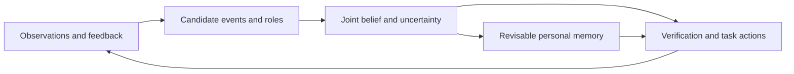

# CPSWM

**Continual Personalized Semantic World Model**

A research prototype for embodied agents that learn how people use shared spaces—and revise that knowledge when new evidence changes the explanation.

[中文介绍](README.zh-CN.md) · [Documentation](docs/README.md) · [Development status](docs/DEVELOPMENT.md) · [Reproduction](docs/REPRODUCTION.md)

## Research question

A robot last saw a mug on the kitchen counter. Later, it finds the mug on a desk. Who moved it? Was this a one-off event, a handoff between people, or a change in someone's routine? A missed observation should not become a confident claim about a person's habits.

CPSWM studies this problem under partial observation, hidden events, multiple residents, unfamiliar people and objects, and changing habits. The aim is to connect uncertain event explanations to personal memory and useful actions, while keeping earlier conclusions open to correction.

## Approach

The design separates sensor evidence, competing explanations, and long-term memory. Each update retains its source and revision history, so later evidence can retract its contribution instead of simply adding another conflicting fact.

*Design overview; the complete loop is still under development.*

The proposed inference framework combines typed particles over event chains, people, object identity and habit changes with three conditional analytic blocks. Seven interacting operators connect observation-aware evidence, hidden-event inference, change attribution, reversible memory and active verification. The [technical framework](https://github.com/goneveitvet240-svg/cpswm/blob/codex/dual-pc-handoff-20260912/docs/结构二/01_结构二完整框架与技术路线.md) specifies the state and interfaces.

## Current implementation

The development branches contain evidence and replay infrastructure, reversible memory components, conditional inference interfaces, and RGB-D perception and simulator adapters. Recent work evaluates object candidates on recorded hand–object interaction data and connects persistent runtime state to camera-action interfaces.

This is an ongoing research prototype. The full perception–memory–action loop has not been demonstrated with calibrated natural observations, and there is no confirmed end-to-end method advantage. Component tests and recorded-input experiments are described in [development status](docs/DEVELOPMENT.md), including unsuccessful results.

## Explore the repository

| Path | Contents |
|---|---|
| [`src/`](src/) | Contracts, runtime, inference and memory components in the selected branch |
| [`tests/`](tests/) | Unit, integration and boundary tests |
| [`apps/`](apps/) | Experiment entry points |
| [`benchmarks/`](benchmarks/) | Benchmark definitions and fixtures |
| [`docs/`](docs/README.md) | Research design, reproduction notes and review records |

`main` currently contains the earlier foundation code and these project pages. Newer implementations remain in review branches; choose the version listed in the [reproduction guide](docs/REPRODUCTION.md) before running an experiment.
