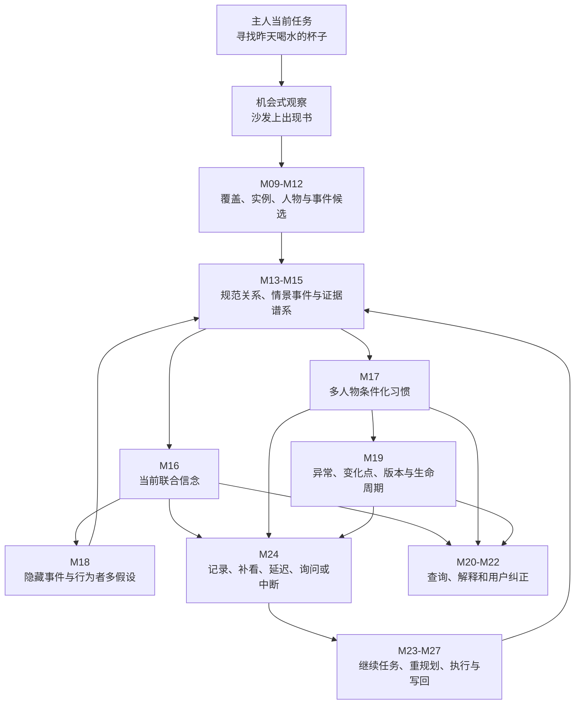

# CPSWM 子结构：机会式观察、多人物归因与抗污染个性化习惯记忆

英文工作名：**Opportunistic Observation, Multi-Person Attribution and Contamination-Resistant Personalized Habit Memory**  
简称：**OAM-PHM**  
版本：`v0.2`  
日期：2026-08-13  
状态：方向与完整能力范围已确认；具体算法、数据库、模型和机器人平台未冻结  
所属总项目：**Continual Personalized Semantic World Model（持续个性化语义世界模型，CPSWM）**

---

## 0. 文档效力、继承关系与范围声明

本文件将“机器人在执行主人当前命令的途中，机会式观察与当前任务无直接关系的物体变化，并把这些证据安全地纳入长期个性化世界模型”正式纳入 CPSWM，作为一个跨模块研究子结构。

本文件受以下文档约束：

1. `项目总纲_持续个性化语义世界模型_v1.0.md`：规定总项目的最终方向与最高范围边界；
2. `技术框架_模块划分与接口_v1.1.md`：规定 A–F 六层和 M01–M32 的模块边界；
3. `技术框架_修改后执行步骤_v1.2.md`：规定模块成熟度和实施先后顺序；
4. 本文件：规定 OAM-PHM 子结构的研究问题、内部闭环、数据语义、评价协议和与 M01–M32 的映射。

发生冲突时，以上顺序从高到低适用。

特别声明：

1. 本子结构不是独立于 CPSWM 的第二套系统，不创建不兼容的实体 ID、事件格式、地图或记忆数据库。
2. 本子结构不是把 CPSWM 缩小为“找东西”或“异常物体检测”项目。
3. O-STaR 是本子结构必须面对的强基线，不是总项目的范围边界。
4. O-STaR 尚未充分解决的多人物、实例、事件、习惯、变化、验证、解释和治理问题全部纳入本子结构，不在其中三选一。
5. 分阶段实施只改变能力的成熟度，不删除最终能力；多个研究成果可以分别验证不同组成部分，但必须共享 CPSWM 规范记录、信念投影和评价协议。
6. 本文件不预先决定采用因子图、粒子滤波、HMM、BOCPD、GNN、Transformer、POMDP 或其他具体算法；这些选择必须通过后续 ADR（Architecture Decision Record，架构决策记录）和匹配实验决定。

---

## 1. 子结构的核心问题

### 1.1 场景定义

主人向机器人下达命令：

> “找到我昨天喝水的杯子。”

机器人在执行该任务、经过客厅沙发时，观察到一本书位于沙发。机器人此前学习到：主人经常把该书放在书房或床头柜。

该观察与当前“找杯子”任务没有直接目标关系，但可能对未来产生价值。系统需要同时回答：

1. 沙发上的书是不是历史中的具体实例 `Book_17`？
2. 书当前是否确实位于沙发，还是受到遮挡、误检或实例混淆影响？
3. 谁移动了它：主人、家庭成员、客人、机器人，还是未知行为者？
4. 是否发生了未被完整观察的拿起、携带、交接或放置事件？
5. 这次观察是临时异常、新的次要位置、习惯渐变，还是习惯突变？
6. 原有的书房/床头柜习惯应当保留、降低权重、版本化还是被反证？
7. 机器人是否应转头确认、绕路检查、询问主人、延迟验证，或继续当前任务？
8. 怎样记录和更新，才能让本次证据服务未来查询、搜索、导航和操作，同时不污染主人习惯？

### 1.2 中心目标

本子结构的中心目标是：

> 构建一个能够在不无故打断当前主人任务的前提下，机会式获取非目标物体证据，联合维护实例—位置—人物—事件—习惯的不确定性，区分当前状态、情景历史、长期人物习惯与习惯阶段，通过抗污染巩固和成本感知验证持续改进个性化世界模型，并把改进转化为未来查询与具身任务效用的闭环。

### 1.3 研究对象的五个槽位

| 槽位 | 本子结构定义 |
|---|---|
| method（方法） | 多时间尺度规范记忆、联合概率信念、多人物软归因、隐藏事件推断、习惯阶段管理和成本感知验证 |
| problem（问题） | 顺带观测怎样安全更新当前状态和长期个性化习惯，而不被偶然异常、客人行为或识别错误污染 |
| scenario/data（场景/数据） | 多人物、多相似实例、跨 session、遮挡、漏观测、交接、渐变/突变习惯的长期家庭环境 |
| constraints/costs（约束/成本） | 当前任务优先级、观察/绕路/开容器/询问成本、隐私授权、有限感知和部分可观测性 |
| metrics（评价） | 错误习惯固化、人物污染、变化适应、实例找回、搜索/验证/错误操作成本和总体任务效用 |

---

## 2. 与 O-STaR 的继承、重合与超越边界

### 2.1 O-STaR 已经建立的能力

O-STaR 已经明确实现并验证：

1. opportunistic multi-target perception（机会式多目标感知）：搜索一个目标时观察其他非目标物体的重新定位；
2. open-vocabulary 3D dynamic scene graph（开放词汇三维动态场景图）；
3. Dirichlet–Categorical location belief（狄利克雷—类别位置信念）；
4. 稀疏跨时观测下的 temporal adaptation（时间适应）；
5. 从家庭迁移规律形成 personalized object search（个性化物体搜索）；
6. 语义常识、几何可行性、时间信念和搜索成本的联合使用；
7. 使用顺带观察提升后续搜索成功率。

因此，本子结构不得再把以下内容单独声明为首次贡献：

- 首次在执行任务途中观察非目标物体；
- 首次利用非目标物体观察更新家庭位置习惯；
- 首次把动态场景图、时间适应和个性化物体搜索结合；
- 首次使用概率位置记忆改善长期物体搜索。

### 2.2 本子结构完整纳入的未充分解决问题

| O-STaR 的现有边界 | OAM-PHM 纳入的完整能力 |
|---|---|
| 主要学习家庭级位置规律 | 分别学习主人、家庭成员、客人、共享和未知行为者的条件化习惯 |
| 一个位置分布同时承担当前状态和长期规律 | 严格分离当前信念、情景事件、稳定习惯、习惯阶段和历史版本 |
| 检测命中直接增加位置习惯证据 | 通过实例、行为者、稳定放置、观察质量和独立性门控后再软更新 |
| 未显式建模具体移动者 | 维护人物后验与 `unknown_actor`，推断拿起、携带、交接和放置事件链 |
| 未联合维护相似实例身份不确定性 | 联合维护 identity–location–actor–event（身份—位置—行为者—事件）多假设 |
| 固定 `Stay+Leak` 扩散 | 区分偶然异常、周期性情境、渐变、突变、旧习惯返回和真正遗忘 |
| 缺少习惯有效时间版本 | 为每个习惯 regime（阶段）保存有效区间、父版本、证据和替代解释 |
| 负证据更新较粗 | 联合考虑视野、遮挡、距离、检测率、容器状态和观察覆盖 |
| 主要利用已发生的顺带观察 | 决定直接记录、微验证、延迟验证、绕路、询问、中断或忽略 |
| 主要以搜索成功率和时间评价 | 增加客人污染、错误固化、人物归因、适应延迟、错误拿取和主任务干扰指标 |
| 长期个性化主要在仿真验证 | 建立 oracle、受控噪声、真实感知回放、半真实和真实家庭分级评价 |
| 证据和用户纠正不是中心 | 每条记忆可追溯、可反证、可撤回、可删除并可重建派生状态 |

### 2.3 创新判断原则

本子结构的研究贡献不能来自“组件数量更多”，而必须来自新的可测能力，例如：

- 未知行为者观测不会被错误写入主人习惯；
- 客人短期到访不会改变主人的稳定模型；
- 新主人习惯出现后，系统能够在低误报下及时适应；
- 相似实例误关联不会造成长期错误传播；
- 额外验证只在其未来效用超过当前任务成本时发生；
- 改进最终降低真实搜索、验证、询问、错误拿取或错误放置成本。

---

## 3. 完整能力范围

本子结构必须包含以下全部能力。

### 3.1 机会式非目标观察

- 在导航、搜索、抓取、递送和其他任务过程中识别非目标物体；
- 记录观察发生时的主任务、路径、位姿、视角、覆盖范围和是否发生额外动作；
- 区分纯顺带观察、微小视角调整、计划内验证和任务外绕路；
- 不让每个异常都自动劫持主人当前命令。

### 3.2 多时间尺度记忆分离

系统必须至少区分：

```text
Current Belief       当前世界状态后验
Episodic Memory      特定时间、地点、人物和证据的情景事件
Personalized Habit   人物—物体—时间—活动—地点的长期分布
Habit Regime         习惯所处的稳定、异常、渐变或突变阶段
Historical Version   已结束但仍可查询、解释和恢复的历史习惯
```

一次新观察可以立即改变 `Current Belief`，但不得因此无条件覆盖 `Personalized Habit` 或删除 `Historical Version`。

### 3.3 多人物条件化习惯

- 为主人、家庭成员、访客、机器人和未知行为者保留不同统计；
- 区分 `belongs_to`、`used_by`、`carried_by`、`moved_by` 和 `shared_by`；
- 允许同一物体在不同人物条件下具有不同位置和活动分布；
- 行为者不确定时使用后验软更新，不得强行归入最大概率人物；
- `unknown_actor` 的概率质量不得静默分配给主人。

### 3.4 实例身份不确定性

- 维护相似实例的竞争身份；
- 融合视觉、三维几何、历史位置、携带连续性和人物交互线索；
- 在身份不确定时保留候选，不自动创建或覆盖长期实例；
- 将实例关联错误作为长期习惯污染的独立来源评价。

### 3.5 隐藏事件和人物归因

系统应从不完整事件链提出多个候选：

```text
主人拿起并放到沙发
其他家庭成员移动
客人临时使用
机器人上一次操作造成变化
物体仍在被携带
发生未观测交接
当前看到的是另一个相似实例
```

候选必须包含后验、证据、因果父事件、互斥关系和替代解释。最高分候选不能被提升为无来源事实。

### 3.6 异常、变化点和习惯版本

系统必须区分：

- isolated anomaly（孤立异常）；
- temporary placement（临时放置）；
- contextual mode（情境性位置模式）；
- new secondary habit（新的次要习惯）；
- gradual drift（渐进变化）；
- abrupt change（突发变化）；
- old habit recurrence（旧习惯恢复）；
- contradiction（反证）；
- true forgetting（真正遗忘）。

习惯变化后不得简单覆盖历史分布，而应创建可追溯的新版本或候选阶段。

### 3.7 抗污染记忆巩固

每条习惯证据至少受以下因素门控：

\[
w_t = q_{\mathrm{identity}}
      q_{\mathrm{actor}}
      q_{\mathrm{placement}}
      q_{\mathrm{observation}}
      q_{\mathrm{independence}}
\]

其中分别表示实例可靠度、行为者归因、稳定放置可能性、观察质量和跨事件独立性。`authorization（授权）` 不是可被其他高分补偿的软概率：未授权证据必须在计算该分数前被 hard gate（硬门）拒绝；已授权证据的 privacy cost（隐私成本）进入巩固/行动效用，而不是作为乘法因子伪装成概率。

具体函数形式不在本文件中固定；它可以是显式概率模型、学习式模型或二者组合，但必须可校准、可消融、可追溯。

### 3.8 观察机会与负证据

系统必须严格区分：

| 结果 | 含义 | 是否能产生负证据 |
|---|---|---|
| `detected` | 有明确实例或候选检出 | 否，产生正证据 |
| `verified_absence` | 目标位置被充分观察且检测能力足够，但未检出 | 可以，强度由似然决定 |
| `not_observed` | 未覆盖、容器未打开或根本没有观察机会 | 不可以 |
| `ambiguous` | 遮挡、视角、实例或感知不足 | 不可以直接作为强负证据 |

“机器人没有看见”不得自动解释为“物体不在那里”。

### 3.9 成本感知的异常验证

发现异常后，动作集合至少包括：

```text
record_only          只记录现有证据
micro_verify         小幅转头或调整视角
defer_verification   加入延迟验证队列
detour_verify        允许有界绕路
ask_user             请求用户澄清
interrupt_task       中断当前任务立即处理
ignore_for_now       因价值不足暂不处理
```

决策应考虑未来记忆价值、当前任务价值、行动/时间成本、用户打扰、隐私和安全，而不是只最大化熵下降。

### 3.10 主任务—地图共同演化

- 主任务继续执行时，顺带证据能够写回世界模型；
- 新证据与当前任务相关时可以触发在线重规划；
- 机器人自己的导航和操作结果也必须进入事件记忆；
- 失败、部分成功和未知结果不能写成确定事实；
- 世界模型更新与任务执行使用一致的状态水位和模型版本。

### 3.11 查询、解释和用户纠正

系统应支持：

- “这本书现在在哪里？”
- “为什么你认为沙发上的书是我的那一本？”
- “谁可能把它移到了沙发？”
- “这是一次异常，还是我最近形成的新习惯？”
- “客人昨天的行为不要算进我的习惯。”
- “我以后就把这本书放在沙发旁。”
- “恢复我上个月的摆放习惯记录。”

解释必须回溯结构化证据；用户纠正必须经过授权，以追加、撤回或替代记录进入规范存储，不允许修改解释文本后直接改变事实。

### 3.12 隐私、删除与派生重建

- 多人物数据按 household 和 authorization scope（授权范围）隔离；
- 人物习惯不得跨家庭静默共享；
- 访客和敏感活动可以使用更严格的保留与访问策略；
- 删除或撤回原始证据后，依赖它的习惯版本、隐藏事件和信念投影必须失效并重建；
- 每次访问、纠正、删除和模型切换都必须可审计。

---

## 4. 核心状态与概率问题

### 4.1 五类状态

对物体实例候选 (o)，系统维护：

\[
\mathcal{S}_t^o = (X_t, E_t, H_t, Z_t, P_t)
\]

其中：

- (X_t)：当前实例、位置、状态、拥有者和关系的联合信念；
- (E_t)：带时间、行为者和来源的情景/隐藏事件集合；
- (H_t)：人物条件化的长期习惯与转移模型；
- (Z_t)：当前及历史习惯阶段；
- (P_t)：证据谱系、模型版本、数据水位和授权状态。

### 4.2 联合信念

候选联合后验为：

\[
B_t = P(L_t, I_t, A_t, E_t, Z_t
\mid Y_{1:t}, Q_{1:t}, C_{1:t}, \Theta, V)
\]

其中：

- (L_t)：位置；
- (I_t)：实例身份；
- (A_t)：行为者；
- (E_t)：隐藏事件；
- (Z_t)：习惯阶段；
- (Y_{1:t})：感知、用户报告和执行反馈；
- (Q_{1:t})：观察机会、选择概率、视野和检测能力；
- (C_{1:t})：人物在场、活动、时间和家庭上下文；
- (\Theta)：人物习惯和转移参数；
- (V)：代码、配置、数据和模型版本。

### 4.3 人物条件化习惯

M17 的习惯分布至少表达：

\[
P(L_{t+1}, R_{t+1}
\mid person, object, time, activity, context, Z_t)
\]

其中 (R_{t+1}) 表示携带、放置、交接、使用等关系或事件类型。

该分布只能作为 M16、M18、M20 和 M24 的统计先验，不能替代直接观测或反向为自己生成训练证据。

### 4.4 记忆写入原则

```text
新观察到达
→ M13–M15 追加规范关系、事件和证据
→ M16 更新当前联合信念
→ M18 生成多个隐藏事件与行为者候选
→ 候选以 inferred 来源追加回 M14/M15
→ 下一 belief tick 重建 M16
→ M17 只消费符合学习防火墙的证据
→ M19 判断巩固、异常、变化点、弱化或版本切换
```

当前信念、情景记录和长期习惯的更新速度不同，但共享相同证据和版本谱系。

---

## 5. 内部子结构与 M01–M32 映射

OAM-PHM 不新增一级 M 模块，而是在现有模块内形成以下协同子结构。

| 内部单元 | 主要 CPSWM 模块 | 职责 |
|---|---|---|
| O1 观察机会与顺带观测 | M05–M12 | 保存主任务上下文、覆盖、遮挡、检测能力、实例和人物候选 |
| O2 规范情景与证据 | M13–M15 | 追加关系、事件、纠正和谱系，不覆盖历史 |
| O3 当前联合信念 | M16 | 维护实例—位置—行为者—关系的可重建多假设后验 |
| O4 多人物习惯 | M17 | 学习人物、物体、时间、活动、地点和情境条件化规律 |
| O5 隐藏事件归因 | M18 | 推断未观测拿取、携带、放置和交接，保留替代解释 |
| O6 变化与生命周期 | M19 | 管理异常、阶段、巩固、反证、弱化、历史和遗忘 |
| O7 查询、解释与纠正 | M20–M22 | 查询五类记忆，解释差异并接收授权纠正 |
| O8 验证与任务协同 | M23–M27 | 决定记录、补看、绕路、询问、中断和写回 |
| O9 仿真、治理与评价 | M28–M32 | 生成长期多人场景，隔离真值，执行基线、指标和数据治理 |

### 5.1 模块边界不变量

1. M13–M15 是规范记录，M16 是可重建派生投影；
2. M17 的输出是先验，不是当前事实；
3. M18 不能直接修改 M16，必须经 M14/M15 追加候选；
4. M19 不删除历史证据来实现“遗忘”；生命周期动作必须可审计和可逆；
5. M21/LLM 只能生成查询或候选，不能直接写入世界模型；
6. M24 计算信息价值与 M16 处理负证据必须使用同一 `ObservationLikelihoodModel`；
7. M27 写回执行结果，但不自行判定结果为真实事实；
8. `gt.*` 只允许 M29/M31/M32 和显式 oracle adapter 读取。

---

## 6. 需要补充或扩展的数据契约

以下是语义要求，不预先决定其最终类名或存储产品。

### 6.1 `IncidentalObservationContext`

至少包含：

```text
primary_task_id
primary_task_goal
observation_mode
robot_pose / frame_id
candidate_entities
field_of_view_coverage
occlusion_state
additional_action_cost
selection_probability
observation_likelihood_model_id
observed_time / recorded_time
```

### 6.2 `IdentityActorEventHypothesisSet`

至少包含：

```text
hypothesis_set_id
object_identity_candidates
actor_posterior
hidden_event_candidates
location_candidates
causal_parent_events
mutual_exclusion_groups
alternative_explanations
input_watermark
model_versions
evidence_refs
```

### 6.3 `HabitRegimeVersion`

至少包含：

```text
habit_version_id
person_or_actor_scope
object_instance_or_class_scope
context_scope
valid_time_interval
regime_kind
location_and_transition_distribution
parent_version_id
supporting_evidence
contradicting_evidence
change_confidence
status: tentative / active / historical / retracted
```

### 6.4 `ConsolidationDecisionRecord`

至少包含：

```text
candidate_evidence_id
target_habit_scope
identity_quality
actor_quality
placement_stability
observation_quality
independence_quality
authorization_status
effective_training_weight
decision
reason_codes
model_version
```

### 6.5 `VerificationDecisionRecord`

至少包含：

```text
belief_snapshot_id
primary_task_id
candidate_actions
expected_information_value
expected_task_value
time / path / interaction / privacy costs
selected_action
policy_version
realized_outcome
world_model_feedback_event_id
```

---

## 7. 端到端闭环



### 7.1 “书出现在沙发”示例状态

直接观测后允许同时存在：

```text
Current Belief:
  P(Book_17 @ Sofa) = high

Episodic Memory:
  在执行 FindCup_042 途中，于 10:32 直接观察到书候选位于沙发

Stable Habit of Person_A:
  Study / Nightstand 仍为稳定多峰分布

Actor/Event Hypotheses:
  Person_A placed it
  Person_B moved it
  Guest used it
  unknown_actor moved it
  identity mismatch

Habit Regime Hypotheses:
  temporary anomaly
  contextual reading location
  emerging secondary habit
  persistent change
```

单次高质量观察足以改变当前状态，但通常不足以单独确定移动者或建立主人新习惯。

---

## 8. 研究问题与可证伪假设

### RQ-O1：机会式观察怎样在不干扰主任务的情况下产生长期价值？

- **H-O1：** 与只记录目标物体相比，记录非目标重定位能够改善未来查询和搜索；
- **H-O2：** 成本感知验证优于“全部忽略”和“全部验证”，能在相同总预算下获得更高长期效用。

### RQ-O2：怎样避免顺带观察污染主人习惯？

- **H-O3：** actor posterior soft update（行为者后验软更新）比家庭级聚合和最大概率硬分配降低客人/家人污染；
- **H-O4：** 实例、行为者和稳定放置门控能够降低异常错误升级率，而不显著牺牲真实新习惯适应速度。

### RQ-O3：怎样区分当前状态、偶然异常和习惯变化？

- **H-O5：** 多时间尺度状态分离优于单一位置分布，在状态预测、习惯恢复和时间化查询上更可靠；
- **H-O6：** 习惯阶段版本化能够同时降低变化误报、缩短变化适应延迟并保留旧习惯可用性。

### RQ-O4：怎样处理未观测移动和相似实例？

- **H-O7：** identity–actor–event 联合多假设优于顺序硬决策，能降低相似实例的错误习惯固化和错误拿取；
- **H-O8：** 在无法辨识的场景中保持 `unknown` 或多候选，能够获得更好的风险调整任务效用。

### RQ-O5：更好的记忆是否真正改善机器人能力？

- **H-O9：** 在双方独立调优、相同感知和行动预算下，完整子结构相对 O-STaR 及其增强组合基线降低搜索、验证、询问和错误操作的综合成本；
- **H-O10：** 如果改进只体现在 NLL、Brier 或 ECE，而没有行动效用收益，则不支持核心系统贡献。

---

## 9. 基线、消融与公平比较

### 9.1 必须包含的基线

```text
last observation / last seen
household frequency prior
person-conditioned frequency prior
Markov transition model
O-STaR faithful reproduction
O-STaR + independently retuned parameters
O-STaR + stronger but matched perception
STREAK-style continual relocation model
完整 OAM-PHM
oracle identity / actor / event / location upper bounds
```

### 9.2 组合增强基线

为了防止把简单叠加误当作创新，至少比较：

```text
O-STaR + person labels
O-STaR + current-state/habit separation
O-STaR + change-point detector
O-STaR + actor attribution
O-STaR + observation-likelihood negative evidence
O-STaR + cost-aware verification
O-STaR + all independently engineered additions
```

完整方法必须击败“忠实 O-STaR + 合理增强”的最强组合，而不能只击败原始简化版本。

### 9.3 必须分别消融

- 机会式非目标观察；
- 实例身份后验；
- 人物软归因；
- `unknown_actor`；
- 当前状态与习惯分离；
- 隐藏事件候选；
- 变化点与习惯版本；
- 抗污染巩固门控；
- 观察机会/负证据模型；
- 成本感知验证；
- 用户纠正；
- 任务写回。

### 9.4 公平性原则

1. 使用相同感知输入、地图、导航器、LLM/VLM 和任务预算；
2. O-STaR 的 `w_hit`、`w_miss`、`gamma` 等参数必须独立调优；
3. OAM-PHM 的门控、变化和行动阈值也必须独立调优；
4. 调参与测试家庭、人物和随机种子必须隔离；
5. 同时报告理想 oracle、受控噪声和真实感知结果；
6. 不允许通过给候选方法更多观察、更多真值或更强感知制造收益。

---

## 10. 场景生成与评价体系

### 10.1 M30/M29 必须支持的家庭场景

1. 主人长期稳定放置；
2. 单次偶然异常；
3. 客人短期到访；
4. 家庭成员具有相反放置习惯；
5. 多人物交接同一物体；
6. 未观察到放下事件；
7. 相似实例身份混淆；
8. 主人习惯突然改变；
9. 主人习惯逐渐改变；
10. 旧习惯经过一段时间后恢复；
11. 机器人自己移动物体；
12. 容器关闭、严重遮挡和观察选择偏差；
13. 用户纠正、证据撤回和数据删除；
14. 当前任务与异常验证发生资源冲突。

### 10.2 固定观察轨道

用于隔离记忆和推理质量：

- current-location Top-k / NLL；
- instance association accuracy / ID switch；
- actor attribution Macro-F1 和 abstention（拒答）质量；
- hidden-event Top-k recall；
- verified-absence calibration；
- false habit consolidation rate（错误习惯巩固率）；
- guest/family contamination rate（客人/家人污染率）；
- anomaly-to-habit false promotion（异常错误升级率）；
- change detection delay / false alarm（变化检测延迟/误报）；
- old-habit retention and recurrence recovery（旧习惯保留与恢复）；
- evidence traceability（证据可追溯率）。

### 10.3 闭环决策轨道

- correct-instance retrieval success；
- 搜索成功率、时间、路径长度和 SPL；
- 错误拿取、错误递送和错误放置率；
- 开容器、补看和绕路成本；
- 询问用户次数和打扰成本；
- 主任务完成延迟和中断率；
- 顺带观察带来的有效地图增量；
- cumulative utility / regret（累积效用/遗憾）；
- 习惯变化后的任务恢复时间。

### 10.4 外部有效性轨道

评价按以下层级逐步推进：

```text
oracle symbolic simulation
→ controlled-noise symbolic simulation
→ embodied physical simulation
→ real-perception replay
→ semi-real deployment
→ real household multi-session deployment
```

合成结果只证明机制可行，不足以单独支持真实家庭或机器人顶会的强外部有效性主张。

---

## 11. 与现有执行步骤的集成顺序

本子结构不修改 `技术框架_修改后执行步骤_v1.2.md` 的总体顺序，而是在各阶段增加对应验收内容。

| 总项目阶段 | 本子结构工作 |
|---|---|
| Step 1 A0 | 复用 M01–M04 的 ID、时间、规范/派生隔离、回放与版本能力 |
| Step 2 F0 | 在 M30/M29-L0/M31/M32 中加入多人、异常、变化、机会式观察和强基线任务 |
| Step 3 B0 | 产生 oracle 与受控噪声的实例、人物、事件和观察机会候选 |
| Step 4 C0 | 通过 M13–M15 保存顺带关系、情景事件、纠正和证据谱系 |
| Step 5 C1 | M16 建立 identity–location–actor–relation 当前联合信念基线 |
| Step 6 C2 | M17/M18/M19 加入多人物习惯、隐藏事件、抗污染巩固和习惯版本 |
| Step 7 D | M20–M22 支持当前/历史/习惯/阶段查询、解释和用户纠正 |
| Step 8 E0 | M23/M24/M27 跑通记录、补看、延迟、询问、重规划和写回闭环 |
| Step 9 B1 | 逐步替换真实实例重识别、人物身份和交互事件感知 |
| Step 10 E1 | 接入真实导航/操作，并测量异常验证对主任务的真实代价 |
| Step 11 F1 | 完成长周期、多家庭、隐私、删除、监控和外部有效性评价 |

阶段化不得被解释为只保留其中一个研究问题。

---

## 12. 完成条件与停止门槛

### 12.1 子结构方向完成条件

只有同时满足以下条件，才能称为完成该子结构，而不是完成某个局部模块：

1. 机会式非目标观察能够进入规范记忆；
2. 当前状态、情景事件、人物习惯和习惯阶段可分别查询；
3. 多人物、未知行为者和相似实例保持多假设；
4. 异常、渐变、突变和旧习惯恢复能够被区分和版本化；
5. 负证据引用真实观察机会和似然模型；
6. 验证策略能够在不无故打断主任务的情况下选择动作；
7. 所有推断和习惯更新可回溯、可纠正、可删除和可重建；
8. 相对独立调优的 O-STaR 及强组合基线产生行动层或效用层收益；
9. oracle、受控噪声和至少真实感知回放轨道均完成评价。

### 12.2 局部研究主张停止条件

以下条件不会删除总项目能力，但会停止对应的论文创新叙事：

- 强组合基线经过独立调优后已经匹配候选方法；
- 收益只来自更强检测器、LLM、导航器或更多观察预算；
- 只改善 NLL、ECE、Brier 等概率指标，没有任务行动或效用改进；
- 人物归因收益只在 oracle identity/actor 条件下成立，真实噪声下消失；
- 真实感知回放显示实例或事件错误使整体收益反转；
- 外部有效性所需数据或部署条件不可实现。

局部主张失败时，应保留可复用的规范接口、数据和评价，但不得用系统规模掩盖研究假设失败。

---

## 13. 风险与控制

| 风险 | 控制原则 |
|---|---|
| 子结构过大 | 保留完整范围，按共享接口形成多个工作包和研究成果，不建立互不兼容系统 |
| 人物跟踪错误传播 | 软归因、`unknown_actor`、多假设和 oracle/噪声敏感性评价 |
| 实例误关联污染习惯 | 身份后验进入巩固门控，禁止一次观测覆盖实体历史 |
| 新习惯适应过慢 | 同时评价污染率与适应延迟，避免只追求保守 |
| 变化检测误报 | 区分情境模式、临时异常和持久阶段，保留旧版本 |
| 验证动作干扰主人任务 | 显式计算主任务延迟、打扰和安全成本 |
| 模型自我确认 | 纯模型预测的习惯训练权重强制为零 |
| LLM 幻觉污染 | LLM 只生成查询、语义约束和候选，不直接写事实 |
| 仿真结果过度外推 | 强制真实感知回放与分级外部有效性门槛 |
| 隐私与访客数据风险 | 授权范围、最小保留、可删除证据和派生重建 |

---

## 14. 工作包体系

全部工作包都属于同一子结构，不是互斥路线。

| 工作包 | 内容 | 主要模块 |
|---|---|---|
| WP0 | O-STaR、STREAK、HOMER 等最强邻近基线的忠实适配和死亡测试 | M31/M32 |
| WP1 | 机会式观察、观察机会、负证据与学习防火墙 | M09/M10/M13–M17 |
| WP2 | 当前状态、情景记忆、长期习惯和习惯阶段分离 | M13–M17/M19 |
| WP3 | 多人物软归因、未知行为者、交接和客人污染 | M12/M16–M18 |
| WP4 | 实例身份—行为者—隐藏事件联合多假设 | M11/M16/M18 |
| WP5 | 异常、渐变、突变、旧习惯返回和版本化生命周期 | M17/M19 |
| WP6 | 成本感知补看、延迟验证、询问和任务中断策略 | M20/M23/M24/M27 |
| WP7 | 时间化查询、证据解释、用户纠正、删除与重建 | M15/M20–M22/M28 |
| WP8 | 物理仿真、真实感知回放、半真实和真实机器人闭环 | M05–M12/M25–M32 |

工作包可以形成多篇论文、数据集、基准或工程里程碑，但全部使用相同实体 ID、事件语义、证据谱系和 Benchmark Manifest（基准清单）。

---

## 15. 现有技术证据与检索边界

检索日期：2026-08-13。

| 工作 | 与本子结构关系 | 证据状态 |
|---|---|---|
| O-STaR: Open-Vocabulary Object Search through Spatio-Temporal Reasoning on Dynamic Scene Graphs, 2026 | 直接覆盖机会式非目标观察、家庭迁移习惯和个性化搜索，是首要强基线 | full text checked（全文核验） |
| DynaMem, ICRA 2025 | 覆盖操作/探索中的动态三维语义记忆更新 | full text checked |
| POCD, RSS 2022 | 覆盖概率对象变化和半静态地图维护 | full text checked |
| Where Did I Leave My Glasses?, 2025/2026 | 覆盖对象稳定性、地图变化和主动维护 | full text checked |
| Learning Object-Based State Estimators, 2020 | 覆盖跨天家庭物体状态和转移学习 | full text checked |
| HOMER / Proactive Robot Assistance, 2023 | 覆盖多日家庭物体移动与习惯预测 | full text checked |
| STREAK, 2024 | 覆盖家庭上下文漂移下的持续物体迁移学习 | abstract/full public text checked as available |
| Forgetting in Robotic Episodic Long-Term Memory, 2024 | 覆盖执行任务时记录未交互物体和选择性遗忘 | full text checked |

代表性关键词包括：

```text
opportunistic multi-target perception
incidental object observation
dynamic spatio-semantic memory
personalized household relocation habits
actor attribution
habit contamination
habit regime change
Bayesian online change-point detection
cost-aware verification
long-term household object memory
```

本轮没有形成 Web of Science、Scopus、IEEE Xplore、ACM DL、CNKI 和万方的穷尽式系统综述导出，因此任何新颖性表述必须继续限定于检索日期、来源和查询，不得使用未经证明的“首次”或“无人研究”。

### 15.1 核心原始来源

- [O-STaR 官方论文与海报合集](https://www.hrl.uni-bonn.de/publications/2026/menon26grc/menon26grc_paper_poster.pdf/%40%40download/file)
- [DynaMem: Online Dynamic Spatio-Semantic Memory for Open World Mobile Manipulation](https://arxiv.org/abs/2411.04999)
- [POCD: Probabilistic Object-Level Change Detection and Volumetric Mapping in Semi-Static Scenes](https://arxiv.org/abs/2205.01202)
- [Where Did I Leave My Glasses? Open-Vocabulary Semantic Exploration in Real-World Semi-Static Environments](https://arxiv.org/abs/2509.19851)
- [Learning Object-Based State Estimators for Household Robots](https://arxiv.org/abs/2011.03183)
- [Proactive Robot Assistance via Spatio-Temporal Object Modeling](https://arxiv.org/abs/2211.15501)
- [STREAK: Streaming Network for Continual Learning of Object Relocations under Household Context Drifts](https://arxiv.org/abs/2411.05549)
- [Forgetting in Robotic Episodic Long-Term Memory](https://h2t.iar.kit.edu/pdf/Plewnia2024.pdf)

---

## 16. 最终定义

OAM-PHM 是 CPSWM 中负责以下闭环的完整研究子结构：

> 当机器人执行主人当前任务时，它能够机会式观察其他物体及其异常位置，在不混淆当前状态、情景历史和长期习惯的前提下，联合推断具体物体实例、可能行为者和未观测事件；系统能够抵抗客人、家庭成员、偶然异常和识别错误对主人模型的污染，识别并版本化渐变或突发的新习惯，决定是否值得补看、绕路、询问或延迟验证，把所有观察和行动以可追溯、可纠正、可删除和可重建的方式写回长期世界模型，并最终改善未来的语言查询、搜索、导航、抓取和递送。

该子结构完整继承 O-STaR 已经证明有价值的机会式多目标观察，但研究范围不限于搜索：它把机会式观察进一步连接到 CPSWM 的多人物关系、实例身份、隐藏事件、持续学习、语言解释、行动决策和长期治理体系。
