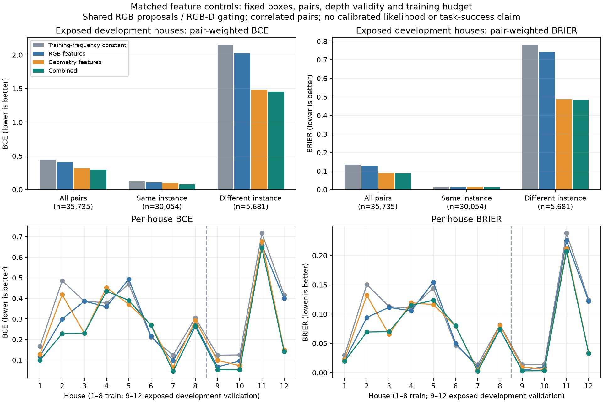

# 固定像素亲和度特征对照与下一主线定位

2026-10-01。冻结功能源码 `a6c026963b5fec1503fa0d582fe016eccf60c756`，base/父 PR76 `ffcaa7b292c73201d799f6631688387409c21cb7`。新增四个 Python 文件，原8维学习器和线上运行默认行为未改。分支 `codex/pc-a-affinity-controls-20261001`，879份绑定源码。交付提交与实际功能源码分开记录。

**同一固定数据上的三组对照已完成，联合特征在四个开发验证屋的总体 BCE/Brier 均优于另两组，但不同实例之间的混淆仍大。** 两轮顺序 A 辅助对抗审查通过，真实 run 与新进程从头复算均 exit 0，292 输出文件逐字节一致。这个结果支持继续研究公开软表面读出，不支持把亲和分数当作已校准身份或观测似然。

## 固定对照与结果

保留 PR76 的全部12屋96帧、两检测器并集候选、8×8网格和像素对去重。房屋1–8训练、9–12开发验证。RGB组仅保留原颜色差3列，几何组仅保留像素/深度/点距5列，联合组保留8列；禁用列在完整验证原输入后置0。相同监督集合、训练频率常数、L2=0.01和30步优化预算，无验证调参。联合组模型JSON与96份分数NPY精确重现父结果。

这是相同候选/样本上的特征组对照。RGB组仍使用RGB-D有效性门控，几何组仍依赖RGB检测框，不能称三个独立传感器系统。

| 方法 | 训练 BCE | 训练 Brier | 开发验证 BCE | 开发验证 Brier |
|---|---:|---:|---:|---:|
| 同训练频率常数 | 0.359805 | 0.102895 | 0.445967 | 0.135510 |
| RGB特征 | 0.333748 | 0.095602 | 0.410656 | 0.128816 |
| 几何特征 | 0.287909 | 0.082842 | 0.317563 | 0.089888 |
| 联合特征 | 0.261817 | 0.077014 | 0.298310 | 0.087341 |

训练38,993个有监督对（同实例34,452／不同实例4,541）；验证35,735个（同实例30,054／不同实例5,681）。353,452个候选内原始关联按像素对去重为352,719个公开有效对，其中277,991个VOID（78.8%），三模式全部保留其有限预测。38帧无候选，另20帧有候选但无合格监督，共58/96帧不贡献监督损失；这些帧没有被删除。

| 验证类别 | 常数 BCE / Brier | RGB BCE / Brier | 几何 BCE / Brier | 联合 BCE / Brier |
|---|---:|---:|---:|---:|
| 同实例（30,054对） | 0.123815 / 0.013562 | 0.104625 / 0.012754 | 0.097125 / 0.014781 | 0.079638 / 0.012553 |
| 不同实例（5,681对） | 2.150235 / 0.780649 | 2.029643 / 0.742817 | 1.483740 / 0.487225 | 1.455146 / 0.482991 |

联合组验证屋等权总体 BCE/Brier 为0.223737/0.061678，几何0.249380/0.065220，RGB0.305216/0.090299，常数0.345692/0.097552。不同实例类只有3个验证屋有分母；屋9负对0、屋10负对6，屋11/12承载5,675/5,681个负对（99.89%）。类别缺失是null而不是0损失，不能把容易的全正类屋当身份区分成功。

失败保留：训练屋4和6的联合总体两指标均差于常数；联合也并非每个训练屋、每一类别都优于单组。验证不同实例Brier仍为0.483，亲和度不能直接用作正式身份接受规则。所有对相关，当前四验证屋已经开发曝光；无新未见确认集、独立校准或显著性结论。

## 可复算性与对抗证据

真实run用111.96秒，另进程fresh verify用109.26秒；两次均先核对父ledger/674成员/历史源码，再从原PR73采集和PR74公开缓存重新提取、监督、训练父模型，随后真实训练三模式并比较完整292产物。没有重新启动Unity或重新运行检测器。当前case ledger外部摘要为 `5eaabaaae15e4ed453c0f84b4f243103e25e5e9c1125f87f23e82e2be352bad2`。

父ledger原pin `32e0dc7cec8fce6dfca5bc36755cfba5cf3551b454c1f746f20ac2076936e842` 保持。历史验证可能读取私有验证材料，因此这里保证训练和公开模型输入隔离，不冒称恶意进程隔离。验证标签只在本轮全部288次公开预测后用于评价。

两轮审查顺序完成：R1 447 passed/81.17秒，R2 447 passed/80.43秒；冻结前447 passed/82.11秒，四文件Ruff和格式通过。R1实际2次父CLI和8个控制CLI，覆盖完整改模型/全部分数及报告重签、模式移植、删除全部VOID分数、父结果自签和合法恢复。R2新增6个实际CLI，覆盖所有依赖和结果路径搬移、16帧的112个成员文件跨分区移植并真实重训、历史源码替换和恢复；另有5项缺类/VOID生产build检查。完整伪造均沿实际后果检查，未只做字段/名称负例。

审查采集/检测器/mask为明确受控fixture，历史SDK审计为原有受控替身；历史affinity和新控制训练CLI是真实生产入口执行。这些受控计数不能替代真实96帧计数。R2执行者参与过wrapper实现；两轮都是A侧辅助，不能称B独立验收或全仓CI。

独立数值核验另见 `DATA_REVIEW.md` 和 `independent-analysis.json`：从父外部pin保护的特征/标签自行计算，不使用生产fit/predict/summarize公式作为期望。该核验从已固定特征开始，不声称另写了原始RGB-D提取器。完整原件、实际命令和失败见 `REPRODUCE.md`、两轮报告及封存包。开发初次测试中空数组攻击没有实际改字节造成1个失败，已改为非空帧攻击；生产检查未放宽，失败日志保留。

## 下一主项为何改变

只读追踪发现，live路径仍使用 `OpenWorldJointFixture` 供给目标观测模型。自然视觉进入q，而穷举内核同时加入integration log(q)，两者在目标权重中抵消。因此只附加亲和度摘要，不能证明自然观测已经影响最终后验。具体源码与缺口见 `NATURAL_FACTOR_GAP.md`；`NEXT_INTERFACE_DESIGN.md` 保留为可复用接口设计，尚未实施。

下一轮采用更直接的开发切片：用原固定combined对所有公开有效seed生成软表面三维代表点，并列相同网格的无权重读出；离线seed的唯一合格mask只负责连接训练/评价标签，SDK pivot和AABB center两套位置参考都保留，分别拟合三维开发bias/covariance。它们不是正式世界身份、物体中心宣告或独立校准结论。

随后只消费一个预先声明的公开seed/证据簇，在显式受控关联下检验同一线性Gaussian模型的预测观测密度如何改变receipt、目标权重和后验，并检验撤回/恢复。使用更新前先验的S=HΣHᵀ+R和完整normalizer，H=[I3,0]保留六维状态，不捏造朝向。旧posterior-projection receipt不能直接追加likelihood；相关seed不能堆乘。正式位置参照、自然I→Z、校准门槛和真实动作观测模型仍待闭合。

完整统一框架、三个RB blocks、七算子、原分类对照、位置+朝向和主动澄清任务均保持。当前交付是特征组开发对照，不是自然因子、完整pipeline或科学收益验收。
