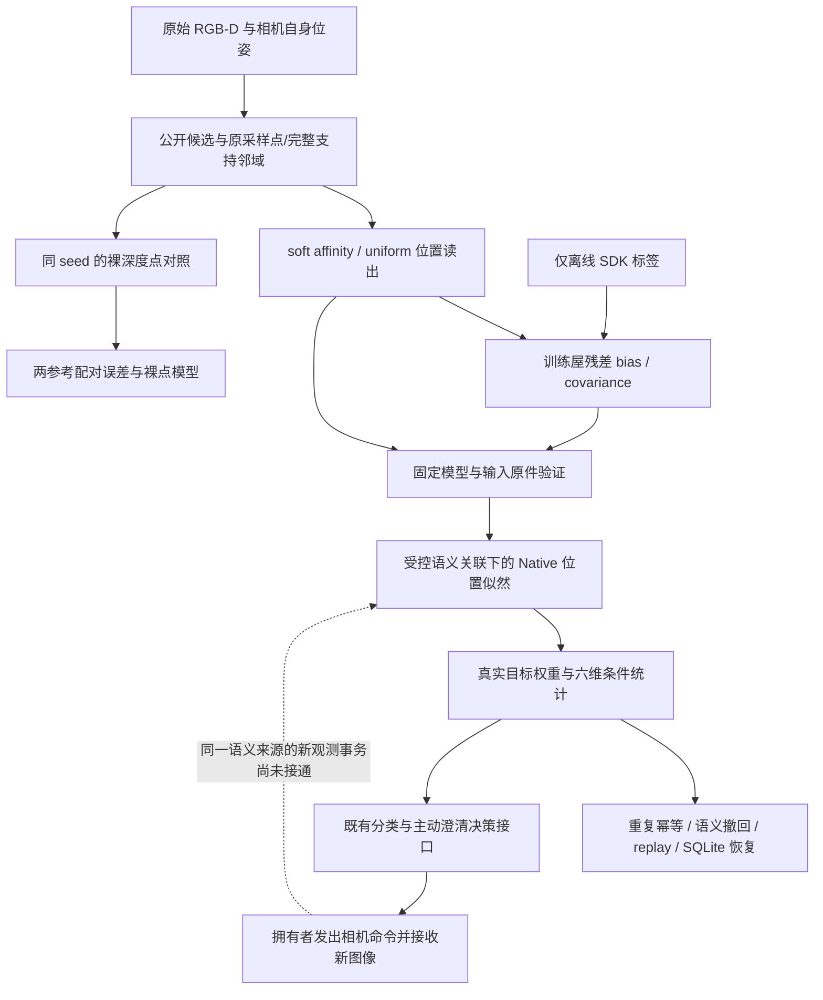

# 本轮源码下的 pipeline 接线与剩余主断点

绑定功能源码 `82c7a81fba0c3af3688978ce222b1b94e4cc5bd9`。是否通过本轮实际数据运行必须以 REPORT.md、case-results.json 和 review-gate.json 为准；本图描述接线范围，不单独构成实验通过证据。

这轮实际桥接沿 A→B→C→P→Q→R→S，使用先前真实仿真采集原件与实际拟合模型。关联、语义事件、known prior、unknown 分布仍是明确的受控设定；没有调用新的物理相机命令。D→N 是固定同分母的方法对照，不是在线自动择优。离线私有标签用于训练/评价，不用于公开 candidate/seed 选择或在线身份赋值。

T→U 在既有相机机制有实现与测试；当前轮不能据此声称 U→Q 已完成。旧语义 source 已发布后，收到新 capture 不等于它已成为一次新的目标密度更新。不能改 semantic UUID 或清 producer 状态来制造闭环。

下一完整工程轮应把这些后果一起完成：

1. 先发布保持不变的旧语义 S；拥有者签发并接收其后的第一条 RGB-D capture A。
2. A 的原件、源/父批次、命令/时间/模型与接受锚一致后，新增真实 Native 更新；独立核算 likelihood、log 权重和条件统计变化，P5 与语义账本不重跑。
3. 重复 A 不增量、不重执行相机；失败不丢已发生的 delivery，计算状态回滚；第二个不同 capture 明确保留为 pending，直到相关性/时序协议有定义，不擅自乘独立似然。
4. 按真实 observation cluster 重放；撤回 S 会排除 S 对应 A；新进程恢复后仍保留一次消费和完整原件约束。
5. source 冻结后依次两轮对抗审核，包括合法正路径、完整自洽错误输入、ledger/动作后果与恢复；随后才新增实际在线相机验证。

细化模块/事务设计见 NEXT_OBSERVATION_IMPLEMENTATION.md。NEXT_DELIVERY_FEASIBILITY.md 的只读 descriptor 是前置接口，已在独立 owned-rgbd-descriptor 分支完成作者开发检查、等待冻结双审，不计为本轮通过；它不能单独替代更新权限或上述完整事务。

完整 H/R/I/C/Z/r/V、三个 RB blocks、七算子、原分类和主动澄清没有缩减。本轮只新增位置观测贡献；朝向、自然多人物/跨视角身份、隐藏事件、未知/杂波模型、正式位置参考与先验/误差校准、时间相关性、长期任务收益仍需分别验证。模块存在、受控贯通、自然推断、行动收益和统一验收是不同层级。
