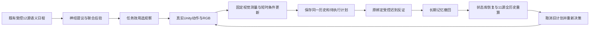

# 同一历史的记忆纠正与真实相机续接

本报告绑定功能源码 `c59b8c88d9d3cb1d03f9042909a58fd7378f7e03`，独立分支 `codex/pc-a-history-action-loop-20260929`，base `bf374f9331426cfa384f2ec23bf0bd0a098ba033`。四条实际持续历史均完成并通过内置复算。记录到记忆纠正、旧计划取消、原生重算和真实相机续接；自然输入闭环与可靠目标完成仍未成立。

## 当前实际结果

| 开发任务／场景 | 实际策略观察 | 纠正前待执行计划 → 纠正后首动作 | 记忆首选位置变化 | 严格内置复核 |
|---|---:|---|---|---|
| 原分类／北 | 0 | 停止 → 停止 | 有 | 通过 |
| 原分类／南 | 0 | 停止 → 停止 | 有 | 通过 |
| 主动澄清／北 | 3 | 左转90°（取消）→ 原地重观测 | 有 | 通过 |
| 主动澄清／南 | 3 | 左转90°（取消）→ 原地重观测 | 有 | 通过 |

每条发生一次合法受控撤回，12个原始语义输入中的11个保留来源重新执行神经推断，生成22条原生记录和一个新重放代；神经重放前后长期账本逐字不变。受控记忆的首选由 `b0f0f121…`（0.5690982764）转为 `9c497f2d…`（0.5063362319）。该变化来自已绑定受控反证，实际相机类别测量没有长期写入权限。

两条澄清历史均实际执行“右转45°→Pass原地重观测→左转90°”，四次转动加两次原地观察，共6个真实公共RGB返回。四条历史保存22条受测SDK事件／快照：4个创建后初始快照、12个显式准备步骤、6个策略观察。已记录对象在物理暂停后平移／旋转差为0，四次旋转的SDK朝向与计划角度差为0。SDK27个源码文件与Unity166个文件在本批运行前后摘要一致。

视觉结果仍失败：北侧三个公共帧目标掩膜像素为554、554、0；南侧为0、0、558。6帧均无apple候选，3个可见帧全部漏检，重复视图不是独立样本。两条澄清历史最终均为 aggregate unresolved 0.9754404356、unknown instance 0.0241177649、known instance 0.0004417995，没有可靠找到目标。

按**假设观测模型**计算，纠正后两次新代测量使完整假设熵从0.3439615313降到0.1695198934 bits，下降0.1744416379；后验主要集中到未决桶。这只是该模型的数值变化，不能当作真实定位准确率或任务完成。源码保留未决和类别测量的权限限制。

单条完整运行含在线流程和归档复算耗时约200、208、237、290秒；后两条运行时同时进行其他已完成历史的只读复算。因此这些时间不是实时控制延迟基准，也不适合直接比较算法速度。

## 本轮解决的问题

旧证据分别证明了“受控长期纠正与神经重放”和“真实相机反馈与短时后验”，但它们不是同一条持续执行历史。本轮增加 `collect_revised_posterior_step`，先处理已经合法接受的语义源失效，调用原子全历史重放，取消旧代 READY 计划，然后沿用普通后验驱动采集。迟到反证接收前、接受后和恢复后保存同一拥有者的状态库；Unity 不随状态库恢复而重启。

这是一条**受控语义＋真实相机的混合工程闭环**。自然 RGB 尚未生成可信的接触／释放／身份事件和长期反证；本轮没有将普通类别结果提升成这些权限。图中的12源语义和迟到反证都来自明确标注的既有夹具，不是自然输入能力。

## 用户确认的任务对照

完整12源历史在实际神经检查点下给出 94.271654% 的 aggregate unresolved 概率。原 whole-atom classification（整原子分类）效用将其作为高概率类别，所有观察的期望分类效用增益为0，故停止。用户确认新增主动澄清开发任务并保留原分类对照。

新增任务以完整假设分布的 log score（对数评分）实现一步信息价值；不是仅看原因标签熵。原概率、已知／未知实例两个公开视角、0.9/0.05/0.5 假设似然、0.01成本、SSDLite 0.5过滤值和神经检查点保持。含当前先验和所有可达后验的报告集合使期望效用增益等于完整假设的信息增益；独立算式回归已通过。单位是开发任务的 bits，不能解释为真实校准的定位收益。

原 CIAV 的 `expected_information_gain` / `expected_cause_information_gain` 针对原因边际，本夹具的原因均为 unresolved，因此可以为0；这里完整假设的信息价值进入任务效用，记录在 `expected_utility_gain`，并与独立熵计算核对，不能混读字段。

未决和类别阳性都不授予“目标找到”；停止可能只是无正效用或预算耗尽。纠正后旧代测量不作为新代假设的证据重复使用，但已经发生的相机旋转仍参与物理朝向计算。实际预检纠正前最大预期信息增益0.038906881 bits、扣费后0.028906881，选择右转45度；纠正后在尚无实际相机历史的预检中仍选择右转45度，不预先宣称纠正必然改变动作。

## 固定实验和可靠性边界

南／北两个既有诊断场景，各运行分类和澄清任务，总计四条历史。每条固定 seed171、12个受控来源、前7源日期中的已提交事件反证规则、typed_factor_graph_transformer 原有开发检查点。该检查点仅经过原组件夹具两次优化，不是自然联合训练。所有相机输入为320×320原图，场景创建后 PausePhysicsAutoSim＋两次 Pass；这只是统一准备流程，不是已证实的渲染暖机阈值。

纠正前最多一次策略动作，纠正后最多两次。原任务允许零动作；没有扫描兜底或为了显出差异调阈值。四次启动不声称像素完全配对；比较的是已确认的开发任务效用，不能据此声称某个神经架构优于基线。

当前冻结源依次通过两轮 A 局部自审18／24项、零跳过；新增及受影响生产模块 mypy、变更文件 Ruff/check-format 通过，详见 [审查](REVIEWS.md) 和 [复现](REPRODUCE.md)。B独立验收、统一验收、既有全量CI失败仍未解决；本轮没有运行完整仓库CI，也不由局部通过覆盖历史失败。

## 保留的首次失败及复核修正

第一版 `d9d4941823312b46e286f79a6e9505510b31e55c` 通过18/19两审，实际首条分类北历史完成采集/纠正后，在归档核验报 `fresh neural full-history replay differs`；驱动返回1，整批随即停止，不能将该目录的采集 COMPLETE 标识解释为验收通过。`attempt01` 以及两份逐字段诊断保留。

差异是重新执行合法撤回时生成的新内部 snapshot／账本记录 UUID；cause snapshot完全相同，地图快照除ID外相同，三类原生概率逐字相同（0.9378595876645135／0.06102257488791397／0.0011178374475725218）。内部标识不同传递到哈希链、runtime和particle IDs。没有据此改动生产记忆或容差。

修正后的复核分两层：先从纠正前检查点重新执行同一反证，以现有语义身份验证器校验原始账本、外部授权/来源/位置/数值和实际返回后果，内部ID只按引用关系重命名；再恢复实际接受的纠正后检查点，使用真实检查点重跑11个保留来源，仍与在线原生联合状态作完全相等检查。原始观测、动作状态、时间、输入绑定、原生工作区也必须相等。新增5项回归，旧轮的通过不替代新源码双审。

## 未闭合项与主线下一步

本轮完成与否以四条实际历史、严格复算及原件检查为准；即使这些通过，也只关闭“合法纠正后，同一个运行拥有者能否撤回、恢复、重算并继续行动”的工程连接问题。它不关闭可信自然事件监督、完整六操作神经修订核、自然联合训练、长期个性化收益、公平闭环基线、B独立及统一验收。

下一主项应沿这条同历史接口，把**有独立真值的自然视觉实体／实例和事件证据**接入提议与纠正，而不是继续增加静态相机帧。先用同一保存图像验证实例对应和类别测量可靠性，保证“未检出”不会冒充不存在或长期反证；随后替换受控语义／反证输入，并以任务完成、成本及错误写入后的恢复为闭环终点。任务效用、自然证据权限或正式指标若进一步变化，仍需用户科学决策。本轮已确认的澄清开发任务继续保留原分类对照。

## 行动变化的解释边界

主动澄清组的旧90度左转计划作废后，新代先在当前视角重观测。这说明合法源纠正改变了实际续接决策；差别也包含旧代短时测量被隔离后的重新取证，不能解释成已经学会正确的位置偏好或更省动作。原受控记忆位置与两个公开相机视角之间尚无自然学习的几何／实例对应。完整的位置、身份和事件证据接线仍是下一主项。

## 交付与复算证据

四条历史均由另一个新Python进程再次完成状态恢复、原绑定反证语义重执行、已接受快照的实际11源神经重放以及原图真实视觉推理；逐项结果与在线归档一致，见 `attempt02/fresh-verification-commands.json`。这是同机归档复算，不是独立Unity重跑或B验收。三个完整归档副本攻击均按指定错误被拒绝，见 `attempt02/archive-attacks.json`。

完整受测原件和脚本（含失败attempt01、成功attempt02、状态库、全部公共/准备原图、掩膜、SDK记录、冻结映射、开发失败日志）共269个文件、325,879,662字节；逐文件读回校验通过。Git共享33,412,800字节压缩包及清单，压缩包SHA256为 `6f29fe4572f7f90bb0f84d61d0f14d551557b64244ac53ffae433320737d2d5d`。报告、外层描述和Python临时缓存不在原件清单计数内。见 [完整原件](evidence/history-action-loop.tar.gz)、[外层摘要](evidence/archive.json)、[逐文件清单](evidence/inventory.json)。

持久本机原件 `output/history-action-loop-20260929/`。以父分支 `codex/pc-a-sim-timing-control-20260929` 的叠加草稿PR交付，不合并。交付前fetch成功，集成 `19ddf26830348a2f0b33f0af54d6ba702c5cfb1c`、B `fd4ca6ef5e81c90d7cf7987b42c0b2810d8a810a`、父分支 `bf374f9331426cfa384f2ec23bf0bd0a098ba033` 未变。后续交付提交仅文档/证据，不将源码自审当作B对新PR的签收。
