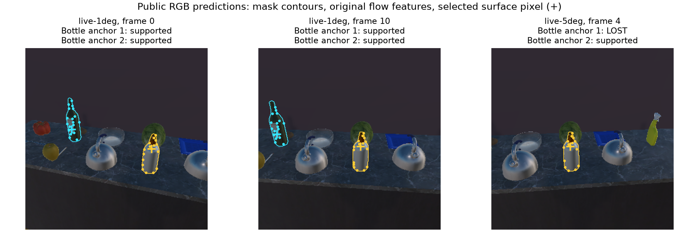

# 自然掩码表面支持：固定连续序列局部交付

2026-10-02；A 独立分支 `codex/pc-a-natural-mask-surface-20261002`，base 为 PR94 head `01c52fef24d5fafc95bf8f6584602771aa176d5c`，冻结功能/测试/驱动源码 `d2c3f51b005b49b97812f43b5dc75c3801017807`。后续提交只封存审查与交接文档。完整统一框架与用户批准的身份＋位置联合任务、报告表面点和闭区间 AABB 开发判据保持。

本轮解决原自然框内 seed/软聚合落到背景的问题，增加独立的 RGB 预测掩码＋公开深度读点、首帧掩码内特征跟踪。在同一屋的已有 16 帧上，离线 WineBottle 参考的表面位置命中从旧固定软聚合 0/16 提高到 14/16；较大转角的末两帧仍为丢失。这是可复现的局部几何改善，**不是自然实例身份裁定、身份＋位置任务成功或主动/记忆收益**。其他初始目标也全部保留，包含碗的 0 命中与类别错误。

## 实现和证据边界

- `NaturalMaskSurfaceDetector` 固定官方 Mask R-CNN ResNet50 FPN V2 / COCO_V1，CPU，native 800/1333 resize。权重完整 SHA 见环境记录，推理不下载权重。模型只读公开 RGB；公开深度和已授权的理想模拟相机自身位姿用于投影。未加入 SDK 目标身份、目标位置或真值 mask。
- 预先固定 detector score≥0.5、mask probability≥0.5。保存模型 native NMS/top-k 后的所有候选与完整 float32 mask 概率，包括 187 个低分候选；不声称保留模型内部被 NMS 去掉的 proposals。门槛是未校准开发规则。
- 单帧读点是 mask 内有效深度点中最大 mask 概率，平局按 `(u,v)` 排序。连续读点还须来自原轨迹的 surviving features（存活特征）；首帧全部 5 个活动候选均各自初始化，后续不新增或重置 anchor。
- 沿用原光流正反向误差≤1.5px、最少4特征。当前同类别 mask 必须唯一得到至少4个原轨迹特征支持；无支持、歧义、共享 mask 均未知，真正光流 LOST 永不续接。跨帧更新先完整暂存、成功后才提交；异常不部分推进。
- 保存 stable local feature IDs（稳定局部特征编号）、原始帧/模型/mask/深度/相机来源和当前选点。局部编号不授予世界身份。小转角 WineBottle 所选特征切换6次，SoapBottle切换4次；**这些可见表面点不能直接作为同一静态物体中心测量输入旧高斯模型**。
- 组件保持 `UNRESOLVED`、无 memory/negative-observation authority（记忆写入/负观测权限）。没有注册新 Native profile、更新原位置校准参数或替换默认路径；旧 SSDLite 序列在每帧重算后与原公开记录一致。

## 全部分母与失败

输入固定为 PR91 已采集的 `live-1deg` 11 帧、`live-5deg` 5 帧：16 帧、14组不同 RGB、1屋，本轮新增相机动作0。推理进程仅读 public manifest，另一个 evaluator 进程读取冻结预测和 SDK AABB/2D boxes。两个序列互相重叠且已开发暴露，不能当16个独立样本。

下表的对象名只是**离线首帧最大2D框IoU参考**，首帧固定后全程跟随同一原 anchor；不按后帧真值改配、不按是否命中选择赢家。未作正式实例身份裁定，`sink → Kettle`、`dining table → CounterTop` 等类别错误不能被 AABB 命中掩盖。真实 AABB 中落点含边界、不膨胀；不规则/透明/空心物体的盒内点不一定在物理表面。

|序列|自然类别 → 离线首帧参考|有点/全部帧|参考AABB内/全部帧|保留未知或丢失|
|---|---|---:|---:|---|
|1°|bottle → WineBottle|11/11|11/11|0|
|1°|bottle → SoapBottle|11/11|11/11|0|
|1°|bowl → Bowl|9/11|0/11|2无当前mask支持|
|1°|sink → Kettle|4/11|4/11|7无当前mask支持|
|1°|dining table → CounterTop|1/11|1/11|10永久丢失|
|5°|bottle → WineBottle|3/5|3/5|2永久丢失|
|5°|bottle → SoapBottle|5/5|5/5|0|
|5°|bowl → Bowl|3/5|0/5|2无当前mask支持|
|5°|sink → Kettle|1/5|1/5|4无当前mask支持|
|5°|dining table → CounterTop|1/5|1/5|4永久丢失|

全部10条初始轨迹/80条帧记录中，49条有点、31条未知/丢失均在原件；详细 anchor、状态和选点切换见 [independent-geometry.json](evidence/independent-geometry.json)。旧框对照 WineBottle 的首个有效网格 seed 是 3/11、1/5 命中；旧 constant-affinity soft（自点1、其余0.5）是0/11、0/5。该 soft 对照不是训练后的 affinity 或旧 Native 后验。新旧模型和分辨率同时改变，计算量不同；结果不能归因为纯 mask 消融优势或同计算预算优势。

图只使用公开预测。蓝色首帧左侧 bottle anchor 在较大旋转后丢失，黄色另一个 bottle 独立保留；没有用后出现的其他瓶子替换原目标。

## 验证与封存

冻结源码后顺序 A 自审 R1 **89 passed / 3.79s**，R2 **2 passed / 118.96s**，零跳过；mypy 401源码文件、Ruff、819文件格式通过。938个源码/测试/工具文件从冻结到验证结束未变。R2 仅选取既有连续事务的重复采集幂等与中间撤回失败回滚，不是新掩码已经接入事务，也不是全49项旧兼容检查。详细范围见 [VALIDATION.md](VALIDATION.md)。

run/fresh 两个新推理进程分别重跑16帧，33个输出逐字相同，两个独立评分文件一致。独立算术脚本不导入 CPSWM：复算76个单帧点、49个光流支持点，检查153个报告点/7038个AABB成员关系、feature编号/支持集合、低分/未知保留和输入摘要配对。它复用同一模型mask与光流输出，**不是第二实现感知验证、B独立审查或新的模拟器验收**。

[封存包](evidence/frozen-run.tar.gz) 14,432,138 bytes，106文件；含全部16帧 public 原始RGB-D/pose、对应SDK/框、旧public结果、全部新候选/mask、评分、manifest、运行/测试日志与冻结清单。不含177MiB模型权重，给出URL和完整SHA；fresh相同大文件不重复封存，其清单保留。[文件清单](evidence/archive-files.json)、[包摘要](evidence/archive-pin.json)、[复现命令](COMMANDS.md)。

开发时96×96合成测试夹具曾携带4×4配置摘要，被生产输入门拒绝；修正夹具摘要后通过，未放宽验证。该早期终端失败未保存完整日志，不冒称可逐字重放。原用户工作树fetch因curl28/EOF退出128，保持失败记录；恢复工作树fetch成功，远端集成 `19ddf26830348a2f0b33f0af54d6ba702c5cfb1c`、B `fd4ca6ef5e81c90d7cf7987b42c0b2810d8a810a`已核对。原树源码、STATUS_B、共享集成未修改。

## 下一门槛

这是第一项目标的局部推进。接下来需要把表面feature谱系与相关误差模型对齐，再通过原事务边界接入可撤回更新；不得把不同表面点连续计为同一中心的新独立证据。自然世界身份裁定、联合任务效用/实际观察结果预测、同任务同动作预算主动比较、后续记忆收益仍未完成。新组件尚未接 Native；现有 PR92 的受控事务结果不自动转移成新组件端到端验收。

完整 H/R/I/C/Z/r/V、三个 RB blocks、七算子、隐藏事件、多人物、开放世界、可逆归因和具身反馈范围保留；B/全仓验收与科学收益保持待完成，不自动合并。
