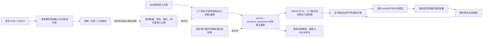

# 结构二当前可执行链路与未闭合边界

当前工程链路已连接到真实神经检查点、原生联合状态、撤回重放、真实Unity相机图像与短时联合反馈；**自然输入到可信长期记忆的完整闭环、理想仿真表现和方法的额外行动收益均未建立**。最终功能源码`b1969f30b85434452f6b23ec53c93d84799ff62f`，各轮结果绑定各自完整SHA，详见[总交付](REPORT.md)和[复现说明](REPRODUCE.md)。本次未改变完整统一研究范围或正式科研决策。

真实神经路径消费的是已接受的语义记录，并非直接从RGB联合推断所有变量。三个已有网络分别加载各2次组件夹具优化的真实权重；第一轮12来源→撤回1→重建11，得到22记录、2当前原子、6维位姿与11份实际模型证明，SQLite与生产者恢复一致。当前有限支撑精确枚举的q/q会抵消，证明执行正确，**不能证明神经提议更优**。`native_neural_production.py`当前只接受branch/preserve_unresolved；其他模块有六操作条件状态数学，不等于六操作已全部能发布到连续活跃账本。

实际相机路径使用受控原生先验和显式假设观测似然。执行转动→收到实际RGB→检测类别→更新短时完整联合概率→下一动作，第一动作后可SQLite恢复且不重复发送。类别反馈不改原生批次或长期账本，不能授予人物身份、接触释放、长期撤回资格。来源链已修复：当前原生来源历史的不完整/分叉不能静默略过；旧原生批次不再用于新联合条件化，但诊断策略仍使用已看视角/停止的原始历史，因此不能说旧历史对所有行动毫无影响。

仿真和比较的实际状态：

- 第三轮24场，后验组未优于关闭反馈/右先扫描。第五轮320与640各24场，共84次转动/132帧，全部成功执行且逐场重建。Faster R-CNN至少一个目标框重叠的场次由6/12到11/12，另1场在无目标像素视角误报并提前停止；SSDLite均0/12。每12是两摆放位置×六方法，非12独立场景。
- 第六轮穷举全部四种二视角二元测量×六方法。实际反馈确实改变概率，但三个神经方法与关闭反馈/右先扫描的动作轨迹在全部四组合完全一样。该配置不能验证反馈额外收益；24组合是明确的4×4受控像素夹具，不计作实际Unity场景。
- 第七轮完整132帧分辨率网格里，Faster R-CNN的目标框重叠为320的16/30、640的19/30；无目标像素帧误报由1/36增为13/36。重叠只指IoU>0，不是正式检测达标或实例正确。高分辨率不是已验证修复，也不是相同算力预算。
- 第八轮私有SDK全实例对应定位到高分apple框实际覆盖Tomato_5（IoU约0.96）。实际两个前端标签表有apple、没有tomato。这支持优先处理开放集混淆与目标对应，但不能断定唯一原因或代选模型。新采集与旧原图不同，旧漏检仍可精确重放。

因此，当前最应推进的是**可信目标对应和观测条件，再让行动任务能够区分反馈价值**：保留所有候选与歧义，隔离模拟器评价真值，覆盖未知干扰物/遮挡/视角/尺寸，并将开发校准与独立验证分开。随后在相同输入信息与预算下，让反馈有机会改变动作排序或停止，并检验真实行动结果。三个有用视角是可选开发实现，不是通用必要条件；新的正式先验、指标或架构仍未替用户选择。

完整六操作神经发布核、自然联合训练、独立接触/释放/人物复核、本前端位姿误差校准、隐藏事件与多人长历史、个性化效用、导航抓取和跨场景验证均继续未闭合。本次每轮两审均A顺序自审；B独立验收和统一科学验收仍未完成。工程修复、受控诊断、真实相机可运行、科学收益是不同层次。
