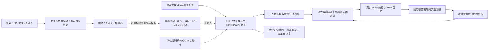

# 结构二当前可执行链路与未闭合边界

这份说明绑定本轮三个交付报告，不能用历史测试数替代新源码验收。完整统一框架保留；当前自然语义生产、完整神经修订核和长期任务收益尚未闭合。

已跑出的主路径有两类来源，必须分清：

1. **真实网络接原生后端**：三个已有网络均加载实际开发检查点，完整概率由消费者重算；受控12来源→撤回1→重建11→22记录/2当前原子/完整6维位姿，随后恢复同一状态。第一轮受测08e5cc1；当前有限支撑枚举只覆盖branch/preserve_unresolved，q/q抵消。它证明执行正确，不证明网络比解析枚举好，也不补齐其余修订操作或自然联合训练。
2. **真实像素接行动反馈**：受控原生先验、假设观测似然、实际神经模型、实际Unity转动与原图检测组成同一连续所有者；像素测量改变短时联合概率，再决定下一动作。第一动作后SQLite恢复不重发；原生批次与长期账本不被这个类别测量入口改写。第二轮最终受测3d917ee；实际两位置均SSDLite漏检，不能称仿真任务已运行理想。

缺口按后果排列：

- **测量是否可靠**：目标实际有554/558像素时SSDLite仍漏检；显式0.9可检出假设因此会错误降低真实位置的概率。Faster R-CNN同图像离线只补回北位置，尚不代表自然数据、多实例或完整身份感知。
- **反馈是否带来行动收益**：当前两视角足以用简单覆盖扫描检查。第三轮预先固定6方法×2位置×2前端，检测阈值、停止规则、已看视角和预算保持公平；没有结果前不能预设后验方法获胜。
- **神经方法是否真正承担近似推理工作**：完整q的接线已补，但当前精确枚举会抵消q。要证明提议模型有用，仍需完整目标/六修订操作、可信自然训练、受控计算预算下的覆盖与行动收益；本轮不把微型开发权重当训练完成。
- **自然语义、可逆记忆、长期任务**：独立接触/释放/人物身份复核和本前端位姿误差校准没有凭空补齐；角色/开放世界/隐藏事件等不能从类别框推定。长期人物污染、个性化效用、导航抓取和跨场景泛化继续未验证。
- **独立验收**：本轮两审均A顺序自审，B验收及统一科学验收尚未完成，独立分支不自动合并。

当前执行顺序仍是先补原生神经接入，再跑实际反馈，最后做有反例能力的公平比较。比较后的主项应由实际失败决定；前端漏检、似然失配和没有额外动作收益分别需要不同处理，不能都用增加训练步数来代替诊断。
