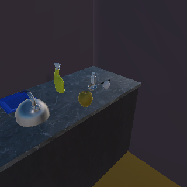

# 第二轮交付：真实像素相机反馈已闭合，SSDLite漏检使短时信念降错权

受测源码 `01d041189c702c3e7f571f9c565b6fe86aa6b7e5`。56/36 顺序两轮A局部对抗自审、mypy377/Ruff通过；八条命令前后完整Python/依赖仍等于同一Git提交。三种实际网络的相机组合均在测试中执行；独立审核人数0，B正式验收未完成。

新增 `CameraOutcomeDecoder` 配置入口及 `JointObservationUpdate` 可重建记录。消费者使用发布动作时保存的完整联合假设似然，解码实际拥有的回包RGB，从原生批次派生短时联合行动视图。调用方不提交后验或“已确认标签”；同一回包反复读取得到同一视图，SQLite恢复重新计算，不重发动作。新语义批次不继承旧相机条件因子，避免重复计数。长期账本、原生统计及事件历史不被此入口改写。

第一轮审查覆盖正确贝叶斯数值、相机方向变化、unknown完整支撑、失败/弃权、实际三网络组合。第二轮覆盖恢复、原生来源切换、已加载解码器/计算函数替换、完全重封的错误回包和分叉动作、真实像素模型权重/配置漂移，并复跑上一轮神经纠错与原生依赖检查。表格所用条件观测模型仍是显式可信配置的开发假设；这些检查不证明其科学标定正确，也不是任意解释器篡改的安全认证。

## 两次真实Unity运行

已有ProcTHOR训练房屋，固定相机初始270度，两个候选视角225/315度；苹果固定放在北/南两个位置之一（外生初始化，不算机器人操作）。方法端仅收到RGB和执行状态；掩膜、目标位置、相机真实朝向独立保存在评估日志。

| 场景 | 实际动作 | 真正有苹果像素的帧 | SSDLite苹果候选 | 短时结果 |
| --- | --- | --- | --- | --- |
| 北位置 | 右45度，再左90度 | 第一次转动，554像素，SDK visible=true | 0 | 两次未检出后停止 |
| 南位置 | 右45度，再左90度 | 第二次转动，558像素，SDK visible=true | 0 | 两次未检出后停止 |

4次相机执行均成功，4次回包都实际改变了联合概率；两次实验均在第一动作后从SQLite恢复相同联合视图并继续第二动作。原生批次及长期账本均未被相机更新改写。原假设观测模型把真正可见的位置因漏检而降权，aggregate unresolved质量从0.35545升至0.59204。这说明“链路可执行”和“推断方向正确”不是同一结论。

此处明确评估的是原有SSDLite前端、0.5既有开发过滤值；不能推及仓库中另一个Faster R-CNN前端。随后会对完全相同的已交付RGB作Faster R-CNN离线复算，保留两种结果，不据此默改正式架构或阈值。

同RGB离线复算已完成：原有Faster R-CNN在北位置可见帧输出苹果0.6334，南位置仍无苹果候选；另外4帧无苹果候选。详见 `fasterrcnn-same-pixels.json`。这是同图像的离线比较，没有重跑Faster R-CNN动作策略，不能称其已完成实时任务。

工件：主仓 `output/neural-native-loop-20260929/round2-attempt01/`。轻量日志、逐场景报告和评估动作记录见 `evidence/round2/`。来源明确为受控原生假设+真实神经检查点+自然像素类别测量；自然完整语义过渡0、人物/接触/身份校准0、物理操纵0，完整自然闭环未完成。

下一步按已固定 `COMPARISON_PLAN.md` 跑同起点、同检测/停止/预算的反馈消融和覆盖扫描。现有失败不删除、不改名为搜索成功，不拿q/q枚举的三网络一致性声称神经任务收益。

## 追加对抗反例与重审要求

追加完整重封攻击复现了一个来源链漏洞：将已实际交付动作的问题 `source_belief_sha256` 改为不存在的值，同时重封命令摘要，旧消费者把它当成无关旧历史跳过，没有报错，从而可静默消除它的概率影响。修复前 `DID NOT RAISE` 保存于 `evidence/development/camera-origin-pre-fix.log`。

修复由连续输入所有者在发出命令时独立记录原生来源，和命令一起持久化。只有确属旧原生代的历史可以不再参与当前条件化；当前来源的链断开、命令丢失/改成普通扫描、已交付分叉等均拒绝。新来源与撤回重放的合法路径继续验证。补绑定像素推理线程/确定性配置，避免恢复使用改变的数值执行条件。该修复需要新的SHA和两轮重审；上面的01d0411通过不能代替修后通过，冻结重审结果另行追加。

修后受测源码 `3d917ee4f5a203bd3bddbdfb1fa6a8e71713c372` 已完成56/41顺序两轮A自审，mypy377/Ruff及两次真实Unity复跑全部通过，8条命令前后源码均等于Git。新覆盖含完整12来源纠错重放后的相机来源切换。两场景仍各两动作、各两概率更新、第一动作后精确恢复、同样漏检；源码修复没有被说成识别质量改善。完整工件 `output/neural-native-loop-20260929/round2-attempt02/`，轻量证据 `evidence/round2-fixed/`。两审完成后才开始第三轮比较实现。
