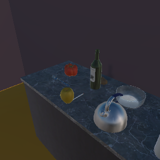

# 第四轮交付：66帧同原图测量诊断，漏检与错误目标均被实际观察到

受测源码 `f8425a0813d78ebabb6b8dbcb55a297203ff978d`。顺序两轮A自审43/24、mypy377/Ruff、66帧完整采集与新进程重算通过，7命令前后全部已跟踪Python/依赖同Git。另补完整伪造阳性：有效UUID、真实模型/原图/上下文、与真苹果框一致的伪候选及一致评估结果，实际推理重算仍拒绝；脚本/结果随evidence/round4保留。两审均为A自审，B未验收。

同房屋、同一Apple资产，两摆放位置×三个相机x位置（1.05/1.25/1.45）×11固定朝向（195～345度每15度），66帧全部成功取得。两固定前端均处理同一份原始字节，继续使用各自官方权重和0.5开发过滤值，无新训练/标定/阈值选择。30帧实际有目标mask像素，36帧无目标像素；这是相关的固定视角读数，不是66个独立场景。

| 前端 / 位置 | x=1.05：可见帧阳性/重叠框 | x=1.25 | x=1.45 |
| --- | --- | --- | --- |
| SSDLite 北 | 0/0（5帧可见） | 0/0（5） | 0/0（5） |
| SSDLite 南 | 0/0（5） | 0/0（5） | 0/0（5） |
| Faster R-CNN 北 | 4/4（5） | 4/4（5） | 4/4（5） |
| Faster R-CNN 南 | 2/1（5） | 2/2（5） | 0/0（5） |

总体SSDLite在30个可见帧全漏；Faster R-CNN在其中16帧给苹果类别候选，只有15帧候选框与真实目标框有非零重叠。两模型在36个无目标像素帧均无苹果候选。非零框重叠只是描述性核对，仍不是实例身份认证或机器人取回成功。

南位置x=1.25时，Faster R-CNN在195度、240度有重叠目标候选，但原闭环使用的225度漏检；南位置x=1.45全部5个可见视角均漏。检测依赖视角/距离，原固定0.9观测假设不能视作可信标定。北位置新网格与旧两视角运行的置信度也并非完全相同，不能把重复渲染叫逐字相同输入。

还发现实际错误目标：南位置x=1.05、225度，目标有700像素且SDK visible=true；Faster R-CNN给出apple 0.6131，却将框放在画面上方另一红色物体处，与真实苹果框IoU=0。目标框[120,175,148,207]，候选约[128.66,127.26,154.71,152.84]。这暴露类别阳性停止的局限，不能把类别标签直接当目标实例已找到。

新增真值来自指定模拟器资产的掩膜/几何与实际相机日志，不是新增独立人类接触、释放或人物身份复核。前端模型从未读取这些私有标签；它们只在推理后做评估。数据没有被拟合成完整联合观测模型，尤其不能由两位置给aggregate unresolved校准。

完整工件：主仓output/neural-native-loop-20260929/round4-attempt01。轻量汇总、审查及来源见evidence/round4。下一轮按提前固定RESOLUTION_DIAGNOSTIC_PLAN.md检验真实640采集是否改善原闭环，保持方法/阈值/先验和全部失败分母，类别阳性与真实框重叠继续分开。完整自然语义、完整神经修订核和长期任务收益仍未完成。
