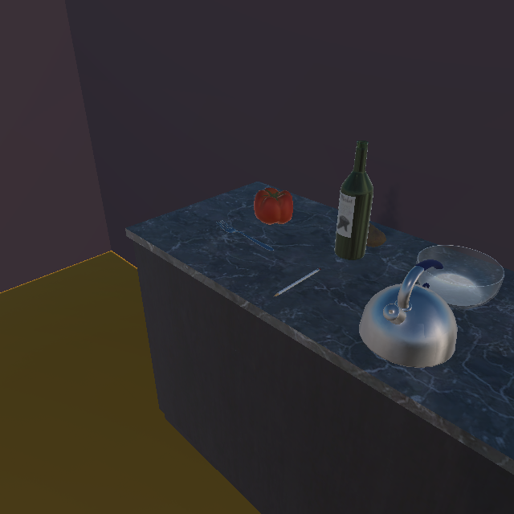

# 第五轮：48场真实分辨率对照完成，改善漏检同时暴露错误停止

受测源码`c54f890aecd5c6af2f9a2005413f7cbf0ba7920b`。55/36顺序两轮A自审、mypy377/Ruff、320与640各完整24场运行及逐场模型/原图/SQLite重建通过，共12命令全部exit0且已跟踪Python/依赖前后同Git。两审仍是A自审，独立审核者0，B未验收。

同一版本重新运行两种分辨率，没有拼入第三轮旧数据。每种分辨率均为6方法×2摆放位置×2前端，原权重、0.5过滤值、先验、假设似然、预算和停止/已看视角规则不变；全部48初始后验在1e-12内一致。640来自仿真器原生采集，非事后上采样。320共43次转动/67帧，640共41次转动/65帧，84次转动全部成功。

| 前端 / 采集 | 类别阳性场次 | 至少有一个框与目标重叠 | 无目标像素时阳性 |
| --- | --- | --- | --- |
| SSDLite / 320 | 0/12 | 0/12 | 0 |
| SSDLite / 640 | 0/12 | 0/12 | 0 |
| Faster R-CNN / 320 | 6/12 | 6/12 | 0 |
| Faster R-CNN / 640 | 12/12 | 11/12 | 1 |

每行12场是2摆放位置×6方法重复，绝非12个独立场景。非零框重叠不是实例身份认证，更不是取回或操作任务成功。640画面面积是320的4倍，本轮没有给出等像素预算或实时性能结论。

Faster R-CNN在320时只北位置阳性；640时南位置也能检出。三神经方法、关闭反馈、右先扫描仍同动作：北侧1次、南侧2次，没有额外后验决策收益。左先扫描在640南侧1次获得目标框，但在640北侧也1次停止，原因却是错误目标：225度原图目标像素为0，模型给另一红色物体apple分数0.920912，目标框IoU=0。若只记录“类别阳性/动作少”，这条错误路径会被算作优胜；本轮明确列为错误停止。

补充只读几何复核覆盖全部132帧：实际机身位置(1.25,0.900999784,2.745277166)、实际相机位置(1.25,1.575999737,2.745277166)跨条件一致，俯仰30、FOV60、两资产位置及实际朝向一致。请求机身高度0.95被引擎落地处理，不冒称真实相机高度。脚本及其SHA随evidence/round5保存；这是模拟器记录核对，不是独立位姿校准。相同位置/朝向的重复渲染仍有2～4种原图SHA，不能称各场像素完全一致。

两轮审查覆盖真实320/640合法路径、实际维度与元数据、完整重封640伪装320、配置/权重/加载代码变化、保存状态与反馈来源重建；不是敌对解释器或联合伪造整套模拟器/SQLite的全面安全证明。完整自然语义、其余神经修订操作、长期记忆与行动收益仍未完成。

完整工件：主仓`output/neural-native-loop-20260929/round5-attempt01/`。第六轮按已固定计划穷举二视角类别组合，检查当前任务能否区分反馈作用；随后预算内完整复查132帧固定视角，确认高分辨率改善与错认的覆盖范围。两项均保留全部不利条件，不默认改变正式架构或分辨率。
