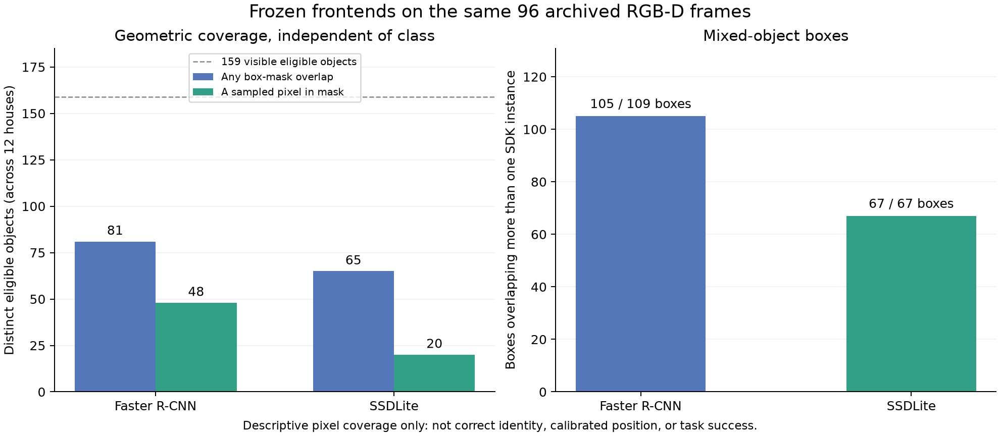

# 固定96帧公开前端诊断交付

两种既有公开前端已在同一固定12屋、96帧RGB-D/相机自位姿归档上完成运行，并分别在新进程中重新推理全部96帧，保存结果完全一致。发现的主要缺口是实例级观测支持：159个可见合格对象中，Faster R-CNN的样点命中48个、SSDLite命中20个；跨至少两个实际相机视角重复命中的只有9个和3个。此结果支持下一步补前景像素与实例的归属，尚不支持把检测框表面点当作对象位置测量。

本轮是对上一轮新采集数据的离线重放，没有再次启动Unity采集。没有训练、拟合位置噪声、赋予自然实例身份、接入观测似然或证明动作收益。

## 版本、数据与权限

实际功能与双审源码：`3babc6d1557b4fe54abc6c8ac1f6054cdeb03e57`；base为PR73 head `5a2a963d7f3b9fc8c3084e0b50d1696b2a7314f2`。只新增两个诊断工具、两个测试；生产src、依赖及固定模型权重不改。文档/证据交付版本与实际源码分开记录。

用户方案1已批准仿真实例ID、掩膜和位置用于离线训练/校准；不再把这项用途列作待决权限。线上特征仍只有RGB-D与相机自位姿。本轮模型输入只取公开观测，完成96帧公开预测后才进行本轮私有全矩阵评价；历史来源核验本来会读取私有原件，不能将调用顺序表述为整个进程完全未读私有数据。

输入固定为PR73的`collection-attempt02`，外部inventory pin：`9791a946543b9158890324d3ff35a80ea04d51c9cabb6e09540f569abd903d47`。先在匹配865份历史Python源码的采集目录执行完整CLI核验。前轮第一批失败仍由PR73保留，不用新源码重签旧configuration，不替换任何房屋/帧。

固定房屋index1–8为训练来源、9–12为验证来源，各屋8个航向。503个合格对象（411/92），其中159个至少有1像素可见（118/41），253个可见对象帧次。全目录仍保留1618个SDK实例，包括不合格和不可见对象。这里的“可见”没有尺寸阈值，不等于所有对象都具备充分视觉信息。完整资产隔离说明沿用PR73；不是所有场景资产均无交叉。

两模型沿用官方本地固定权重、原默认0.5开发筛选，CPU两线程；无阈值搜索或验证集调参。COCO和SDK词表分别保留，不把任意重叠计作正确类别识别。

## 实际结果

| 描述性统计 | Faster R-CNN | SSDLite |
|---|---:|---:|
| 固定帧数 | 96 | 96 |
| 零候选帧 | 54 | 51 |
| 全部候选框 | 109 | 67 |
| 表面采样点 | 327 | 201 |
| 有任意框/mask交叠的合格对象 | 81 / 159 | 65 / 159 |
| 被采样像素命中的合格对象 | 48 / 159 | 20 / 159 |
| 框交叠对象帧次 | 101 / 253 | 86 / 253 |
| 采样命中对象帧次 | 57 / 253 | 24 / 253 |
| 至少2视角框交叠的合格对象 | 20 | 19 |
| 至少2视角采样命中的合格对象 | 9 | 3 |
| 同时交叠多个SDK实例的框 | 105 / 109 | 67 / 67 |
| 采样像素属于合格对象mask | 116 / 327 | 44 / 201 |

真值mask中有84个合格对象在至少两个实际相机航向可见（训练59、验证25）。本批每屋相机位置不变，只转yaw；这些不是具有平移视差的多视图，也不是独立统计样本。跨视角按实际位置、yaw、pitch去重，不用UUID或图像哈希代替。现有局部IoU关联器遇相机几何变化会重置，不能把其track ID当跨视角实例身份。

| 分区 | 可见合格对象 | Faster框覆盖/样点命中 | SSDLite框覆盖/样点命中 | Faster至少2视角样点命中 | SSDLite至少2视角样点命中 |
|---|---:|---:|---:|---:|---:|
| 训练来源 | 118 | 59 / 31 | 38 / 11 | 4 | 1 |
| 验证来源 | 41 | 22 / 17 | 27 / 9 | 5 | 2 |

这里“105个框混多实例”不是105个误检：边界框自然会包括上下文和邻接对象。它说明不能将整框深度归给单个对象。不合格样点也包含被资产隔离规则排除的合法对象，不能全称背景。样点的mask像素归属本身不能证明该深度值在透明/遮挡等情况下来自同一物理表面。

下面只统计像素属于合格对象mask的样点；每个候选对所有SDK实例的完整位移仍在原始report中保留。

| 原始距离，米 | Faster（116样点） | SSDLite（44样点） |
|---|---:|---:|
| 到SDK pivot：中位数 / P90 | 0.574 / 1.219 | 0.705 / 1.189 |
| 到AABB中心：中位数 / P90 | 0.391 / 1.002 | 0.415 / 0.941 |

表面点与对象原点/包围盒中心是不同量，上表不是校准位置误差。两个模型选中的对象和像素不同，不能据此排定位精度；AABB距离较小也不能作为正式参考点选择的依据。完整值、分位数定义和房屋分组保留在report/analysis中。

## 核验与两轮对抗审查

冻结代码后按顺序完成[第一轮](ADVERSARIAL_ROUND1.md)与[第二轮](ADVERSARIAL_ROUND2.md)，各231项定向测试通过，静态检查通过。第一轮含完整资格升格、两位置参照共同平移、完整零候选伪造、布尔数字混淆和原件重签；第二轮含独立CLI合法搬移路径、相机与几何共同伪造、分区/资格/权限篡改，以及96帧时间/动作/288观测回执整体重签攻击。保留外部信任pin时均拒绝。合法正路径不是只有负例或缺字段攻击。

两轮属于电脑A辅助审查；第二轮执行者参与过驱动测试编写，已明确披露。不是电脑B独立验收、全仓CI或独立标签托管。开发期实际发现并修复的结构化相机序列化、严格布尔类型和保存比较缺陷见DEVELOPMENT_FINDINGS.md，修复前材料保留。

双审结束后才执行真实归档：Faster首次run/完整verify均exit0，SSDLite首次run/完整verify均exit0。四项命令、时间、完整源码SHA及输出文件摘要见case-results.json；不将进程总时间当纯网络速度基准。每次verify重新加载模型并推理96帧，再重建私有矩阵，非仅检查文件自身哈希。

analysis脚本核对四项结果、全部保存文件摘要、固定96动作、12屋×8实际视角、原始实例及两模型输入完全相同，再重算summary。另一个A辅助任务不调用生产summarize，直接从候选×实例×样点矩阵和math.dist独立复算覆盖与距离，详见[数据复算](DATA_REVIEW.md)。图表已渲染并目视核对；首次绘图出现本机fontconfig默认缓存不可写提示，使用临时Matplotlib缓存成功生成，不影响计算结果。

两个完整report文件SHA256：

- Faster：`dcdd1b0b6b3161450c6132f0a4ad4ef25ab0cce655e000f2f9785c5b28bcabd3`
- SSDLite：`343d5f469e83a4691ed7fe04bca7a62c2247cb66a3053f9b24d140bf12430d8e`

复现步骤见[REPRODUCE.md](REPRODUCE.md)。使用原有Python3.13.5前端环境及历史Python3.11.16 SDK入口，不是独立环境重建或Windows复现。

## 下一步与尚未完成

下一主项是基于已批准离线mask/实例标签，构建实例级前景监督和公开RGB-D观测支持，保留当前两前端作固定对照；先让“哪些像素属于同一对象”有可检验的模型输出，再学习对象位置观测与不确定性。沿用房屋/目标资产隔离，训练与验证分开，保留零候选、未知及重复候选，不用私有实例ID或mask作为线上输入。当前诊断已经暴露验证来源结果，后续应称开发验证，不冒充未接触的最终测试。

正式位置参照仍需明确；当前同时保留pivot与AABB，不静默选择。用户已选位置+朝向任务，本批没有朝向观测，不能填0朝向凑6D噪声；可利用既有矩形观测算子支持部分维度，但必须绑定真实观测定义和校准来源。详情见FACTOR_INTERFACE_FINDINGS.md。

训练/校准模型、自然身份与位置观测似然、替换受控目标密度、可逆后验/记忆更新及主动观察任务收益都还未完成。改变神经提议q不等于替换目标密度。隐藏事件、多人物、开放世界、可逆归因、具身反馈、H/R/I/C/Z/r/V、三个RB blocks、七算子及原分类对照完整保留。

交付前再次fetch核对共享集成`19ddf26830348a2f0b33f0af54d6ba702c5cfb1c`、B分支`fd4ca6ef5e81c90d7cf7987b42c0b2810d8a810a`、父PR73 `5a2a963d7f3b9fc8c3084e0b50d1696b2a7314f2`未变。当前为独立A候选分支`codex/pc-a-offline-front-end-20260930`，通过草稿PR叠加PR73交接，尚未合入共享集成。
