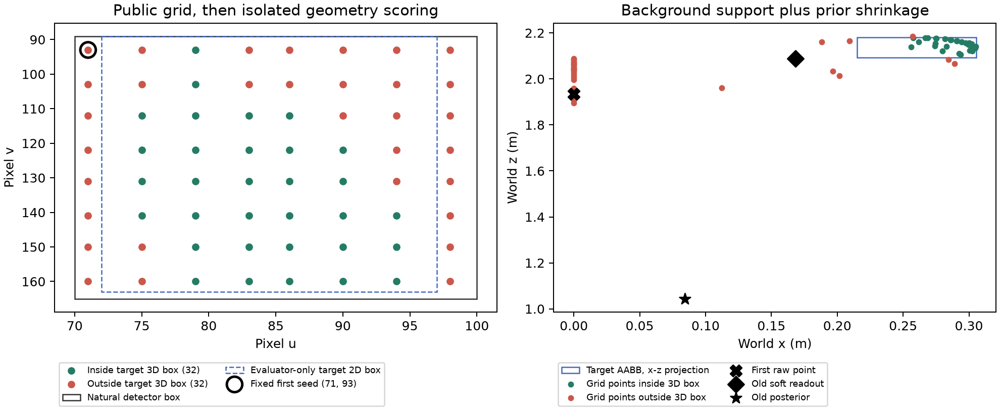

# 位置校准完成首轮开发比较，尚不足以替换默认模型

交付：[草稿 PR #94](https://github.com/goneveitvet240-svg/cpswm/pull/94)，叠加PR93，未合并。代码与完整证据提交 `cfc70b4779a6847a5d25ae1739683aec06de4287` 已推送；功能仍为 `27d396d6db4c248992f37285d3b7ad42b20df408`。本次追加仅确认交接链接，不改变已验证源码。

用户已批准检查自然表面对应、分离训练与评测、校准位置先验及误差并保留旧对照。身份＋位置联合成功、可复查位置、真实三维包围盒开发判据继续有效；不再等待这些授权。完整统一框架、三个 RB 块、七算子及其余研究范围保持。

分支 `codex/pc-a-position-calibration-20261002`，base `5073311fbd9aa5cdc0520876d2b34b02ab92c8b1`（PR93）。核心拟合与比较实现 `4d1082a16ed043bddb88747b1832cd6dfedafacc`；最终功能提交 `27d396d6db4c248992f37285d3b7ad42b20df408` 仅追加评分账本防覆盖保护及其检查。以下实数据最终 run/fresh 均在最终功能提交执行。开工 fetch 成功，集成 `19ddf26830348a2f0b33f0af54d6ba702c5cfb1c`，B `fd4ca6ef5e81c90d7cf7987b42c0b2810d8a810a`；未修改集成、STATUS_B或原用户工作树。

新增模块只提供隔离的开发拟合与数学比较，**未登记为 Native 生产 profile，未更换默认先验、位置误差或种子选择**。模型比旧受控收缩模型好，但在已批准的位置分项上仍明显弱于原始表面读数；当前自然实例对应也没有解决。原计划“通过后再接入”的条件尚未满足，不把本轮称为完整更新链路交付，也不把自然对应路线删去。

## 自然 WineBottle 失败的原件诊断

旧真实相机归档在原冻结源码 `ccccacc8ced5245ee6c38b2466632bac37d37cd0` 下恢复，由独立脚本重建自然检测框、公开网格和读数；未篡改来源摘要来让旧 SQLite 适应新源码。公开输出落盘后才读取 SDK 评估几何。两次新进程的 public/result 文件逐字相同，原始数据库不改写，恢复副本中的 checkpoint 在探针前后不变，新动作数0。

自然框 `[70,89,100,165]`，评估二维框 `[72,89,97,163]`。64个公开网格点中48个在二维框内，32个反投影点在目标真实三维盒内；这不等于32次独立观测。固定规则选择首个有效像素 `(71,93)`，其点约 `(0.0000013,1.1561,1.9352)`，在目标外。原常数亲和权重下的软读数约 `(0.1683,1.0618,2.0879)`，仍在目标外；受控 `N(0,I)` 先验再把后验拉至约 `(0.0842,0.5309,1.0440)`。不能用真值从32个点里挑出“成功点”替代实际选择。

原归档的 `004-mask.npy` 是最初 Apple 查询的 mask，**不是 WineBottle mask**，因此这里只检查二维框与三维包围盒，不声称独立裁定了像素实例身份。旧 live 的 soft affinity 为常数权重，离线数据使用已训练亲和模型，两者不可冒充同一个读出分布。

## 固定数据、拟合方式与权限边界

复用上一轮已经封存的96帧全部公开读出，验证父轮两份成功 run/replay 账本及302份文件摘要。训练固定屋1–8，验证固定屋9–12；这些验证屋已经开发曝光，且资产可能共享，**不是新独立 holdout**。本次没有重新采集96帧、重新训练检测器或重跑完整历史父链。

64训练帧中25帧无候选，32验证帧中13帧无候选，完整帧清单保留。每个模型使用同样2004条合格训练 seed，来自8屋、57对象、67对象帧。按屋→对象→对象帧→seed逐层等权，拟合相机坐标中目标参考和读出残差的总体矩；秩不足直接失败，不补协方差地板。本轮六模型均成功拟合。分布拟合不等于概率覆盖率校准，artifact 明确 `coverage_calibrated=false`、`natural_identity_authority=false`。

三个读出分别为裸像素点、已训练 soft affinity、uniform；保留 AABB 中心和 SDK transform 两种既有参考。后验对照固定为旧 `N(0,I)`＋单位世界误差、仅新先验、仅新误差、两者同时更新。原始读数另列为基线，没有把某个验证赢家自动提升为默认。两个参考不改变用户批准的 AABB 位置成功判据。

残差同时包含表面到参考位置的差异、混合邻域和深度误差，不能解释为纯传感器位姿噪声；先验也仅代表本训练面板中可见且有合格标签的对象分布。

初始相机位姿只用于把训练先验从相机坐标转到世界坐标，不接收目标真值或目标像素。新误差的多帧数学接口使用旋转后的观测矩阵和相机轴中的共享残差；`rho=0.5` 沿用显式受控假设，**没有在本轮数据中估计时序相关性**。固定面板实际比较每条读出的单次后验；多帧部分仅有独立联合高斯数值检查，不能拼接成自然连续更新或主动观察收益。

prepare/训练/公开预测/评估为分开的进程入口：拟合器只接受1–8屋训练行，冻结模型和公开预测后才评分验证标签。数据隔离是程序入口与输入依赖隔离，不是防恶意进程访问磁盘的沙箱。模型另绑定公开读出 profile 摘要，防止将训练 soft 的残差用于常数 soft。内容摘要绑定数据版本，不能自己授予来源或自然身份权威。

## 开发位置分项结果

固定首个公开有效 seed 的验证面板有78条公开记录，只有23条有合格位置标签，涉及15对象、15对象帧、4屋；其余55条未裁定，不从公开分母删掉。下表是23条可评分记录中落在其离线标签对象 AABB 内的数量，**标签对象由 seed 的离线 mask 对应确定，不证明它就是任务想找的物体**。因此不能称为身份＋位置联合任务成功率。

| 公开读出 | 拟合参考 | 原始读数 | 旧模型 | 仅先验 | 仅误差 | 两者 |
|---|---|---:|---:|---:|---:|---:|
| 裸像素点 | AABB中心 | 22 | 1 | 5 | 8 | 12 |
| 裸像素点 | SDK变换位置 | 22 | 1 | 6 | 4 | 7 |
| soft affinity | AABB中心 | 19 | 0 | 4 | 4 | 6 |
| soft affinity | SDK变换位置 | 19 | 0 | 5 | 3 | 7 |
| uniform | AABB中心 | 19 | 0 | 4 | 2 | 4 |
| uniform | SDK变换位置 | 19 | 0 | 5 | 2 | 5 |

例如 soft/AABB 同时更新为6/23可评分、6/78全部公开记录；原始 soft 为19/23、19/78。前者中心 RMSE 约0.815m，原始 soft 约0.866m：**中心误差略降与包围盒位置成功退化同时发生**，不能用 RMSE 掩盖已批准成功指标的退化。

全部seed也保留：验证4968条公开seed、1664条可评分；裸点/soft/uniform原始命中1597/1345/1079，AABB参考同时更新为865/408/272。它们是强相关的网格样本，既不是1664项独立任务，也不能作为主动观察有效样本量。训练/验证、双参考、四消融臂、全部/首seed、未知与空帧均见 `evidence/report.json` 和封存逐行数据。

结果说明：新先验缓解了旧世界原点收缩，但当前“总体目标参考位置＋总体残差”的模型未保住表面点读出的盒内成功。此结果和 WineBottle 错误首点共同阻止默认替换；没有通过放宽盒、换验证seed、删VOID或增加预算制造成功。

## 验证、复现与剩余工作

最终新增边界/数学检查27项通过，包含独立矩、坐标变换、联合高斯等价、分区伪造、读出错配、外部pin、完整重签坏面板、保留空帧/未知、含边界评分、失败重试和既有账本防覆盖。旧报告/连续事务的回归及源码一致性见 `VALIDATION.md`，该范围仍是电脑A局部验证，不是B独立或全仓统一验收。

最终两个新进程链的 models/predictions/report/scored-rows 逐字一致，且追加防覆盖保护前后数值产物相同。另一脚本不导入新实现，按逐层均值与二阶矩、协方差形式高斯更新独立核对6模型/12分布、269760预测点、120组公开分母/可评分分母/盒内计数，全部一致。它复用封存输入，**不是独立原始采集验收或身份裁定**。

本轮已完成授权的表面诊断和首轮训练/验证分离校准比较。下一工程门槛是让目标的公开表面支持稳定对应正确自然实例，保留无法对应/跟踪丢失，并验证适合已批准表面报告任务的误差模型；随后才接新的可撤回 Native 更新与联合动作效用。已有旧受控多次更新、回滚/撤回/重放能力保留。本轮没有接入新校准到该事务，没有同任务/同动作预算主动比较，没有后续记忆收益实验；完整三阶段目标仍未完成。
