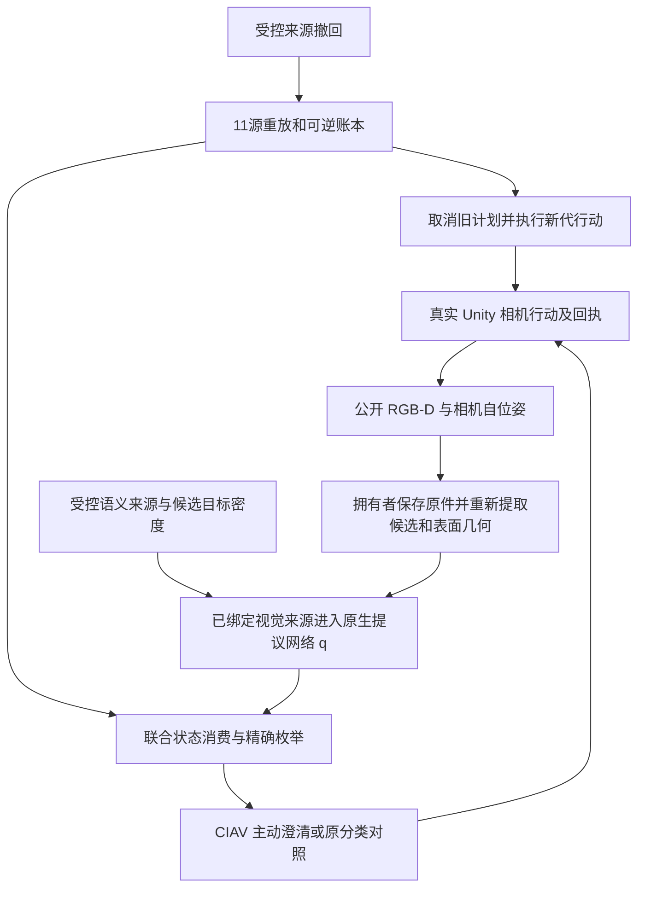

# 当前 pipeline 与主干缺口（2026-09-30）

读取本页时绑定测试源码053b27851c2f935e4de8fb00b0bee4dd9f294821，生产代码与PR66实际仿真源码c87b6bb1e3c72986afe517f7f29ebf3d028f2283相同。本页是本轮实际代码/证据快照，不替代共享集成状态；草稿栈未合并，B尚未独立验收。

| 环节 | 已有可检查证据 | 尚未证明的部分 |
|---|---|---|
| 相机输入 | 同次动作拥有的RGB、深度、自位姿；恢复时原件绑定和几何重算 | 理想自位姿不是实际机器人定位误差模型；渲染/碰撞面差异未消失 |
| 候选与几何 | 框/类别及框内表面点进入原生输入；相机移动会重置纯图像IoU关联 | 表面点不是物体中心，框轨迹不是世界身份；类别混淆仍在 |
| 神经提议 | 真实网络在重放中调用11次；去除视觉或几何时q可变化 | 当前checkpoint是受控开发组件；不是自然联合模型训练 |
| 联合密度 | 保留完整既定状态范围和未决项；拥有者重推拒绝完整假视觉证明 | run_history_action_loop.open_joint仍使用OpenWorldJointFixture；在有限精确枚举中q抵消，改变q不会自动改善后验 |
| 行动与纠正 | 同一物理历史受控撤回后取消旧READY，Pass后继续观察；动作、视图、证明和账本可异目录完整恢复 | 受控来源撤回不等于自然接触/释放/人物反证；本轮无物体操作 |
| 评价与交付 | 三次真实观察最终未决0.9754404356085137；两种完整自洽假动作报告被拒绝 | 没有自然任务成功或长期泛化结论；完整CI和B验收单列 |

主要实现入口：tools/run_history_action_loop.py、src/cpswm/system/native_visual_source.py、owned_visual_support.py、native_neural_production.py、structure_two_joint_consumption.py、joint_camera_policy.py、checkpoint_artifacts.py。流程保留H/R/I/C/Z/r/V、三个RB块、七算子以及原RGB/分类对照；上述证据不等于各项都获得自然输入监督。

当前视觉源重放使用不可变发布截止点；PR64的11次重放均读取1帧/4候选/12表面点。后续相机返回仍经既有类别反馈，直到下一次语义发布，不能声称每个新像素已触发完整自然联合更新。

下一项科学主线是用自然观测支持的实例/位置候选及观测因子替换受控密度。具体离线仿真监督方案见[用途选择](../owned_visual_neural_2026-09-30/CALIBRATION_DECISION.md)：固定房屋/目标资产隔离训练验证，标签在线禁入。该用途扩展仍待答复，未执行私有标签训练或校准。当前可继续的主干工程是修复完整回归失败并交付可复核版本，不能靠增加同一图像的重复帧或调小未决先验制造成功。

## 本轮交接栈

| 草稿 | 已交付的主要内容 | 实际方法/核验源码 |
|---|---|---|
| [PR63](https://github.com/goneveitvet240-svg/cpswm/pull/63) | RGB-D/自位姿来源绑定、投影与轨迹核验 | 采集dacc6c6cf070225fbc5b13ce351f1487636f6ec8，核验修复2ff55ee5b69f27b963d389c5ecccd0044f2d7373 |
| [PR64](https://github.com/goneveitvet240-svg/cpswm/pull/64) | 拥有者视觉来源进入神经提议及相机运动关联修复 | 30d57a0ba7df824ab7fb6fc955e5deacb404f256 |
| [PR65](https://github.com/goneveitvet240-svg/cpswm/pull/65) | 按内容定位checkpoint，搬移后完整恢复 | 154595da9a2f033934edaeb2d490d039ece29c23 |
| [PR66](https://github.com/goneveitvet240-svg/cpswm/pull/66) | 完整环境与真实动作转换报告、完整假报告拒绝 | c87b6bb1e3c72986afe517f7f29ebf3d028f2283 |
| 当前测试修复 | 正路径观察真实调用，保留来源检查 | 053b27851c2f935e4de8fb00b0bee4dd9f294821 |

这些实际源码均为当前分支祖先，封存包实际哈希再次读取记录在inherited-handoff-chain.json。祖先关系和归档哈希一致不等于重新运行所有旧矩阵，不替代B独立复核。
