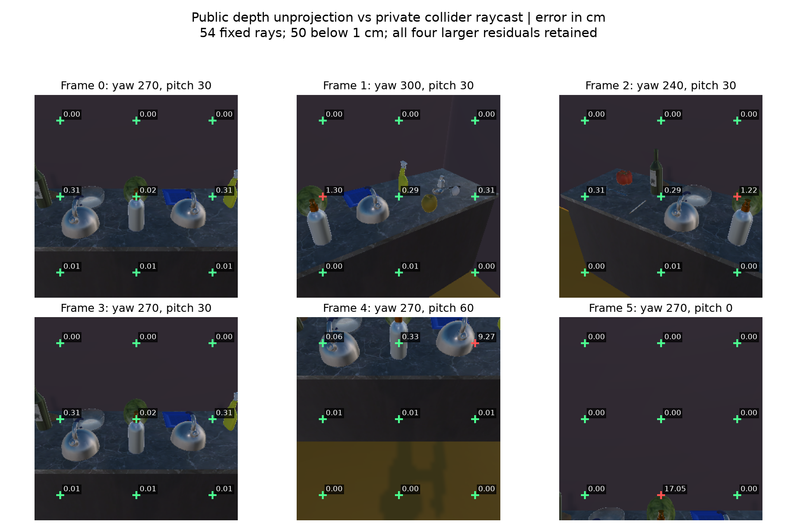

# RGB-D / 自位姿接线与真实几何核验

用户明确批准新增公开 RGB-D 与相机自身位姿，并授权本轮八小时内安排主干工程推进。保留 RGB、原分类任务和主动澄清开发任务，完整统一研究范围不变。

实际采集/方法源码：`dacc6c6cf070225fbc5b13ce351f1487636f6ec8`。随后仅几何归档验证器及其测试修复：`2ff55ee5b69f27b963d389c5ecccd0044f2d7373`。两份源码和证据的角色不可混称同一次验收；后者未改变捕获、感知、运行时或模型代码。

## 已完成的主干接线

显式 `rgbd_self_pose` 配置把同一 SDK 事件的 RGB、米制深度、相机自身位姿作为三条公开观测，通过同一动作、时间、范围和联合回执绑定，进入原有 M05/SQLite 历史。纯 RGB 默认保持。深度、自位姿、内参、单位或暴露权限不匹配均拒绝。公开响应为白名单；物体身份/位姿、分割和射线查询仅用于评价。

`visual_observation_support()` 从动作拥有的原件和绑定检测器重新计算全部保留候选及三维表面采样，包含原生代际和相同 RGB 的依赖组；不增加第二份可写记忆。世界表面坐标不等于物体中心、6D 姿态、世界实例身份或概率，不授权负观测/长期记忆写入。

对应版本的 [Depth shader](https://github.com/allenai/ai2thor/blob/f0825767cd50d69f666c7f282e54abfe58f1e917/unity/Assets/Scripts/ImageSynthesis/Shaders/Depth.shader) 使用 `Linear01Depth * (far-near)`；本轮显式近/远面 0.1/20 米，反投影先还原相机前向深度，使用像素中心与 Unity 上向 Y 坐标。[相机元数据及射线实现](https://github.com/allenai/ai2thor/blob/f0825767cd50d69f666c7f282e54abfe58f1e917/unity/Assets/Scripts/BaseFPSAgentController.cs) 对应同一二进制提交，SDK 5.0.0 源码也已读取、保存身份。没有把旧文档的毫米说明沿用到当前运行时。

## 实际结果

固定几何探针为 6 姿态（含左右旋转及俯仰）、54 个网格射线，全部保存。校正后的误差中位数 0.0493 毫米、P90 3.13 毫米，50/54 小于 1 厘米、52/54 小于 5 厘米，最大差异 17.05 厘米；未经缩放还原的中位数为 6.35 毫米。垂直射线方向的最大残差仅 1.69 微米，说明大差异主要沿视线发生；原图显示大差异位于物体轮廓。渲染深度和碰撞体射线并非同一种表面定义，因此不能把这些残差当作已校准的真实传感器噪声。

| 实际历史 | 动作/帧 | 不同 RGB | 候选 | 世界表面采样 | 最终未决 |
|---|---:|---:|---:|---:|---:|
| 北侧 Faster / RGB | 3 | 2 | 10 | 0 | 97.5440% |
| 北侧 Faster / RGB-D+自位姿 | 3 | 2 | 10 | 30 | 97.5440% |

两条历史均完成：一次受控源撤回、11 源神经重算/22 条记录、一个新代际、原 READY 左转 90 度取消，新代先原地观察再左转 90 度；每条从 SQLite 恢复后继续使用同一 Unity 进程。独立新进程的视觉评价再次恢复并核对视图、记忆、动作和源绑定，2/2 完成。它们是同机复算，不是 B 独立验收。两次启动不声称物理初态完全相同，也不以此估计传感器因果收益。

RGB-D 中的 10 个候选为 bottle 5、dining table 3、sports ball 2，没有 apple 类候选。仅在评价端查看已验证的实例掩膜后发现：两次 sports ball 框各有 2/3 采样像素落在 Apple 的渲染掩膜内，另一个落在台面。其余框也混有墙、地板、台面。这是**类别误报和框内表面混合**的直接诊断；渲染像素标签不证明透明物体的深度表面归属，更不是目标中心/身份权限。未把这些评价标签回灌模型。

自然语义转移为 0、真实物体操作为 0，候选目标密度仍由原受控 fixture 给出，类别观察似然仍是假设值。当前新增几何为主干拥有的观测支持，尚未进入原生联合提议/目标密度，不能宣称自然完整闭环或任务收益。

## 审查与可复现性

初始冻结顺序两轮 A 自审 96/44 项、零跳过，4 生产模块 mypy 与 14 文件 Ruff/格式通过。实际归档追加攻击发现：旧几何验证器接受了伪造的动作标签。该失败保留为 `geometry-archive-audit/results.json`，不并入通过数。修复绑定固定轨迹、SDK 动作回执、实际相机移动、唯一动作和因果捕获时间后，重新顺序两审 19/54 项、零跳过，合法完整归档仍通过；完整副本的伪造全优结果、错误相机、伪造轨迹、重复动作和倒序/重复时间五类均拒绝。原件逐字未改。

另发现旧 marshal 代码指纹受保留浮点常量引用影响：几何样本存活期间会误报代码变化。新增几何绑定改用稳定类型化编码，保留输出的回归测试已通过；没有宣称全仓旧指纹实现已经重写。

SDK 27 / Unity 166 文件运行前后全部一致。完整原件、命令、原始失败、源码映射和辅助分析脚本在封存包；详见 [双审](REVIEWS.md)、[复现](REPRODUCE.md) 和 [归档清单](evidence/archive.json)。依赖环境沿用本机，不是独立重建。全仓 CI、Windows/B 独立复现与旧神经证据中的绝对 checkpoint 路径仍未关闭。

下一主项是把所有候选及几何通过运行时拥有的来源接入提议网络，保留类别/身份歧义；同时保持 q 与目标密度分开。精确枚举中的 q 仍应正确抵消，不能靠修改 q、降低未决质量或标签回流制造后验收益。
