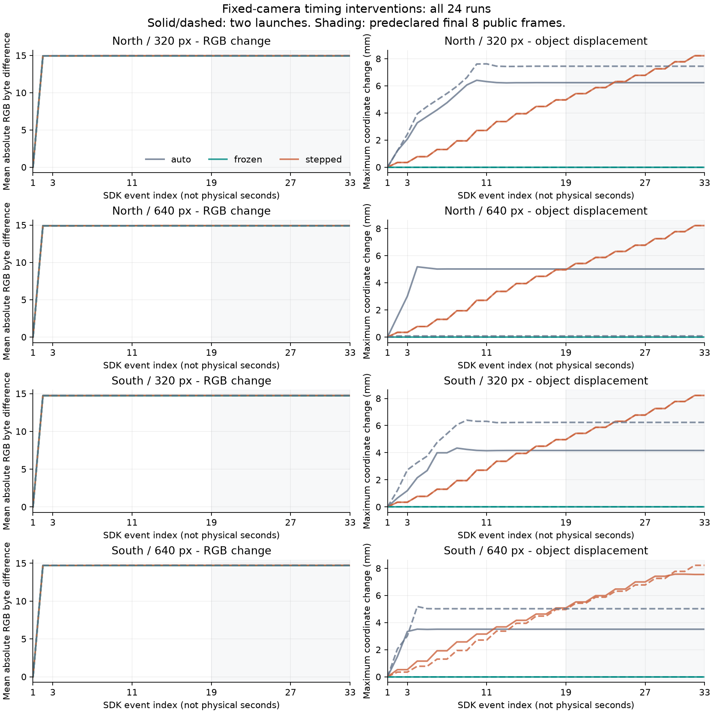

# 结构二：仿真物理时间与采集时序核验

已完成预先固定的 24 格、384 帧时序对照，以及两个前端共 768 次原图重新推理。数据与汇总一致，但图像稳定没有解决漏检/误报；下一优先项是同一批原图上的可信实例对应。不同方法分别启动仿真的闭环比较，还需要明确初始状态配对。本轮未证明方法收益或完成自然闭环。

功能源码 `a981541fc15bd1e441051f9479dc96b17cdc2f44`；分支 `codex/pc-a-sim-timing-control-20260929`，base `e80ddab4f4f792a372c1410862b071f79aebdb64`。新增两个诊断工具与两个测试文件，正式生产入口未更换。后续文档/证据提交与受测功能 SHA 分开记录。

## 做了什么

在同一房屋、同一目标资产、同一相机位姿下，交叉比较南/北位置、320/640 原始图像尺寸、auto（默认物理）、frozen（暂停物理）、stepped（每次显式步进 0.01 秒），每项重新启动两次。每格 16 个公共 Pass，私有保存初始、准备及全部时钟事件，共 34 个 SDK 事件。两个固定权重前端先消费同一公共 RGB，再读取私有数据评价；模型、过滤值及观测似然保持。

完整[采集前计划](PLAN.md)、[方法解释](METHOD.md)、[详细结果](RESULTS.md)和[复现入口](REPRODUCE.md)分别保留。后八帧是预先固定的描述性窗口，并非经验证的正式暖机门槛；384 帧是一个房屋内的相关重复，不能按 384 个独立场景统计泛化。

## 两轮审查及实际复核

| 阶段 | 实际结果 | 证据 |
|---|---|---|
| 第一轮 A 顺序自审 | 32 通过，0 跳过 | [JUnit](evidence/attempt01/round1.xml) |
| 三模式实际合法夹具 | 3 条 × 16 帧 | [命令记录](evidence/attempt01/commands.json) |
| 第二轮 A 顺序对抗自审 | 17 通过，0 跳过 | [JUnit](evidence/attempt01/round2.xml) |
| Ruff | 通过，源码保持 | [日志](evidence/attempt01/ruff.log) |
| 首批全量采集 | 23 完成、1 失败，整批非零退出 | [失败摘要](evidence/attempt01/failure-summary.json) |
| 第二批从头完整采集 | 24/24 格，384 帧 | [完成记录](evidence/attempt02/completion.json) |
| 第二批新进程原图复推 | 384 帧 × 2 模型，预测/事件/评价/汇总一致 | [验证记录](evidence/attempt02/verification.json) |
| 运行前后来源核验 | Python 源文件不变；SDK 27、Unity 166 文件不变 | [命令](evidence/attempt02/commands.json)、[运行时核验](evidence/attempt02/runtime-verification.json) |

两审含真实合法序列、完整一致伪造阳性、物理步长/返回动作/漏事件/私有几何/重封漏帧及前端依赖绑定，覆盖及局限见 [REVIEWS.md](REVIEWS.md)。均为本机局部自审；没有新增独立审核者，B 独立及统一验收未完成。

首批失败与用户确认的窗口调整/最大化相符：SDK 返回尺寸突变，分割图缓冲区无法按元数据解码。保留原失败及 13 帧完成前缀，第二批从头重跑全部 24 格，没有拼接成功格或缩放伪造原图。[事故记录](RESIZE_INCIDENT.md)在重跑前形成；重跑成功不能把整体运行可靠率写成 100%。本工具尚未实现窗口变化后的无损恢复。

## 关键发现

1. **物理冻结有效，但不能解释全部早期图像变化。** 八条 frozen 序列准备后所有已记录对象位置/旋转及相机元数据不变；准备图到最后图的 RGB 绝对差均值仍为 14.695607–14.936403（0–255 字节尺度）。随后每条序列的 16 张公共图像完全一致。记录到的位姿运动不是早期 RGB 变化的必要条件；具体渲染原因未确认。
2. **稳定图像仍有稳定错误。** 南侧 320 的 96 帧每帧均有 558 个目标像素，两个前端均未检出 apple。北侧 640 的 96 帧均无目标像素，Faster R-CNN 却每帧都有 apple 类别候选。南侧 640 为 96/96 类别阳性及框交集，但 IoU>0 只是几何描述，尚不能授予指定实例身份或任务成功。SSDLite 整批 384 帧均无 apple 候选。
3. **冻结不保证不同启动共享初始世界。** 冻结条件的 64 对同序号图像中，只有 16 对逐字相同；最大对象坐标分量差约 4.771 毫米。创建后的暂停会保留创建阶段已产生的差异。当前证据不能把分别启动的方法比较称为完全相同起点。
4. **显式步进仍有物理演化。** 每格成功返回的 16 个时间请求合计 0.16 秒，最后八帧仍有约 2.494–3.258 毫米的对象坐标分量变化；不将请求时间当作全部引擎时间，也不将固定相机当作整个世界静止。

图的横轴是 SDK 事件序号，不是秒；灰色区域为最后八张公共图像所在窗口。左列早期变化较大，后期小差异以 [详细数值](RESULTS.md) 为准。图表数据见 [plot-data.json](evidence/plot-data.json)。

## 证据交付及范围

完整本地原件：主仓 `output/sim-timing-control-20260929/`。封存快照含 7,355 个文件、3,646,844,813 字节，[逐文件清单](evidence/RAW_INVENTORY.json)明确相对路径与摘要；后续报告及交付文件不加入该快照。两个批次、三条审查夹具和失败前缀均保留。

Git 交付全量轻量结果、日志、命令、源码/运行时身份与逐文件清单，并附三条完整原始序列：`south-320-frozen-0`（漏检）、`north-640-frozen-0`（无目标像素而类别阳性）、`south-640-frozen-0`（可见且有几何交集）。这 48 帧是共享原件子集，不能替代 384 帧全量。共享清单含 468 个文件、265,181,620 字节（清单自身另计）；复制原件与本地逐字一致。[共享清单](evidence/SHARED_INVENTORY.json)可供接收方核验。全量复推在本地原件上完成，不冒称只凭共享子集完成另一台机器复现。

交付前 fetch 成功，集成仍为 `19ddf26830348a2f0b33f0af54d6ba702c5cfb1c`，B 仍为 `fd4ca6ef5e81c90d7cf7987b42c0b2810d8a810a`。采用叠加前批 A 分支的草稿 PR 交接，不自动合并，不修改 B 正式比较协议。

## 下一步与未完成项

**首先推进同一保存图像上的可信实例对应。** 保持模型及正式阈值不变，核对每个 apple 候选实际覆盖哪一个对象，将正确目标、相似物体、无目标像素及漏检分开记录；缺少可靠实例真值时不得用类别分数替代。当前时序归档包含目标掩膜及对象元数据，尚不是完整的全实例掩膜真值集；需明确复用既有完整实例快照与新增对应证据的边界。然后才能判断哪些样本可用于条件测量和观测似然校准。

后续分别启动环境的闭环比较还需可复现的初始状态配对和物理时钟协议，不能只增加重复次数。正式新模型、先验或阈值选择仍须科研决策；本轮没有训练、拟合似然或替换正式 pipeline 默认策略。自然接触/释放、人物身份、位姿误差校准、完整神经修订核、可逆长期记忆与长程行动收益、强基线和 B 验收仍未闭合。H/R/I/C/Z/r/V、三个 RB blocks、七算子及完整统一研究范围保留。
