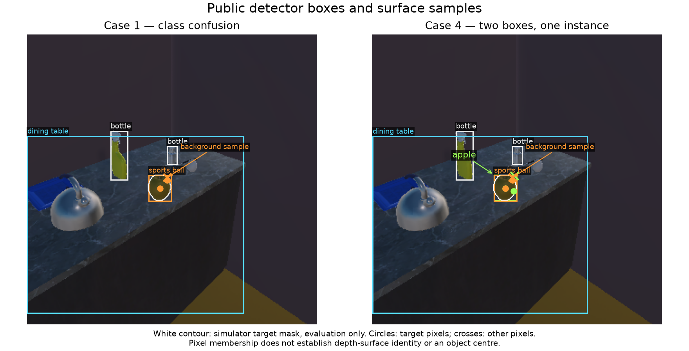

# 自然实例／位置因子：完整候选诊断

本轮补齐了自然观测因子实现前的一项实际缺口：原实例评价只统计 apple 类候选，会遗漏“苹果被报成 sports ball”以及两个类别同时覆盖同一对象的情况。新增工具从已有公开 RGB-D 原件重新运行实际检测器及表面几何，再在评价端输出全部候选 × 全部实例的交叠和原始位置位移。尚未训练、校准或将自然因子写入在线后验。

实际审查源码：`4798bd67059eb96f2128a957cfd81d1b1f5d509f`；base `c52920208c123434c556710988cbbec2119373a1`。分支 `codex/pc-a-surface-factor-diagnostic-20260930`。仅增加诊断工具及测试，src 下生产方法没有改变。公开数据和私有评价结果分别输出，标签不进入检测器输入或记忆。

## 五份固定旧归档的结果

五份均完成当前诊断工具的重新推理；输入运行前后逐文件哈希不变。这不是新启动五次仿真，也不代替各历史源码的完整闭环复算。

| 归档 | 帧 | 候选 | 表面采样 | 目标可见帧 |
|---|---:|---:|---:|---:|
| RGB-D 原接线 | 3 | 10 | 30 | 2 |
| 语义输入对照 | 3 | 10 | 30 | 2 |
| 视觉输入神经提议 | 3 | 10 | 30 | 2 |
| 可搬移 checkpoint | 2 | 10 | 30 | 2 |
| 行动报告修复 | 3 | 10 | 30 | 2 |
| 合计 | 14 | 50 | 150 | 10 |

**14 帧只有 3 组不同 RGB / RGB-D 几何输入，150 个采样只有 32 个不同的“几何输入组＋像素位置”组合。** 全部来自既有诊断场景，不能当作独立训练/验证样本或估计泛化性能。原始重复行保留，没有通过去重隐藏行动历史。

50 个候选包含 bottle 24、dining table 14、sports ball 10、apple 2。10 个 sports ball 框均覆盖目标苹果，每框三个表面采样中两个像素属于苹果渲染掩膜，一个属于其他表面。仅在可搬移 checkpoint 那份归档的两个重复帧出现 apple 框；apple 与 sports ball 两种候选同时覆盖同一苹果，不能直接计成两个独立对象或两份独立位置证据。表中目标可见 10 帧均与某个框相交，这不是身份识别成功。历史名称仅用于定位原件，不能将类别差异归因于 checkpoint 搬移或方法改动；所用前端权重相同，但图像存在差异。

这些 sports ball 框的两个前景表面采样到苹果 AABB 中心约为 5.13 / 5.70 厘米，背景采样约 22.76 厘米；apple 框的背景采样约 24.72 厘米。前景表面本来就不等于中心，这些原始距离不是已校准的定位误差。工具同时保留 SDK transform position 与 AABB center，未擅自选其中一个作为正式训练目标。

图中白轮廓来自评价端仿真实例掩膜；橙色 sports ball 与绿色 apple 为公开检测器结果。圆点属于目标渲染像素，叉号属于其他像素。渲染掩膜特别在透明表面不保证对应深度表面的同一身份。

## 审查、失败和边界

首版 `2880397e042053fe671a3e5707b4124c90fa5c71` 的受控两审为 66/48 通过，但五份真实归档全部在完整绑定检查处失败。原因是新工具把模型工件绑定与运行时完整绑定混用，并未正确覆盖撤回状态；这些日志完整留在 attempt01，未算成通过。

修复后加入真实运行时拥有者产生的合法正路径和全部非观察状态，用上述最终源码重新顺序完成 **70 / 52 passed，零跳过**。覆盖完整候选/实例矩阵、不可见实例、无候选/无深度、重复像素、同历史来源约束、完整几何与掩膜伪造、来源变动、原有神经输入、完整撤回/账本/SQLite 恢复及动作读出。Ruff 和格式检查通过。它们均为 A 本机自审，使用已冻结依赖的既有 Python 3.13.5 实体环境，不是 B 独立复核；未做全仓完成声明。

此外，真实完整归档搬移后在新进程重新推理并逐字段比较输出通过；三项完整副本攻击按预期 exit 1 拒绝：重新生成跨文档摘要的伪造表面位置报告、更新输入 pin 后的伪造完整公开几何、更新输入 pin 后同步删去不可见实例及其掩膜。攻击命令、失败回溯及副本保留。合法目录与原件未改。

清单哈希只绑定指定输入，不能证明同一仿真引擎标签具有独立真实性。若整个 SDK 标签源被另行替换且获得新的可信 pin，本工具不提供外部托管证明；测试明确保留“更改私有参考位置只改变评价，不改变公开预测”的边界。

## 下一主项

下一步仍是自然实例／位置观测模型：保留跨类别的实例歧义，处理同帧多个框和重复图像的相关性，并将前景表面与对象位置区分。需要一个有证据支持的测量模型后，才能进入原生候选目标密度及条件统计；不能只改变提议 q、降低未决质量或把框分数直接当似然。

此前已提交具体的离线仿真标签训练/校准用途选择，尚待用户答复。本轮仅评价既有材料，没有扩大标签用途，没有选择新先验/正式阈值/任务终点。完整 H/R/I/C/Z/r/V、三个 RB blocks、七算子、隐藏事件、多人物、开放世界、可逆归因及具身反馈范围保留。自然观测因子本身、自然任务收益、完整 CI 和 B 独立验收仍未完成。

复现见 REPRODUCE.md；完整结果为 case1–case5/report.json，原始交叠与位移逐行保存；analysis.json 为描述性汇总，crosscheck.json 独立核对公开输出与报告的数量。输入列表和外部 pin 在 fixed-cases.json。
