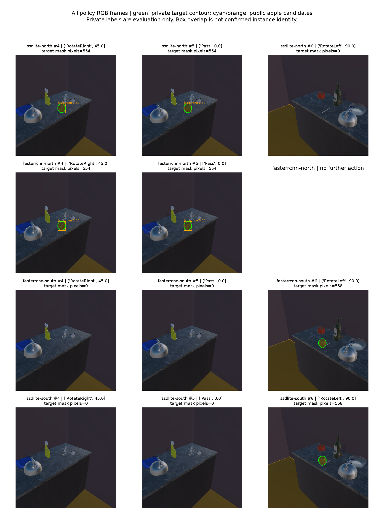

# 同历史视觉证据接线与主瓶颈定位

本轮完成了两种固定前端在同一持续历史中的创建、纠正、恢复、真实相机续接及逐图完整实例评价。**实际检出改善没有转化为目标任务完成；主线下一项应替换受控候选密度和假设观测模型所留下的缺口。** 不是自然完整pipeline或B独立验收。

分支codex/pc-a-visual-history-20260929，base 00cc5a47cad988b453d5839b63fd7c6a89f4246d，实际功能源码00283c607a5fb49c293cefe8eafd65cc2192f558。补充测试修复ac93f8d489209943cbcff9292ab483330538854b仅隔离可选依赖，顺序33/42双审重跑通过；实验方法源码不变，原件复算仍须使用00283c版本。详见[CI补充交付](CI_FOLLOWUP.md)；共享集成19ddf26830348a2f0b33f0af54d6ba702c5cfb1c、B fd4ca6ef5e81c90d7cf7987b42c0b2810d8a810a交付前fetch核验未变。

## 真实历史与同图结果

预先固定SSDLite北、Faster北、Faster南、SSDLite南4条主动澄清历史全部完成，合计11次实际策略观察。每条都使用原12源受控语义日程和既有开发检查点，接受1次受控来源撤回，重放11个保留来源/22个原生记录；同一个Unity进程在状态库恢复前后保持连续，重放不改长期账本。另一个新Python进程4/4复算了实际状态、神经推理、相机反馈及同原图双前端结果。

| 在线前端与位置 | 实际观察数 | 最终未决质量 | 本次终止情况 |
| --- | ---: | ---: | --- |
| ssdlite-north | 3 | 97.5440% | 后续预算用完 |
| fasterrcnn-north | 2 | 99.1422% | 预期效用不足而停止 |
| fasterrcnn-south | 3 | 97.5440% | 后续预算用完 |
| ssdlite-south | 3 | 97.5440% | 后续预算用完 |

三个仍有旧READY的历史均取消旧左转90度计划，重算后先原地重观测。Faster北在纠正前已经停止、旧计划为空，因此其old_pending_cancelled=false是合法分支，不能把它报告成第四次取消。四条受控长期记忆偏好位置均改变，但这些位置与真实相机世界位置尚无自然对应。

全部11份实际公共RGB都交给两个固定前端重推，共22份测量输出，再核查每个apple候选与该帧全部仿真实例的框重叠及掩膜交集。6个目标可见帧中，SSDLite覆盖目标0/6，Faster覆盖4/6；Faster的改善来自北侧，南侧目标可见帧仍漏。5个目标没有可见像素的帧，两者均无apple候选。本轮320像素结果不覆盖历史640像素Tomato误报，不能由此抹去旧失败。

同图评价控制了输入像素，实际在线两前端仍是分别启动的历史。例如北侧两次启动的原图哈希不同，不能把它们称为像素完全配对的在线试验。重复原地帧和同一房屋不同放置也不构成独立泛化样本。框覆盖是私有评价量；目标身份、物理不存在、接触/释放和长期反证均没有由类别框得到授权。

## 为什么检出改善后仍没有完成任务

Faster北真实得到两次apple候选，最终未决仍0.9914222111。纠正后下一视角的期望完整假设信息收益为0.0049356332，低于开发成本0.01，净值-0.0050643668，所以停止。该停止不是“目标找到”，少一个动作也不是任务效率收益。原分类任务仍保留并有回归，本批未重新运行原分类的物理对照。

使用实际纠正后先验（未决0.9378595877、unknown_instance 0.0610225749、known_instance 0.0011178374），独立穷举315/225两个视角四种二元测量。在原0.9/0.05/0.5假设似然下，**最有利结果的未决仍至少81.7963%，known_instance质量至多0.40545%**。乘积归一化与独立赔率公式核对一致，四结果边际概率和为1，双负结果重建实际后验。未执行组合只是代数反事实，不是新Unity运行；该界只适用于这份开发先验、两视角和假设模型，不是对完整结构二的否定。

进一步源码追踪定位到OpenWorldJointFixture/JointFixture：候选支持、条件统计、部分测量和未决未归一化质量1仍由受控夹具给出。NeuralNativeProducer实际执行了检查点推理，但当前是有限支持精确枚举，积分权重q与提议分母q按设计抵消。因此只多训练/更换提议q不会自动改变这一精确后验；不应通过删掉抵消或任意压低未决项制造成功。自然视觉候选密度、世界位置对应、事件及自然纠正输入仍须接上。

## 验证与交付范围

同一冻结功能源顺序两轮A局部自审33/42通过、零跳过；Ruff/格式通过。发现上述瓶颈后额外跑三个真实神经臂的精确枚举数学回归，3/3通过，单列不混入两轮计数。四项完整归档副本攻击分别伪造完整阳性预测和一致评价、移动等像素数实例掩膜、伪造自然闭环/校准声明、删除相机后验更新，全部按指定错误被拒绝。详见[审查](REVIEWS.md)。

SDK27个Python文件和Unity166个文件运行前后摘要不变。27条SDK记录包括4个创建后初始快照、12个明确准备动作和11个策略观察，不代表已单独插桩所有SDK内部启动步骤。冻结后对象记录中的位姿没有变化。复算与其他历史采集有并行时段，本批耗时不能作为实时延迟或公平速度比较。

[监督索引](evidence/supervision-index.json)整理了11个拥有者观测、5份不同RGB字节和1个房屋来源组，保留公共像素与私有实例标签分界，全部标为已用于开发，不给出独立holdout。新增人工接触/释放/身份标签仍为0。

完整原件326文件、289,262,814字节，压缩31,019,073字节；逐文件读回校验通过。压缩包SHA256：69ebffccc3a89638fb275ebb9fe52e2396a3ec84ccea3afde92af585401a4197。共享[原件包](evidence/visual-history.tar.gz)、[逐文件清单](evidence/inventory.json)及[外层摘要](evidence/archive.json)。本机持久位置output/visual-history-20260929。

完整仓库CI仍有两个继承测试文件的格式失败，全量测试尚未取得完成结果；B独立及统一验收仍未完成。神经证据中的检查点绝对路径仍限制旧归档跨机定位；本轮未声称Windows一键复算。复用本机锁定环境，不是独立环境重建。初次格式检查及两个外部诊断入口错误已记录，实际冻结主实验没有失败试次。完整框架、原任务对照和既有科学选择保持。

## 下一步

[具体下一步](NEXT_STEP.md)已把源代码入口和数据边界列清：优先以公共观测支持的实例/位置候选密度逐步替换受控夹具，保留无法对应和开放世界支持，再接自然事件/反证；为测量校准准备按独立场景/实例分离的数据。当前RGB-D表面接口既不估计目标中心也不提供朝向/身份，不能把这些缺失量补成常数。新先验、数据权限或正式指标选择仍由用户决定。下一轮的终点仍要追到同历史中的后验、实际动作、任务完成及长期恢复。

[复现说明](REPRODUCE.md)。本批已推送并通过[草稿PR61](https://github.com/goneveitvet240-svg/cpswm/pull/61)叠加父分支交接，未合并。
