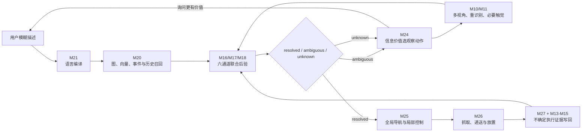

# 项目方向结构三：模糊语言联合后验、主动确认与不确定性具身闭环

版本：`v1.0`  
日期：2026-08-13  
所属总项目：Continual Personalized Semantic World Model（持续个性化语义世界模型，CPSWM）  
实现状态：`s3-2_controlled_noise_baseline + s3-3_route_independent_ingress + selected_route_contract_vertical_slice`

---

## 0. 方向定位与完整范围

方向结构三研究：

> 当用户使用模糊、时间化、人物化、关系化或功能化语言描述目标物体时，机器人如何把语言编译成可检查的查询约束，结合视觉、三维几何、事件、人物和习惯证据维护包含 `unknown` 的实例级联合后验；在证据不足时保留 Top-k 和 `ambiguous`，通过多视角、实例重识别和必要且安全的触觉主动确认，并根据 value of information（信息价值）选择下一观察点；最终把未找到、抓取失败、滑落、部分成功和未知执行结果作为带不确定性、可追溯的证据写回长期世界模型。

本结构完整保留以下六项能力：

1. 从单次语义相似度升级为“语言＋视觉＋几何＋事件＋人物＋习惯”的联合后验；
2. 使用多视角主动确认、实例重识别和必要且安全的触觉，避免单张图强行确定身份；
3. 分离 static geometry layer（静态几何层）与 dynamic object layer（动态物体层），物体移动时不重建整张静态地图；
4. 保留 Top-k、`unknown` 和 `ambiguous`，支持 abstention（拒答）和 clarification（询问澄清）；
5. 使用信息价值选择下一观察点，而不是执行固定搜索位置列表；
6. 将未找到、抓取失败、物体滑落、部分执行和未知结果作为概率证据写回，而不是写成确定事实。

### 0.1 已冻结的下一阶段技术路线

2026-08-26，项目负责人选择了 `S3-DG-09D、10D、14D、11E、12C、13D`：

- Multi-parse posterior compiler（多解析后验编译器）；
- probabilistic dynamic instance graph（概率动态实例图）；
- revision-aware neuro-symbolic evidence graph（可修订神经符号证据图）；
- Habitat + Isaac/ROS dual platform（双平台）；
- complete neighbor audit（完整邻近系统审计）；
- layered hybrid FindingDory ingress（分层混合 FindingDory 入口）。

当前完成的是这些路线的强契约和第一条可测试纵切片，不等价于真实 LLM、真实感知、
真实双平台运行或外部系统复现已经完成。所有未完成接入继续保留在推进清单中，不能因
单一平台或单一模型暂时不可用而删除人物、事件、习惯、多步确认或具身反馈范围。

结构三横跨 SP1、SP3、SP4、SP6、SP7 和 SP8，与结构一、结构二共享 M01–M32 契约。它不取代长期家庭观察和个性化习惯主线，也不创建独立、不兼容的第二套世界模型。

---

## 1. 研究对象与失败问题

### 1.1 典型查询

```text
“把我晚上经常放在床边用的那个东西拿来。”
“找昨天从书房拿出来的那本书。”
“拿一个能修车的工具，不要客人刚用过的那个。”
“找那个蓝色的、像杯子、但我通常用来放笔的东西。”
```

这些查询不能仅靠文本向量与物体标签的 cosine similarity（余弦相似度）解决，因为目标可能同时依赖：

- 具体物体实例，而非类别；
- 用户身份、拥有者或使用者；
- 时间、活动与近期事件；
- 历史位置和当前隐藏转移；
- 三维空间关系、容器和可达性；
- 物体功能、外观和个性化使用习惯；
- 当前场景中尚未建图的未知实例。

### 1.2 结构三必须防止的错误

1. LLM（大语言模型）依据常识猜出一个物体后直接写入世界模型；
2. 只按文本—图像相似度选择第一名，忽略事件、人物和习惯反证；
3. 把一帧中的高置信检测当作跨天实例身份确认；
4. 连续视频相邻帧被错误地当成多个独立证据；
5. 物体移动导致整张静态地图重建或旧地图被覆盖；
6. Top-k 截断后重新归一化，使系统隐藏未返回概率质量；
7. 没找到目标就写入“目标不在这里”；
8. 抓取失败就写入“目标不是该物体”或“目标不存在”；
9. 只最大化熵下降，忽略路径、时间、打扰、隐私和安全成本；
10. 用 LLM 生成的解释文本反向改变世界状态。

---

## 2. 总体闭环



LLM 只输出 `CompiledSemanticQuery`（已编译语义查询）或候选解释；真正的实例后验由世界模型计算。语言模型没有写入 M13–M19 的权限。

---

## 3. M21 模糊语言编译

### 3.1 输出而不是答案

语言层输出：

```text
CompiledSemanticQuery
  query_id
  utterance
  category_candidates
  attributes
  relations
  affordances
  person_entity_ids
  time_expression
  activity_candidates
  hard_constraints
  soft_constraints
  compiler_model_version
```

例如：

```json
{
  "utterance": "找我晚上经常放在床边用的那个东西",
  "category_candidates": ["phone", "glasses", "cup"],
  "relations": ["used_by", "usually_located_at"],
  "time_expression": "night",
  "soft_constraints": ["bedside", "frequently_used"]
}
```

### 3.2 约束语义

- `hard_constraints`：若证据明确不满足，则候选被排除；
- 每个候选必须对每条 `hard_constraints` 提供结构化的
  `satisfied / violated / unknown` 评估和 evaluator model version（评估器模型版本）；
  `violated` 候选后验为零，`unknown` 候选可以保留但不能直接 `resolved`；
- `soft_constraints`：改变似然或先验，不直接排除候选；
- `category_candidates`：是召回提示，不是事实；
- `person_entity_ids`：必须来自已授权的身份解析；
- 未解析指代不得静默绑定给当前用户；
- LLM 版本、提示配置和查询输入必须可回放。

---

## 4. 六通道联合后验

### 4.1 状态

对候选实例和位置维护：

\[
P(O=o,L=l,I=i,E=e,A=a,Z=z
\mid Q,Y_{1:t},G_{1:t},V_{1:t})
\]

其中：

- \(O\)：物体实例；
- \(L\)：位置；
- \(I\)：实例身份；
- \(E\)：相关观察或隐藏事件；
- \(A\)：行为者/人物；
- \(Z\)：当前习惯阶段；
- \(Q\)：结构化语言查询；
- \(Y\)：视觉和其他感知；
- \(G\)：几何与地图状态；
- \(V\)：规范事件、关系和证据历史。

候选集合必须包含一个显式的 `unknown`：

\[
\mathcal{C}=\{c_1,\ldots,c_n,c_{unknown}\}
\]

`unknown` 表示目标可能尚未建图、现有召回失败或描述无法落到已知实例。它不是普通物体节点，也不能携带伪造的位置。

### 4.2 第一版可运行基线

当前实现使用 calibrated weighted log-opinion pool（经校准的加权对数意见池）：

\[
\log \tilde p(c)
= \log p_0(c)
+ \sum_{m \in \mathcal M}
w_m r_{m,c} a_{m,c}\log p_m(e_m\mid c)
\]

其中：

```text
M = {language, visual, geometry, event, person, habit}
w_m       通道权重
r_m,c     该通道对候选的可靠度
a_m,c     通道是否有可用证据；缺失证据不能变成负证据
```

随后对全部候选（包括 `unknown`）统一归一化。

这是一条可审计、可替换的 baseline（基线），不是最终概率图模型。使用者不得把六通道默认视为条件独立；相关性通过外部校准权重、证据簇与后续消融控制。零似然在实现入口前必须按校准协议平滑为一个显式的最小正值，并记录版本。

### 4.3 后续可替换模型

在不改变契约的前提下可替换为：

- factor graph（因子图）或 dynamic Bayesian network（动态贝叶斯网络）；
- particle filter（粒子滤波）或 Rao-Blackwellized filter（拉奥—布莱克韦尔化滤波）；
- structured energy-based model（结构化能量模型）；
- neuro-symbolic probabilistic model（神经符号概率模型）；
- calibrated learned fusion（经校准的学习式融合）。

最终选择需要由匹配基线、校准、行动效用和外部有效性共同决定；本文件不替项目负责人预先固定唯一方法。

---

## 5. Top-k、unknown、ambiguous、拒答与询问

### 5.1 返回规则

输出包含：

```text
GroundedSearchResult
  Top-k candidates（保留原始后验，不对截断结果重新归一化）
  full posterior by candidate id
  posterior_mass_returned
  unknown_probability
  resolution_status
  response_policy
  channel contributions
  explanation_codes
```

第一版决策门控：

```text
unknown mass 高或高于最佳已知实例
→ status=unknown
→ active_verify 或 abstain

最佳实例低于阈值，或第一、第二名 margin 太小
→ status=ambiguous
→ active_verify 或 ask_user

最佳实例同时满足后验阈值与 margin
→ status=resolved
→ return_top_k
```

阈值必须在验证集上分别校准，并按任务风险调整；药品、隐私物品和高风险操作不能复用普通遥控器的阈值。

### 5.2 询问不是失败

如果一个低打扰问题能显著减少候选：

```text
“你说的是眼镜还是手机？”
“是你昨天用过的蓝杯子，还是床边那个白杯子？”
```

M24 可以把 `ask_user` 当作信息获取动作，与转头、绕路、开容器和安全触摸共同比较成本与收益。

---

## 6. 多视角、实例重识别与必要触觉

### 6.1 多视角确认

实例确认融合：

- 开放词汇检测和分割；
- DINO/CLIP/SigLIP 等视觉表征；
- RGB-D、点云形状、尺度和局部几何；
- 物体相对静态锚点的空间关系；
- 跨时间位置与运动连续性；
- 人物携带、放置和使用事件；
- 历史实例特征与冲突候选。

当前 `MultiViewIdentityVerifier` 按 `evidence_cluster_id` 去重。同一视频片段的相邻帧不能被当成多份独立证据；每个证据簇只采用质量最高的代表观测。

`IdentityViewEvidence.TACTILE` 本身也受授权和安全门控。即使外部绕过
`ObservationActionCandidate.TOUCH` 直接构造触觉身份证据，未授权或不安全请求也会在契约边界被拒绝。

身份只有在以下条件同时满足时才 `resolved`：

1. 独立视角数量达到要求；
2. 第一名实例后验超过确认阈值；
3. 第一与第二名 margin 超过歧义阈值。

否则保留 `ambiguous`。

### 6.2 触觉边界

触觉只在以下条件下作为补充确认：

- 视觉/几何仍无法区分；
- 触摸动作经过可供性和安全检查；
- 不涉及危险、易碎、污染、药品、隐私或未经授权对象；
- 预期信息价值高于动作、打扰和安全成本；
- 触觉传感器与预测模型在当前对象域内有校准证据。

触觉不是默认动作，也不能通过“摸起来像”覆盖明确视觉或用户反证。

---

## 7. 静态几何层与动态物体层

### 7.1 静态层

`StaticGeometryAnchor` 保存：

- 房间、墙、地面、固定家具和容器锚点；
- mesh、TSDF、occupancy map（占据图）或点云引用；
- 层级拓扑关系；
- 稳定坐标系。

静态层修改会增加 `static_revision`，但不能因为杯子移动而增加静态版本。

### 7.2 动态层

`DynamicObjectState` 保存：

- 物体实例 ID；
- 所属静态锚点；
- 当前 6DoF pose（六自由度位姿）；
- 当前局部点云和视觉特征引用；
- 状态概率和证据来源。

物体移动只更新 `dynamic_revision`。旧状态通过 M13–M15 的追加式历史保存；内存中的当前动态视图是可重建投影，不能覆盖规范历史。

当前分层地图基线要求动态物体 pose frame（位姿坐标系）与所属静态锚点 frame 一致。未知或未对齐的相机坐标系不能直接写入动态层；跨 frame 写入必须先经 M02 `FrameRegistry` 完成有效变换。

### 7.3 VIO、点云和 MPC 的位置

- VIO（视觉惯性里程计）/SLAM：估计机器人位姿、相机位姿和坐标变换，不负责物体语义识别；
- RGB-D/点云/TSDF：提供几何、遮挡、尺度、表面和抓取输入，不自行决定物体属于谁；
- VLM/检测/重识别：提供开放词汇语义和实例候选；
- 全局搜索/导航：选择房间、静态锚点和观察视点；
- MPC/MPPI：在动态约束下执行局部安全运动与轨迹跟踪，不决定语义搜索顺序。

---

## 8. 信息价值驱动的下一观察点

对观察动作 \(a\)：

\[
IG(a)=H(B_t)-\mathbb E_{y\sim p(y\mid a,B_t)}[H(B_{t+1}\mid y,a)]
\]

净价值为：

\[
V(a)=\lambda_I IG(a)
-\lambda_M C_{motion}
-\lambda_T C_{time}
-\lambda_U C_{interruption}
-\lambda_P C_{privacy}
-\lambda_S C_{safety}
\]

候选动作至少包括：

```text
move_viewpoint     移动到新观察位姿
micro_verify       小幅转头、靠近或换角度
open_container     在授权和可操作条件下打开容器
touch              必要且安全的触觉确认
ask_user           询问用户
stop/abstain       当前没有正净价值动作时停止或拒答
```

当前 `InformationGainPlanner` 使用离散观察结果模型计算期望熵下降，再扣除五类成本。它不会按预设位置顺序选择动作；即使某位置排在列表第一，如果它不能区分候选，也不会因此优先。

M24 和 M16/M09 必须使用同一版本的 `ObservationLikelihoodModel`，否则机器人会用一种检测概率规划、再用另一种检测概率解释“没找到”。

---

## 9. 不确定执行反馈写回

### 9.1 规范记录

M27 输出 `ExecutionFeedbackRecord`：

```text
action_id / action_type
target_entity / attempted_location
valid_time
outcome_distribution
task_goal_satisfied_probability
observation_opportunity_id
evidence_refs
diagnostics
```

结果不是单一布尔值，而是：

```text
success
not_found
grasp_failed
object_slipped
partial
unknown
```

例如：

```json
{
  "action_type": "search",
  "outcome_distribution": {
    "not_found": 0.80,
    "unknown": 0.20
  },
  "diagnostics": {
    "occlusion": "partial"
  }
}
```

`not_found` 必须同时绑定目标实体、尝试位置和此前记录的 observation opportunity（观察机会），才能使用视野、遮挡、距离和检测器似然决定哪一个命题获得负证据。

行动结果模型必须覆盖反馈分布中所有正概率结果。例如实际出现 `grasp_failed`、模型却只定义 `success/unknown` 时，核心投影器会拒绝更新，而不是静默丢弃失败概率质量。

`outcome_distribution.success` 表示当前 action（动作）成功；它不自动等于整个取物任务完成。`task_goal_satisfied_probability` 单独表示当前反馈支持任务目标已经完成的概率，并且不得高于动作成功概率。例如导航成功只能推进任务图，不能使取物闭环提前结束。

### 9.2 后验更新

对目标是否存在于位置 \(l\)：

\[
P(X=1\mid f,a)
=\frac{P(f\mid X=1,a)P(X=1)}
{P(f\mid X=1,a)P(X=1)+P(f\mid X=0,a)P(X=0)}
\]

其中 `ActionOutcomeLikelihoodModel` 必须在相应机器人、传感器、抓取器和环境域校准。

这保证：

- “未找到”通常降低目标在该处的概率，但不会自动降为零；
- “抓取失败”可能来自定位、碰撞、抓取姿态、硬件或物体性质，不能直接否定身份；
- “物体滑落”表示机器人自身造成了潜在位置变化，需产生新位置候选和后续搜索；
- 部分成功和未知结果保持概率质量，不伪造确定事实。

规范反馈追加到 M03/M13–M15；`FeedbackBeliefUpdate` 是可删除、可重放、可重建的 M16 派生投影。

---

## 10. 记忆可靠度与遗忘接口

结构三直接采用总纲的原则：

> `time since last seen（距上次看见的时间）` 与 `category stability（类别通常稳定性）` 只是先验变量，不等价于当前记忆可靠度。

当前状态可靠度应取决于：

```text
原始观测质量
+ 实例身份后验
+ 机器人定位与坐标不确定性
+ 后续人物和物体事件
+ 未观测携带、放置和交接候选
+ 视野、遮挡、容器状态和检测似然
+ 正证据、已验证负证据和冲突
+ 人物条件化习惯和当前习惯阶段
+ 证据独立性
+ 用户纠正、权限和模型版本
+ 机器人自己的行动结果
```

M19 必须分别处理：

- `uncertainty_growth`：当前状态概率扩散；
- `contradicted`：被后续证据反证；
- `superseded`：被有来源的新版本替代；
- `historical`：仍作为过去事实保留；
- `habit_regime_change`：习惯阶段改变；
- `archived`：存储层归档；
- `deleted`：授权/治理删除并触发派生重建；
- `true_forgetting`：经过明确策略判定后降低可用性，但不篡改历史。

当前实现增加 `MemoryReliabilityProjector`（记忆可靠度投影器）。它从 prior odds（先验赔率）出发，以经校准且按独立性降权的 likelihood ratio（似然比）融合：原始观测、实例身份、定位对齐、介入事件、条件化转移生存率、观察机会、习惯阶段、执行反馈和用户纠正。输出为：

```text
fresh / stale / uncertain / contradicted / historical / superseded
+ posterior_current_probability
+ factor contributions
+ lifecycle action
```

原始 `seconds_since_last_direct_observation` 只用于区分呈现层的 `fresh/stale`，不参与后验计算。同样的校准证据无论记录年龄是多少，得到相同当前状态后验；若要表达“过去十天里物体可能被移动”，必须由带人物、物体、活动、情境和时间间隔的 `TRANSITION_SURVIVAL` 模型提供似然，而不是直接套一个统一指数衰减。

实现使用 stable logistic（稳定逻辑函数）和 log-domain likelihood ratio（对数域似然比），合法的极端概率不会因 `exp` 或先除后取对数而溢出。

结构三不把简单的指数时间衰减升级成项目主方法。后续模型必须通过 calibration（校准）、action utility（行动效用）、长期外部有效性和 matched-baseline（匹配基线）检验。

---

## 11. M01–M32 接口映射

| 能力 | 主要模块 | 结构三接口 |
|---|---|---|
| 传感器与标定 | M05/M06 | RGB、RGB-D、点云、IMU、触觉及质量元数据 adapter |
| VIO/SLAM | M07 | 位姿、协方差、跨 session 坐标变换 |
| 静态/动态分层地图 | M08 | `StaticGeometryAnchor`、`DynamicObjectState` |
| 观察机会和负证据 | M09 | `ObservationLikelihoodModel`、视野和遮挡 |
| 开放词汇感知 | M10 | 六通道中的 visual/geometry likelihood provider |
| 实例重识别 | M11 | `IdentityViewEvidence`、多视角身份后验 |
| 人物与事件 | M12 | person/event likelihood provider |
| 规范证据 | M13–M15 | 查询所读关系、事件、来源和执行反馈 |
| 联合后验 | M16 | `JointPosteriorRequest/Result` 派生投影 |
| 习惯与隐藏事件 | M17/M18 | habit/event/person 通道与转移先验 |
| 记忆生命周期 | M19 | 反证、版本、阶段、归档、删除和重建 |
| 查询和语言 | M20/M21 | `CompiledSemanticQuery`、混合召回 |
| 解释与询问 | M22 | 通道贡献、证据路径、拒答与澄清 |
| 高层任务 | M23 | 搜索、询问、导航、操作的任务图 |
| 主动观察 | M24 | `ObservationActionCandidate`、信息价值规划 |
| 导航和局控 | M25 | 观察位姿执行、MPC/MPPI adapter |
| 操作和触觉 | M26 | 抓取/放置/触觉 adapter 与安全门控 |
| 闭环写回 | M27 | `ExecutionFeedbackRecord` |
| 治理、仿真和评价 | M28–M32 | 授权、受控噪声、真实轨道和指标 |

---

## 12. 工程目录与当前搭建结果

```text
src/cpswm/contracts/grounded_search.py
  结构三全部公共契约

src/cpswm/world_model/grounded_search/
  joint_posterior.py        六通道联合后验基线
  identity_verification.py 多视角与触觉建议
  layered_map.py            静态/动态分层地图
  active_verification.py   信息价值选观察动作
  execution_feedback.py    不确定执行反馈投影
  feedback_replay.py       M03 规范反馈的重启回放与目标—位置派生信念重建
  memory_reliability.py    证据条件化记忆可靠度与生命周期投影
  oracle.py                M29-L0 真值编译、候选、观察、执行和结果模型 provider
  pipeline.py              后验、主动观察、执行反馈写回与再规划闭环

src/cpswm/system/evaluation_operations/direction_three_oracle_suite.py
  17 情境 S3-1 真值套件、五维真值注入与机器可读指标

src/cpswm/system/evaluation_operations/direction_three_dataset.py
  统一 episode 契约、评价器真值隔离与跨 split 泄漏门

src/cpswm/system/evaluation_operations/direction_three_controlled_noise.py
  S3-2 六通道受控噪声变换与 60-case 基线

src/cpswm/system/evaluation_operations/direction_three_metrics.py
  检索、开放集、校准、选择性风险、任务、恢复与成本统一指标

src/cpswm/system/evaluation_operations/real_data_adapters/findingdory.py
  FindingDory 官方八列 metadata adapter、缺失字段与可用性审计

src/cpswm/system/evaluation_operations/direction_three_prediction_cache.py
  split、episode 内容、模型版本和校准域绑定的 evidence prediction cache

src/cpswm/system/evaluation_operations/direction_three_comparison.py
  外部／内部方法同数据、同候选集、同动作成本预算的公平比较门

tests/test_direction_three_grounded_search.py
  77 项结构三契约、算法和闭环测试

tests/test_direction_three_oracle_suite.py
  13 项多情境覆盖、manifest、组合真值维度、失败语义和 CLI 测试

tests/test_direction_three_dataset.py
tests/test_direction_three_controlled_noise.py
tests/test_direction_three_metrics.py
tests/test_direction_three_findingdory_adapter.py
tests/test_direction_three_prediction_cache.py
  数据隔离、受控噪声、统一指标、真实数据边界和缓存防泄漏测试

apps/direction_three/run_grounded_search_vertical_slice.py
  S3-0 单轮决策示例

apps/direction_three/run_grounded_search_oracle_closed_loop.py
  S3-1 M29-L0 真值闭环示例

apps/evaluation_runner/run_direction_three_oracle_suite.py
  S3-1 多情境真值套件与 JSON 报告入口

apps/evaluation_runner/run_direction_three_controlled_noise.py
  S3-2 受控噪声与统一指标 JSON 报告入口

apps/evaluation_runner/prepare_direction_three_findingdory.py
  FindingDory JSONL、Dataset Viewer JSON 与可选 parquet metadata 入口

apps/direction_three/replay_execution_feedback.py
  从序列化 M03 规范日志重建目标—位置派生信念

apps/evaluation_runner/validate_direction_three_comparison.py
  在读取 evaluator-only truth 前校验外部／内部方法的公平比较绑定
```

### 12.1 当前已实现

- 六通道必须全部显式出现，缺失通道通过 `availability=0` 表示；
- 每个硬约束必须具有候选级结构化评估；违反者被排除，未知者不会被强制确认；
- 候选先验与后验包含唯一的显式 `unknown`；
- Top-k 截断不重新归一化，保留完整后验和返回概率质量；
- `resolved / ambiguous / unknown` 与 `return / verify / ask / abstain` 契约校验；
- 多视角按证据簇去相关，视角不足时不确认身份；
- 视觉不足且满足安全门控时可建议触觉；
- 触觉身份输入本身也强制检查授权与安全，不能绕过观察动作契约；
- 静态几何和动态物体使用独立 revision；
- 离散 observation model（观测模型）上的期望信息增益与成本规划；
- M24 规划动作和 M16 观测更新使用同一 observation likelihood model ID、
  calibration domain（校准域）和候选条件似然；不一致时拒绝更新；
- `touch` 和 `open_container` 必须携带授权、可供性安全判断、风险阻断项、
  校准域和证据引用；仅有动作标签不能绕过安全门；
- `not_found / grasp_failed / object_slipped / partial / unknown` 概率反馈；
- 执行反馈可作为 M03 规范记录追加，M16 派生后验不会改写原记录；
- 搜索反馈的 action-outcome model version（行动结果模型版本）和 calibration domain
  已进入规范 M27 记录；重启后必须使用完全相同的模型绑定从 M03 日志重建目标—位置概率，
  缺少初始快照先验、观察机会或模型版本时 fail closed；
- M29-L0 oracle provider 已串起
  `ambiguous → 选择观察 → 规范观察写入 → 重新后验 → resolved → 执行 → M27 写回`；
- `not_found` 可通过校准行动结果模型降低当前候选概率，并触发下一候选再规划；
- `not_found` 必须绑定目标、位置和真实观察机会；行动结果模型必须覆盖全部实际正概率结果；
- action success（动作成功）与 task-goal satisfaction（任务目标满足）已分离；只有搜索类反馈用于更新目标存在概率，抓取失败不会被误写成目标不存在；
- oracle 闭环拒绝跨 household、session、trace 的观察和执行证据；
- 记忆可靠度按校准证据似然比更新，原始年龄不能直接降低后验或删除记忆；
- 极端似然比在对数域稳定计算；动态位姿必须处于静态锚点坐标系；
- 17 个确定性 oracle 情境覆盖多人物、相似实例、隐藏移动、容器、跨时间、
  未建图目标和失败反馈；
- 3 个独立组合 probe 分别联合注入 2、3、5 个真值维度；全维组合覆盖多人、
  相似实例、隐藏事件、关闭容器、遮挡和跨时间语义轴；
- 身份、位置、人物、事件、习惯五个真值维度可以分别作为决定性证据注入；
- `ask_user / move_viewpoint / micro_verify / open_container / touch / stop-abstain`
  动作语义与六类执行结果均进入统一机器可读报告；
- 可配置的 17 情境 JSON manifest，回放结果与内置冻结情境一致；
- 统一 episode/data contract 将方法可见记录与 evaluator-only truth 结构隔离，
  绑定观察动作、结果和 selection probability，并阻断 household、scene、time group、
  trajectory 和相邻视频帧跨 split 泄漏；
- S3-2 首个矩阵覆盖通道缺失、误校准、相关性降权、identity/actor/event/habit
  错误、召回漏失与遮挡代理，共 10 条件 × 6 真值探针 = 60 cases；
- S3-2 修正版扩展扫描为 33 configurations × 6 probes = 198 cases；其中 18 个
  stochastic missingness configurations 使用冻结种子，15 个确定性 configurations
  只做一次敏感度扫描；
- known-in-support、known-out-of-support 与 true-unknown 标签分离；retrieval recall
  独立报告，Recall@k/MRR、unknown AUROC/AUPRC、ECE/Brier/NLL 与选择性风险只在
  conditional fusion set 上计算；
- 误拿指标拆分为 known-target misidentification、unknown-target false-pick 和
  overall unsafe-pick；
- FindingDory 八列 metadata adapter 接受 `task_41` 字符串格式，保留答案帧与
  `[[-1]]` 语义，并将实例、人物、事件、位置、pose、可见性和候选真值标为不可用；
  当前 fixture 已验证；新增 Dataset Viewer JSON 和可选 parquet 入口，但本环境
  2026-08-26 直连官方 row API 超时且未安装可选 `pyarrow`，真实官方行仍未落盘；
- prediction cache 按 split、visible episode hash、model version、calibration domain 和
  inference config 绑定；读取时还会针对调用方当前 dataset manifest 和全部外部期望值
  重新校验，跨数据集整包替换也会 fail closed；
- 外部系统比较必须与结构三方法共享 dataset manifest、可见 episode hash、候选 support、
  observation/execution action budget 和五类成本；test split 不得用于调参，不提供归一化
  后验的方法只能参加非概率指标，不能伪报 ECE/Brier/NLL；
- 结构三定向测试持续由 CI 统计，不在文档中冻结一个会漂移的数字。

### 12.2 已搭建但尚未接入真实实现

以下均已定义契约或 adapter 边界，但当前不宣称真实硬件完成：

- 真实 LLM 到 `CompiledSemanticQuery` 的受约束调用与准确率评价；
- Grounding DINO/SAM2/VLM 等实际 visual likelihood provider；
- VIO/SLAM、RGB-D、点云和 TSDF 实际地图 adapter；
- 跨天实例重识别模型与真实标定；
- 触觉硬件、触觉预测模型与安全策略；
- ROS 2 导航、MPC/MPPI 和机械臂执行；
- 真实世界 action outcome likelihood（行动结果似然）校准；
- 长期家庭数据上的外部有效性验证。

当前状态只能称为：

```text
s3-2_controlled_noise_baseline
```

不能称为：

```text
validated_real_robot_system
deployed_household_robot
```

---

## 13. 评价协议

### 13.1 查询与联合后验

- known-target retrieval recall；仅在 target in support 时计算 object-instance
  Recall@k、MRR、Top-k accuracy；
- `unknown` AUROC/AUPRC 和 open-set risk；
- ambiguous detection accuracy；
- selective risk / coverage（选择性风险/覆盖率）；
- ECE、Brier、NLL；
- 询问正确率和不必要询问率；
- 每通道缺失与误校准下的鲁棒性。

### 13.2 实例确认

- 跨视角、跨房间、跨天 re-identification accuracy；
- ID switch rate；
- 单帧、多视角、多视角＋事件、多视角＋必要触觉消融；
- 证据相关性重复计数造成的过度自信；
- 相似实例误拿率。
- known-target misidentification rate、unknown-target false-pick rate、overall
  unsafe-pick rate；

### 13.3 地图与行动

- 静态地图不必要重建次数；
- 动态对象更新延迟和位置误差；
- 每次确认的信息增益、移动成本和打扰成本；
- correct-instance retrieval success；
- 搜索时间、路径长度、SPL；
- 抓取失败、滑落和未知状态后的恢复成功率；
- 写回前后信念与后续任务效用变化。

### 13.4 必须报告的基线

```text
text-image similarity only
language + visual
language + visual + geometry
latest observation map
static open-vocabulary 3D map
dynamic map without person/event/habit
six-channel fusion without active verification
fixed search order
entropy-only verification
full value-of-information policy
oracle identity/location/event upper bounds
```

ECE、Brier 和 NLL 只作为诊断，不能单独证明方向有效。最终 go/no-go 必须看同预算下的实例检索、误拿率、行动效用和真实/半真实外部有效性。

---

## 14. 分阶段实现路线（完整范围不删减）

| 阶段 | 成熟度目标 | 交付 |
|---|---|---|
| S3-0 | contract_tested | 已完成：本文件、公共契约、概率基线、分层地图、信息价值、执行反馈和测试 |
| S3-1 | oracle | 进行中：已完成首个闭环、17 情境真值套件、3 个多维组合 probe，以及搜索失败规范日志的重启回放；仍需非搜索失败后的多步恢复及完整真实路径指标 |
| S3-2 | controlled-noise | 进行中：已完成语义修正后的 60-case 基线与 198-case 严重度／随机种子／确定性敏感度扫描；观察选择偏差估计和更大随机种子数仍待补齐 |
| S3-3 | perception_baseline | 边界继续推进：FindingDory fixture、Dataset Viewer JSON、可选 parquet 入口与外部重绑定 prediction cache 已完成；官方真实行仍因当前网络/依赖未落盘，VLM、RGB-D、点云和实例重识别离线预测取决于待选技术栈 |
| S3-4 | simulated_embodiment | 接入仿真导航、观察视点、抓取、滑落和写回 |
| S3-5 | real_robot_baseline | 接入真实 VIO/SLAM、ROS 2、MPC/MPPI、机械臂和可选触觉 |
| S3-6 | validated | 同预算强基线、长期家庭任务、校准和行动效用验证 |

这些是实现成熟度，不代表永久砍掉后续能力。S3-0 的代码不得绕过当前总项目 F0 复审阻断状态进入未授权的真实部署；结构三可以完成独立契约和基线搭建，但与主干阶段推进仍需遵守总项目审核门。

### 14.1 本轮 S3-1 推进边界

本轮没有缩小结构三的完整范围，也没有把单个方法提前指定为唯一论文路线。在首个可回放 oracle closed loop（真值闭环）基础上，已经加入 17 个确定性情境：分别覆盖身份、位置、人物、事件和习惯真值，多人物与相似实例、隐藏移动、容器、跨时间、未建图目标，五类观察动作与停止/拒答，以及 success、not_found、grasp_failed、object_slipped、partial、unknown 六类结果。`not_found` 已形成失败后再规划并最终成功的多步轨迹；其余失败类型当前验证的是“规范概率写入且不虚报完成”。机器可读报告输出任务成功、误拿、询问、动作成本、恢复及覆盖指标。

它尚不等于 S3-1 全部完成。下一轮仍需在保留六项完整能力的前提下，补齐：

- 将当前 3 个组合 probe 扩展为包含主动观察和后续执行的组合闭环；当前组合轨道
  验证的是联合后验与成功写回，不虚报为容器动作也在同一轨迹内发生；
- 为 `grasp_failed / object_slipped / partial / unknown` 补齐多步恢复，而不只验证规范写入；
- 增加实例 Recall@k、MRR、完整路径长度/搜索时间和不必要询问率，而不把当前 motion/time cost 当成真实机器人测量；
- 继续让可配置 scenario manifest 作为 S3-2 受控噪声生成器的冻结输入；
- 继续受总项目 F0 审核门约束，不把 oracle 指标外推为真实感知或机器人能力。

### 14.2 本轮 S3-2 推进边界

已完成统一 direction-three episode contract（方向三回合契约）和 evaluator-only truth（仅评价器真值）隔离；同一 household、scene、split group、object trajectory 或相邻视频区间不得跨 TRAIN/CALIBRATION/VALIDATION/TEST。首个 controlled-noise benchmark（受控噪声基准）在身份、位置、人物、事件、习惯五个真值探针与一个 unknown 探针上运行 10 个条件，共 60 cases，并使用同一统一指标层报告检索、开放集、校准和选择性决策结果。

当前 S3-2 结果只验证“噪声注入和评价管线可工作”，不证明所用噪声强度代表真实分布。
retrieval miss 现在标为 `known_out_of_support`：5 个已知目标 probe 的 retrieval recall
为 0，且不进入 fusion/open-set/calibration 指标；该条件唯一可融合 case 是原本就属于
true unknown 的 probe，因此其 conditional Top-1 不能解释为 retrieval miss 成功。

仍需补齐：

- observation selection bias（观察选择偏差）的估计目标、logging policy（日志策略）与校正方法；该项已登记为用户后续决策门，当前先保留原始选择概率字段；
- 将当前仅用于两个随机 missingness 臂的 3-seed Student-t 诊断区间扩展为足够种子数；
- candidate-set size、risk level、人物数、遮挡与时间跨度分层；
- FindingDory 真实官方 rows/parquet 接入，以及 Habitat 原始 episode schema、
  scene/time grouping 与许可边界核验；当前 fixture adapter 不足以宣称真实数据可用；
- 使用真实 VLM/GPU 推理填充现有 prediction cache；当前只完成缓存契约与防泄漏验证；
- 每个 baseline 独立重调后的 matched comparison（匹配比较）。

---

## 15. 结构三完成定义

结构三最终完成不是“LLM 猜对了一个物体”，而是：

> 对模糊描述，系统能够从真实世界模型中召回已知实例并保留未知可能，输出经校准、可追溯的多模态联合后验；当身份或位置证据不足时，不强行下结论，而是在询问、多视角、移动、开容器和必要触觉之间选择净信息价值最高且安全合规的动作；机器人搜索、导航和操作产生的成功、失败、滑落、部分和未知结果以概率证据进入规范记忆，驱动可重建的信念更新与在线重规划，同时保持历史事件、当前信念、个性化习惯和真正遗忘之间的语义边界。
