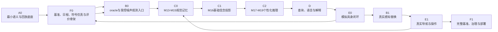
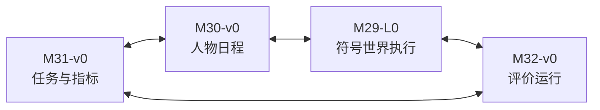
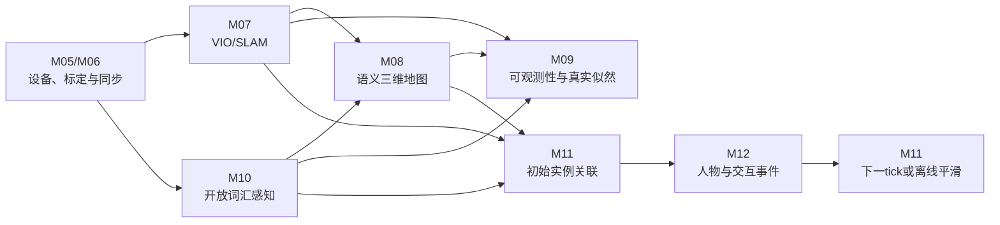

# 持续个性化语义世界模型：修改后执行步骤 v1.2

## 0. 文档定位

本文给出 Continual Personalized Semantic World Model（持续个性化语义世界模型，CPSWM）的修改后执行顺序。

本文只调整搭建次序、实现成熟度和阶段出口，不删除六层架构中的任何模块，也不预先确定数据库、消息系统、仿真平台、概率模型或机器人硬件方案。

完整范围保持为：

| 层级 | 模块 | 职责 |
|---|---|---|
| A. 公共契约与运行底座 | M01–M04 | 统一语义、身份、时间、坐标、存储和通信 |
| B. 具身观测、感知与空间建图 | M05–M12 | 将传感器与仿真数据转换成可关联的空间、语义和事件观测 |
| C. 长期世界模型、记忆与推理 | M13–M19 | 维护关系主张、事件、证据、概率信念、习惯和持续记忆 |
| D. 查询、语言与解释 | M20–M22 | 将语言转换为查询并返回可追溯结果 |
| E. 任务、搜索、导航、操作与写回 | M23–M27 | 使用世界模型行动，并把行动证据写回模型 |
| F. 仿真、数据、评价与系统治理 | M28–M32 | 提供隐私治理、长期数据、基准、评价和部署能力 |

---

## 1. 总体执行路线



以下三个模块从第一阶段开始贯穿全部执行过程：

```text
M28：隐私、授权、删除和审计
M31：任务、数据划分和评价协议
M32：测试、指标、回归、监控和版本记录
```

所有模块使用同一实现状态序列：

```text
contract_only
→ oracle
→ baseline
→ validated
→ deployed
```

阶段推进只改变模块的实现成熟度，不改变模块边界和最终能力范围。

---

## 2. Step 1：建立 A0 最小公共底座

当前 M01 Schema v0.1 已完成并通过 33 个契约测试。下一步补齐 M02–M04 的第一版，但不要求一次完成全部工业化能力。

### 2.1 M02：身份、时间与坐标语义

第一版实现：

- 全局 ID 生成与解析；
- `household_id / session_id / entity_id / observation_id / event_id` 命名空间；
- `valid_time / observed_time / recorded_time` 校验；
- 时钟来源、时间偏移和时区规则；
- `frame_id` 和坐标变换引用；
- 跨 session 时间与坐标对齐接口。

模块边界：

```text
M02：定义和管理时间、身份和坐标语义，维护frame registry
M06：估计传感器标定参数和时间偏移，并注册到M02
M11：判断两个观测是否属于同一物体实例
```

M02 不重新定义 M01 已经建立的公共字段，而是在其上提供生成、解析、对齐和变换查询服务。

### 2.2 M03：追加式事务日志与回放

第一版建立：

- M13/M14/M15 共用的全局事务序列；
- append-only（追加式）写入；
- `global_commit_seq`；
- 幂等写入键；
- 按水位读取；
- 快照和回放入口；
- canonical store（规范存储）与 derived projection（派生投影）隔离；
- 在线状态和训练数据隔离。

同时定义：

```text
ReplayManifest
  replay_manifest_id
  input_watermark
  schema_version
  code_version
  model_versions
  configuration_hash
  random_seed
  execution_mode
  created_at
```

具体存储产品在此阶段不固定。

### 2.3 M04：最小运行编排

第一版采用同进程编排接口，支持：

- command（命令）；
- event（事件）；
- handler（处理器）；
- retry（重试）；
- idempotency（幂等）；
- replay（回放）；
- trace（调用链追踪）；
- 代码、配置和模型版本记录。

ROS 2、多进程消息系统和分布式编排保留为后续实现成熟度，不成为世界模型纵切路径的前置条件。

### 2.4 Step 1 完成条件

```text
给定相同ReplayManifest和输入记录
→ 重放得到相同输出或规定数值容差内的输出
→ 每条输出都能追溯输入水位、代码、配置和模型版本
```

---

## 3. Step 2：共同建立 F0 长期实验骨架

F0 不是一次性串行开发，而是 M29–M32 共同演进。M28 同时提供最小治理能力。

### 3.1 M31-v0：Benchmark Manifest（基准清单）

定义第一版：

- 家庭、人物、物体、房间和容器范围；
- 时间长度和 session 划分；
- oracle、controlled-noise 和 real perception 三条评价轨道；
- Object Retrieval、Memory Accuracy、Habit Prediction、Memory Calibration、Adaptation 和 Explanation 任务接口；
- 数据划分和随机种子；
- 查询预算、行动预算和验证预算；
- 输出格式和指标接口。

### 3.2 M30-v0：Synthetic Human Routine Generator（合成人类日程生成器）

支持：

- 多人物身份和家庭角色；
- 日常活动序列；
- 人物—物体—活动—地点关系；
- 稳定习惯；
- 偶然异常；
- 突变和渐变；
- 客人到访；
- 家庭成员之间的物体交接；
- 可复现的日程采样。

输出 `RoutinePlan` 和 `RoutineChangeSpec`。

### 3.3 M29-L0：Symbolic World Model Simulator（符号世界模型仿真器）

实现：

- 离散事件时钟；
- 独立的 `gt.*` 真值状态；
- 人物动作和物体状态转移；
- 遮挡、漏检、混淆和观测延迟；
- 随机强制验证及其选择概率；
- 机器人观察动作接口；
- 可复现状态推进；
- `simobs.*` 有限观测输出；
- 反事实分支的基本接口。

### 3.4 M32-v0：评价运行器

实现：

- 固定随机种子运行；
- 读取 `BenchmarkManifest`；
- 记录指标和运行版本；
- 检查真值泄漏；
- 比较不同代码提交；
- 输出回归结果；
- 保存失败案例和运行日志。

### 3.5 M28-v0：最小数据治理

同时增加：

- household 数据隔离；
- 数据权限范围；
- oracle 通道权限；
- 用户纠正权限；
- 删除请求契约；
- 审计记录。

### 3.6 F0 共同演进关系



M31 可以先产生第一版任务清单，但不能一次冻结；M29/M30/M32 暴露的新需求必须通过版本化 `BenchmarkManifest` 反馈到 M31。

### 3.7 Step 2 完成条件

```text
相同RoutinePlan和随机种子
→ M29产生相同长期真值与有限观测
→ M32可以重复执行同一评价
→ 非oracle模块不能导入或读取gt.*
```

---

## 4. Step 3：建立 B0 双观测入口

oracle 和受控噪声轨道必须分离，但保持下游候选契约一致。

### 4.1 受控噪声轨道

```text
M29内部gt.*
→ noise_and_missingness_engine
→ simobs.SyntheticObservation
→ M05
→ rule-based B层适配
→ C层候选输入
```

该通路不得携带 ground-truth reference（真值引用）。

### 4.2 Oracle 轨道

```text
M29 gt.*
→ explicit oracle adapter
→ oracle_channel=true
→ M11/M12兼容候选
→ C层候选输入
```

所有 oracle 输入、输出和指标必须单独标记和保存。

### 4.3 B0 第一版组件

实现：

- M05 统一观测入口；
- M06 时间、坐标和观测质量适配接口；
- M07/M08 的符号位姿与符号地图适配；
- M09/M10 的 synthetic likelihood provider（合成观测似然提供器）；
- M11 oracle/rule-based 实例关联；
- M12a oracle 人物身份链；
- M12b oracle/rule-based 事件链。

合成观测似然必须带独立的模型类型、版本和校准域，不能作为真实检测器标定结果使用。

### 4.4 Step 3 完成条件

```text
同一仿真过程
→ 分别产生oracle轨道和controlled-noise轨道
→ 两条轨道使用相同下游候选契约
→ 两条轨道的输入、输出和评价结果严格隔离
```

---

## 5. Step 4：建立 C0 规范记忆

第一组世界模型存储模块为：

```text
M13关系主张
+ M14事件记录
+ M15证据谱系
```

三者必须通过同一个 M03 事务提交：

```text
CanonicalTransaction
  transaction_id
  relation_assertions
  event_records
  evidence_records
  global_commit_seq
  committed_at
```

实现：

- observed、reported、inferred、executed 来源隔离；
- `valid_time / observed_time / recorded_time` 查询；
- `supersedes`、撤回和纠正；
- 因果父事件和替代假设；
- 证据可靠度；
- 任意记录的来源回溯；
- 用户纠正经 M28 授权后追加写入；
- 按 `global_commit_seq` 重放。

这里的 canonical（规范）表示“权威记录入口”，不表示记录内容必然是真实世界真值。推断候选可以进入 M14，但必须保持 `inferred` 来源、替代解释和完整证据谱系。

### 5.1 Step 4 完成条件

```text
任意关系或事件
→ 能找到产生它的证据
→ 能看到其有效时间和记录时间
→ 能看到后续纠正
→ 不通过覆盖旧记录修改历史
```

---

## 6. Step 5：建立 C1 基础 M16 信念投影

先建立不依赖 M18 的 M16 基线，使隐藏事件推理能够读取一个已经存在的父信念快照。

实现：

- 实例身份竞争假设；
- 位置竞争假设；
- `held_by / inside / located_at / belongs_to` 等关系后验；
- 正证据更新；
- 负证据更新；
- `BeliefSnapshot`；
- `input_watermark`；
- incremental projection（增量投影）；
- checkpoint（检查点）；
- 删除证据后的 checkpoint 失效和投影重建；
- `projection_lag`；
- 推理、观测似然和习惯模型版本记录。

M16 只能从 M13–M15 的规范输入及相应模型版本重建，不能反向成为规范事实源。

### 6.1 Step 5 完成条件

```text
相同M13-M15输入水位和模型版本
→ 重建相同BeliefSnapshot
→ 删除M16全部投影后仍然可以恢复
→ 最高概率候选不会自动改写为直接观察事实
```

---

## 7. Step 6：建立 C2 个性化与隐藏事件推理

### 7.1 M18：隐藏事件候选

执行顺序：

```text
M16发布B_t
→ M18读取B_t和新增证据
→ M18产生多个隐藏事件候选
→ M14/M15追加inferred记录及证据
→ M16产生B_t+1
```

M18 不得直接修改 M16，也不得将最高分假设提升为无来源事实。

### 7.2 M17：人物条件化习惯

学习：

- 人物—物体偏好；
- 活动—物体关系；
- 时间规律；
- 地点转移；
- 放置、携带、使用和交接模式；
- 人物条件化状态转移先验；
- 跨 session 的长期规律。

### 7.3 M19：持续学习和生命周期

实现：

- change-point detection（变化点检测）；
- 巩固；
- 反证；
- 弱化；
- 遗忘；
- 模型版本切换；
- 训练清单冻结；
- 下一 epoch 生效。

### 7.4 C2 时间约束

```text
belief tick：
M16 B_t → M18 → M14/M15 → M16 B_t+1

training epoch：
M19检测变化 → 下一epoch训练M17 → 原子切换模型版本
```

M11/M12、M16/M18 和 M17/M19 的反馈依赖均不得在同一个 tick 或 epoch 内形成同步递归。

### 7.5 Step 6 完成条件

系统能够完成：

```text
Person_A拿起Cup_17
→ Person_A进入Kitchen
→ 系统没有观察到放下
→ M16保留多个位置假设
→ M18提出携带、放置等隐藏事件候选
→ 后续观测修正后验
→ 全部推断保留证据和替代解释
```

---

## 8. Step 7：建立 D 层查询与语言接口

内部顺序：

```text
M20结构化查询
→ M21自然语言编译
→ M22解释和纠正
```

### 8.1 M20：结构化查询

支持：

- 当前状态查询；
- 历史有效时间查询；
- 人物条件化查询；
- Top-k 候选；
- 事件、关系、信念、向量和空间状态联合检索；
- `retrieval_budget`；
- `retrieval_coverage`；
- `projection_lag`；
- unknown（未知）结果；
- ambiguous（有歧义）结果；
- 一致性读取模式。

### 8.2 M21：自然语言语义落地

只负责：

```text
自然语言
→ 结构化WorldModelQuery
```

LLM/VLM 不得直接写入 M13–M19。

### 8.3 M22：解释和用户纠正

负责：

- 证据化解释；
- 多候选对比；
- 用户澄清；
- 用户纠正入口；
- 将纠正交给 M28 授权；
- 返回纠正处理状态；
- 不让解释文本反向成为事实。

M22 的纠正入口契约可以在 M13–M15 阶段提前测试，但完整语言解释依赖 M20/M21。

### 8.4 Step 7 完成条件

```text
“找我昨天喝水的杯子”
→ 时间、人物、活动和物体约束
→ Top-k候选
→ 后验概率
→ 证据路径
→ 检索覆盖率
→ 必要时返回澄清问题
```

---

## 9. Step 8：建立 E0 模拟具身闭环

先固定 M27 写回语义，再逐步接入行动模块。

实现顺序：

1. M27 执行反馈和写回接口；
2. M23 任务规划与监督；
3. M24 搜索和信息增益；
4. M25 oracle shortest-path navigation（真值最短路径导航）；
5. M26 magic grasp/transfer/place（退化抓取、交接和放置）；
6. M29-L0 simulated action adapter（模拟行动适配器）；
7. 在线重规划。

### 9.1 观察闭环

```text
M20查询候选
→ M23生成任务计划
→ M24选择观察位置
→ M25-oracle移动
→ M29-L0改变机器人视点
→ simobs新观测
→ B0候选
→ M13/M14/M15追加
→ M16更新
→ M23重新规划
```

### 9.2 操作闭环

```text
M26-oracle操作
→ M29-L0修改真值世界
→ M27记录executed event
→ M13/M14/M15写入
→ M16重新投影
```

M27 不直接判断事实真伪，只把执行结果转换为带来源、状态和不确定性的规范输入。

### 9.3 Step 8 完成条件

系统跑通：

```text
语言查询
→ 候选检索
→ 主动搜索
→ 未检测形成负证据
→ 信念更新
→ 重规划
→ 找到、抓取或递送
→ 执行变化写回
```

---

## 10. Step 9：逐步建设 B1 真实感知

真实 B 层不是完全线性的，按依赖分支推进：



### 10.1 M11/M12 时序规约

```text
tick t：
M11根据视觉、空间和历史信息产生初始关联候选
→ M12根据轨迹和关联候选产生人物及交互事件

tick t+1或离线平滑：
M12事件一致性
→ 作为线索修正M11的后续关联
```

M11 和 M12 不得在同一个 tick 内同步递归调用。

### 10.2 Oracle 替换记录

每替换一个 oracle 实现，都在相同 M31 任务上比较：

```text
pose noise
detection noise
association noise
event-stream noise
likelihood miscalibration
→ belief / query / habit / action degradation
```

### 10.3 Step 9 完成条件

每个真实感知模块都具备：

- 独立模块指标；
- 对应 oracle 对照；
- 对应受控噪声对照；
- 下游信念影响；
- 下游查询和习惯影响；
- 下游任务效用影响。

---

## 11. Step 10：建设 E1 真实导航与操作

逐步替换：

```text
M25 oracle navigation
→ 仿真导航
→ 真实导航与局部避障

M26 magic operation
→ 仿真物理操作
→ 真实抓取、递送和放置
```

M27 在此阶段负责：

- 行动成功或失败写回；
- 部分执行状态；
- 导航中止；
- 抓取失败；
- 物体滑落或放置偏差；
- 机器人自身造成的世界变化；
- 新观测触发的重规划；
- 执行状态和世界模型水位同步。

### 11.1 Step 10 完成条件

```text
真实机器人执行结果
→ 通过M27形成带来源的执行事件
→ 进入M13/M14/M15
→ M16更新信念
→ 失败、部分成功和未知结果不被写成确定事实
```

---

## 12. Step 11：完成 F1 基准、治理和部署体系

### 12.1 M29-L1：具身物理仿真

完善：

- 家庭三维场景和资产适配；
- 视觉、深度和点云渲染；
- 物理交互；
- 导航和操作；
- 反事实分支；
- 从 L0 日程和真值事件选择性进入 L1 具身时间窗。

具体采用 Habitat、iGibson、Isaac Sim、其他平台或多平台组合，由独立 ADR 决定。

### 12.2 M31：完整长期家庭记忆基准

完善：

- 多家庭；
- 多人物；
- 跨 session；
- 跨周和跨月；
- 习惯突变和渐变；
- oracle、受控噪声和真实感知轨道；
- baseline（基线）；
- ablation（消融）；
- action utility（行动效用）评价；
- 无偏或选择偏差修正后的校准评价；
- 数据版本、任务版本和评价版本。

### 12.3 M32：评价、监控和部署

完善：

- 实验运行；
- 指标统计；
- 模型和数据版本；
- 长期监控；
- 回归测试；
- 部署观测；
- 失败案例归档；
- 性能、成本和投影延迟监控。

### 12.4 M28：完整隐私和数据治理

完善：

- 权限范围；
- 数据脱敏；
- 保留期限；
- 用户删除；
- 证据撤回；
- 受污染 checkpoint 失效；
- M16 投影重建；
- 完整访问和变更审计。

### 12.5 Step 11 完成条件

```text
同一代码、数据、模型和BenchmarkManifest
→ 可以重复运行完整长期实验
→ 可以比较oracle、受控噪声和真实感知结果
→ 可以执行用户数据删除并重建所有受影响派生状态
→ 可以把世界模型质量与实际机器人任务效用连接起来
```

---

## 13. 最终阶段汇总

| 阶段 | 主要模块 | 核心交付 |
|---:|---|---|
| 1 | M02–M04 A0 | ID、时间、最小事务日志、回放和编排 |
| 2 | M28–M32 F0 | 基准骨架、日程、符号仿真、评价和最小治理 |
| 3 | M05–M12 B0 | 分离的 oracle/受控噪声观测入口 |
| 4 | M13–M15 | 规范关系、事件和证据存储 |
| 5 | M16 | 可重建多假设信念投影 |
| 6 | M17–M19 | 习惯、隐藏事件、变化和记忆生命周期 |
| 7 | M20–M22 | 查询、语言、解释和纠正 |
| 8 | M23–M27 E0 | 模拟搜索、导航、操作、写回和重规划闭环 |
| 9 | M05–M12 B1 | 真实定位、建图、感知、关联和事件识别 |
| 10 | M23–M27 E1 | 真实导航、操作和状态同步 |
| 11 | M28–M32 F1 | 完整仿真、基准、治理、监控和部署 |

---

## 14. 当前实际状态

```text
已完成：
M01 schema v0.1
+ 公共契约
+ 33个契约测试
+ gt.*类型隔离
+ 查询预算、用户纠正和M16 checkpoint契约
+ M02-A0身份、时间、坐标和跨session对齐
+ M03-A0追加式事务日志、水位、存储隔离、快照和ReplayManifest
+ M04-A0同进程命令/事件编排、重试、幂等、追踪和确定性回放
+ M02→M03→M04联合回放验收
+ 首轮审稿阻断项修复：批内ID唯一性、稳定零水位、清单/版本/日志绑定、整数精确比较
+ 两个独立Python进程加载序列化日志的重启回放测试
+ A0 emitted-message 确定性身份、session 继承与完整运行时边界复验
+ F0 版本化绑定链：manifest v0.4、routine v0.2、policy v0.3、`synthetic-routines@0.2 / symbolic-simulator@0.8 / f0-evaluator@0.9`

当前状态：
Step 1 A0 + 首个 F0 纵切 = implemented_vertical_slice
审核结论 = BLOCK
验收状态 = not_accepted

当前只允许：
修复评价底座与 A0 回放阻断项，提交复审证据

复审放行前暂停：
多人物、访客污染、交接和变化检测范围扩展
```

这里的 A0 完成表示它已经能够支持下一条纵切路径，不表示完整 A 层的数据库、ROS 2、分布式消息和生产部署能力已经全部完成。

第一条可运行研究纵切路径为：

```text
M01/M02公共契约
→ M03追加式日志与M04回放编排
→ M31-v0/M30-v0/M29-L0/M32-v0
→ B0双观测入口
→ M13/M14/M15规范记忆
→ M16基础派生投影
→ M18隐藏事件
→ M20预算化Top-k查询
→ M23/M24/M25-oracle/M26-oracle/M27模拟行动闭环
```

随后在同一契约和评价任务下，依次提高 M17/M19、B1、E1 和 F1 的实现成熟度，直到完整 32 模块进入 validated 或 deployed 状态。
