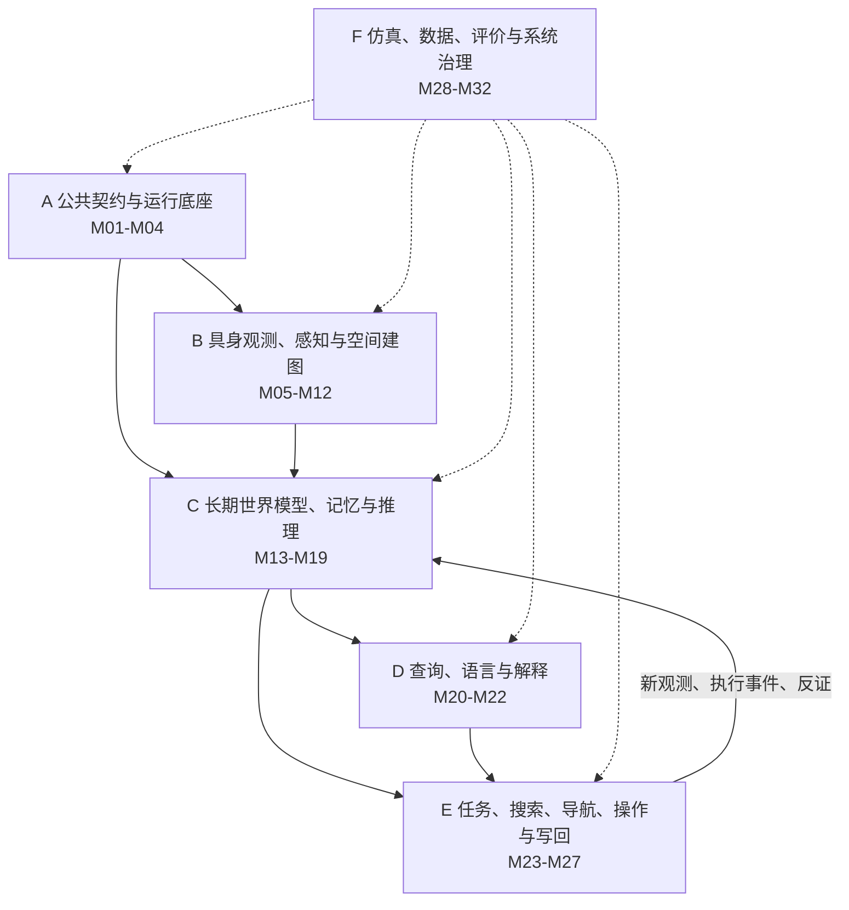
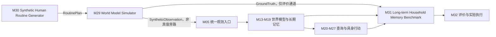

# 持续个性化语义世界模型：技术框架、模块划分与接口

版本：`v1.1`  
日期：2026-08-10  
依据：`项目总纲_持续个性化语义世界模型_v1.0.md`

v1.1 变更：

- 确认 M13/M14/M15 为规范输入，M16 为可重建的 derived projection（派生投影视图）；
- 增加循环依赖的 tick（更新步）与 epoch（训练周期）时序规约；
- 增加 `ObservationLikelihoodModel`（观测似然模型）契约；
- 增加 M29 World Model Simulator（世界模型仿真器）；
- 增加 M30 Synthetic Human Routine Generator（合成人类日程生成器）；
- 将数据与实验协议加强为 M31 Long-term Household Memory Benchmark（长期家庭记忆基准）；
- 将评价、可观测性与部署管理顺延为 M32。

v1.1 实现前纠错：

- 将公共字段拆为基础元数据、证据可靠度和后验概率三类类型，禁止所有记录共享概率字段；
- 为 `WorldModelQuery` 增加读取预算，为结果增加覆盖率；
- 将用户纠正从执行反馈中分离，并加入权限等级与权限范围；
- 将 M12 内部分为人物身份链和交互事件链，并规定 oracle/rule-based/learned 降级实现；
- 将 M29 分成 L0 符号仿真与 L1 具身物理仿真，L1 不阻塞世界模型研究；
- 增加 `gt.*` 真值类型隔离、静态依赖检查和显式 oracle adapter；
- 为 M16 增加 checkpoint、重建成本与删除失效规则；
- 为校准评价增加随机强制验证和选择概率记录；
- 区分层级依赖顺序与研究纵切路径；
- 增加 `research_role` 与 `implementation_status` 两类模块标注。

---

## 0. 本文边界

本文只完成四件事：

1. 完整保留项目总纲规定的系统范围；
2. 把总项目拆成可独立开发、测试和替换的一级模块；
3. 定义模块之间的数据契约、依赖关系和世界模型读写权限；
4. 给出按依赖关系展开的搭建顺序和工程目录。

本文不替项目负责人完成以下决策：

- 不删减总纲中的研究能力；
- 不把总项目压缩成某个最小原型；
- 不指定唯一的模型、数据库、仿真器、机器人或中间件；
- 不决定某个子项目的论文优先级和研究路线；
- 不把模块拆分等同于微服务拆分。

具体技术选型通过 Architecture Decision Record（ADR，架构决策记录）单独决定。

---

## 1. 总体结论：6 层、32 个一级模块

完整系统拆为以下 6 层、32 个一级模块：

| 层 | 模块编号 | 数量 | 作用 |
|---|---|---:|---|
| A. 公共契约与运行底座 | M01–M04 | 4 | 统一语义、身份、时间、坐标、存储和通信 |
| B. 具身观测、感知与空间建图 | M05–M12 | 8 | 把传感器数据转成可关联的空间与语义观测 |
| C. 长期世界模型、记忆与推理 | M13–M19 | 7 | 维护实体、关系、事件、概率、习惯和持续记忆 |
| D. 查询、语言与解释 | M20–M22 | 3 | 把语言转成查询并返回可追溯结果 |
| E. 任务、搜索、导航、操作与写回 | M23–M27 | 5 | 使用世界模型行动，并把行动证据写回模型 |
| F. 仿真、数据、评价与系统治理 | M28–M32 | 5 | 提供隐私治理、长期数据生成、基准、评价、部署与可观测性 |
| **合计** | **M01–M32** | **32** | **完整项目技术边界** |

“32 个模块”表示 32 个稳定职责边界。开发初期可以存在同一代码仓库或同一进程中，只有出现独立扩缩容、故障隔离或硬件部署需求时才需要拆成独立服务。

### 1.1 三十二个模块总表

| 编号 | 一级模块 | 一句话职责 |
|---|---|---|
| M01 | 领域本体与模式注册 | 统一全部实体、关系、事件、信念、查询和行动的语义 |
| M02 | 全局身份、时间与坐标 | 统一 ID、时间轴、坐标系和跨 session 对齐 |
| M03 | 数据持久化、版本与回放 | 保存原始数据和结构化状态，并支持版本化重放 |
| M04 | 运行时消息、API 与编排 | 连接在线、离线、机器人和学习任务 |
| M05 | 机器人、传感器与仿真器适配 | 把不同数据源转成统一观测 |
| M06 | 标定与时间同步 | 对齐多模态传感器的几何和时间 |
| M07 | VIO、SLAM 与定位 | 维护机器人位姿、轨迹和几何地图 |
| M08 | 三维场景与拓扑地图 | 维护房间、家具、容器和可通行结构 |
| M09 | 可观测性与负证据 | 判断哪里可见、被遮挡或本应看到但未看到 |
| M10 | 开放词汇语义感知 | 识别类别、属性、状态、功能和三维语义 |
| M11 | 实例重识别与数据关联 | 维持具体物体跨时间、跨空间的身份候选 |
| M12 | 人物、活动与事件感知 | 提取人物和物体交互事件候选 |
| M13 | 时态实体—关系主张图 | 保存带有效时间、证据可靠度和来源的规范关系主张 |
| M14 | 情景事件记忆 | 保存可查询、可纠正、可回放的事件时间线 |
| M15 | 证据谱系与审计 | 让每项主张都能回溯到观测、模型或行动 |
| M16 | 多假设概率信念投影 | 从 M13–M15 的规范输入派生身份、位置、状态、拥有者和关系后验 |
| M17 | 个性化习惯与转移模型 | 学习人物条件化的习惯和状态转移规律 |
| M18 | 隐藏事件与因果候选推理 | 推断未被直接观察的移动、放置与交接 |
| M19 | 记忆生命周期与持续学习 | 管理巩固、反证、弱化、变化点和遗忘 |
| M20 | 结构化查询与检索 | 联合查询图、事件、信念、向量和空间状态 |
| M21 | 自然语言落地与消歧 | 把时间化、人物化和功能化语言编译为查询 |
| M22 | 证据化解释与用户反馈 | 生成可核验解释并接收有来源的用户纠正 |
| M23 | 任务规划与执行监督 | 把目标分解为查询、搜索、导航、操作和验证 |
| M24 | 主动搜索与主动感知 | 选择搜索顺序、位置、视角和信息获取动作 |
| M25 | 语义导航与局部控制 | 执行到房间、家具、容器和观察视点的移动 |
| M26 | 操作、抓取、递送与放置 | 完成物理交互并生成执行状态变化 |
| M27 | 闭环写回与在线重规划 | 把行动证据写回世界模型并触发重规划 |
| M28 | 隐私、授权与数据治理 | 管理采集、访问、保留、脱敏、删除和审计 |
| M29 | World Model Simulator | 生成长期家庭世界状态、可控观测和完整真值事件流 |
| M30 | Synthetic Human Routine Generator | 生成多人物、长时间、有约束且可发生变化的生活日程 |
| M31 | Long-term Household Memory Benchmark | 定义长期家庭记忆数据、任务、划分、指标和实验协议 |
| M32 | 评价、可观测性与部署管理 | 管理指标执行、基线、消融、监控、版本和部署 |

### 1.2 研究角色与实现状态

两个字段必须分开：

```text
research_role
  core_research       项目的主要方法贡献
  adapted_research    需要自研，但可从相邻工作改造
  benchmark_research  仿真、数据与评价本身可能形成研究贡献
  integration         以成熟方法集成和接口适配为主
  architecture_core   不一定是论文贡献，但决定系统语义正确性
  infrastructure      通用工程与治理能力

implementation_status
  contract_only       只有文档和契约设计
  oracle              只有真值或退化实现
  baseline            已有可运行基线
  contract_tested     契约实现已通过测试
  validated           已通过模块与集成评价
  deployed            已进入长期机器人部署
```

`research_role` 表示当前项目定位，可以由项目负责人通过 ADR 调整；`implementation_status` 只记录仓库事实，不能用于替代研究优先级。

| 模块 | research_role | implementation_status |
|---|---|---|
| M01 | architecture_core | contract_tested |
| M02 | infrastructure | contract_only |
| M03 | infrastructure | contract_only |
| M04 | infrastructure | contract_only |
| M05 | integration | contract_only |
| M06 | integration | contract_only |
| M07 | integration | contract_only |
| M08 | integration | contract_only |
| M09 | core_research | contract_only |
| M10 | integration | contract_only |
| M11 | adapted_research | contract_only |
| M12 | adapted_research | contract_only |
| M13 | adapted_research | contract_only |
| M14 | adapted_research | contract_only |
| M15 | architecture_core | contract_only |
| M16 | core_research | contract_only |
| M17 | core_research | contract_only |
| M18 | core_research | contract_only |
| M19 | core_research | contract_only |
| M20 | integration | contract_only |
| M21 | integration | contract_only |
| M22 | integration | contract_only |
| M23 | integration | contract_only |
| M24 | adapted_research | contract_only |
| M25 | integration | contract_only |
| M26 | integration | contract_only |
| M27 | architecture_core | contract_only |
| M28 | infrastructure | contract_only |
| M29 | benchmark_research | contract_only |
| M30 | benchmark_research | contract_only |
| M31 | benchmark_research | contract_only |
| M32 | infrastructure | contract_only |

---

## 2. 总体架构



长期数据与评价链单独展开为：



系统存在两条不能断开的主链：

```text
证据进入链：传感器 → 观测 → 关联 → 事件 → 信念 → 长期记忆

任务闭环链：语言 → 查询 → 候选 → 计划 → 执行 → 新证据 → 世界模型更新
```

---

## 3. A 层：公共契约与运行底座（4 个模块）

### M01 领域本体与 Schema Registry（模式注册表）

职责：

- 定义实体、关系、事件、证据、信念、查询和行动的统一 schema；
- 定义关系方向、允许的主客体类型和时间语义；
- 管理 schema 版本、兼容性和迁移规则；
- 为全部模块生成或校验统一的数据对象。

核心对象：

- `Entity`、`Person`、`ObjectInstance`、`Place`、`Container`、`Activity`；
- `RelationAssertion`；
- `EventRecord`；
- `EvidenceRef`；
- `BeliefState`；
- `WorldModelQuery`；
- `ActionRecord`。

输入：总纲规定的概念、关系和事件词表。  
输出：版本化 schema、校验器、序列化协议。  
边界：不保存业务数据，不执行感知或推理。

### M02 全局身份、时间与坐标服务

职责：

- 生成和解析 `household_id / session_id / entity_id / observation_id / event_id`；
- 管理传感器时间、观测时间、有效时间和写入时间；
- 管理地图坐标、房间坐标、机器人坐标、相机坐标之间的变换；
- 防止不同 session、不同模块自行生成不兼容 ID；
- 支持跨 session 的时间对齐和坐标对齐。

输出：`IdentityRef`、`TimeInterval`、`FrameTransform`。  
边界：不判断两个观测是否属于同一物体；该判断属于 M11。

### M03 数据持久化、版本与回放

职责：

- 保存原始观测、结构化记录、向量、地图资产、模型输出和配置快照；
- 实现 append-only（追加式）事件记录和可重放更新日志；
- 保存世界模型 projection（投影/快照）的版本；
- 支持实验快照、数据迁移、备份、恢复和按时间查询；
- 支持训练数据与在线状态数据隔离。

推荐逻辑存储分区，但不在本文指定具体数据库产品：

```text
raw_store          原始图像、深度、点云、音视频和机器人日志
structured_store   实体、关系、事件、信念、查询和行动记录
vector_store       视觉、语言、几何和事件 embedding
map_store          三维网格、点云、占据图、房间和容器地图
model_store        模型权重、特征版本、训练元数据
audit_store        权限、删除、访问、解释和更新审计
```

边界：M03 负责可靠保存，不定义世界模型语义；语义来自 M01。

### M04 运行时消息、API 与工作流编排

职责：

- 定义同步 API、异步事件和批处理任务三类通信方式；
- 管理模块启动、健康检查、重试、幂等、超时和背压；
- 提供在线流处理与离线回放的同一入口；
- 记录每次处理使用的代码、配置和模型版本；
- 管理 ROS、仿真器、数据库和学习任务之间的适配。

核心消息主题：

```text
observation.received
pose.updated
scene_map.updated
semantic_detection.produced
association.hypothesis.produced
event.asserted
belief.updated
habit.updated
query.requested
query.completed
plan.created
action.executed
world_model.feedback
privacy.requested
```

边界：M04 只负责编排，不修改任何业务推理结果。

---

## 4. B 层：具身观测、感知与空间建图（8 个模块）

### M05 机器人、传感器与仿真器适配

职责：

- 接入 RGB、RGB-D、点云、IMU、里程计、机械臂状态和人物交互信号；
- 接入家庭仿真器和真实机器人；
- 把设备私有格式转换为统一 `ObservationEnvelope`；
- 记录传感器内外参、数据质量和丢帧信息；
- 支持 rosbag、仿真日志和离线数据集回放。

输入：设备或仿真器数据。  
输出：`ObservationEnvelope`。  
边界：不进行语义识别。

### M06 传感器标定与多模态时间同步

职责：

- 相机、深度、IMU、机器人基座和机械臂外参标定；
- 多传感器时间同步；
- 估计标定和同步误差；
- 为后续三维投影和事件时序提供质量标记。

输入：M05 原始流。  
输出：`CalibratedObservation`、`CalibrationState`。  
边界：不估计长期机器人轨迹。

### M07 VIO、SLAM 与机器人定位

职责：

- 估计机器人位姿、轨迹和位姿协方差；
- 建立局部/全局几何地图；
- 回环检测、地图对齐和跨 session 重定位；
- 输出可被对象地图使用的坐标变换；
- 保存定位失败、漂移和不确定性。

输入：M06 标定数据。  
输出：`RobotPoseEstimate`、`TrajectorySegment`、`GeometricMapUpdate`。  
边界：不判断物体语义身份。

### M08 三维场景、房间、家具与容器地图

职责：

- 建立房间、家具、表面、容器和可通行空间；
- 表达 `inside / on_top_of / near / connected_to` 等空间关系；
- 维护房间拓扑、容器层次和导航区域；
- 检测家庭布局变化；
- 为对象位置分布提供离散位置单元和连续三维坐标。

输入：M07 几何地图、M10 语义观测。  
输出：`SceneGraphUpdate`、`PlaceEntity`、`SpatialRelationCandidate`。  
边界：不维护人物—物体使用关系。

### M09 可观测性、视野、遮挡与负证据模型

职责：

- 根据相机位姿、视场、深度、遮挡和检测能力计算可观测区域；
- 区分“未观察到”“本应观察到但未检测到”“确认不存在”；
- 生成带质量的 negative evidence（负证据）；
- 估计重新观察某位置能排除多少候选；
- 产生 `p_visible_given_state` 几何可见性项；
- 与 M10 的检测响应模型联合形成 `ObservationLikelihoodModel`；
- 为 M16 的负证据更新和 M24 的信息增益计算提供同一观测似然。

输入：M06、M07、M08、M10。  
输出：`VisibilityReport`、`NegativeEvidence`、`VisibilityLikelihood`、`ObservationLikelihoodModel`。  
边界：不能仅凭未检测到就删除世界模型实体。

### M10 开放词汇语义感知

职责：

- 物体、人物、家具、容器、场景和活动的检测与分割；
- 开放词汇类别、属性、颜色、材质、状态和 affordance（可供性）识别；
- 把二维结果投影到三维；
- 输出原始模型分数、校准置信度和模型版本；
- 保留多个类别/属性候选；
- 基于验证数据提供视距、视角、遮挡、类别和传感器条件下的检测响应模型；
- 输出漏检、假阳性和标签混淆参数，供 M09 组合观测似然；
- 通过 `PerceptionCalibrationRun` 记录标定数据清单、数据域、检测器版本、分桶方法和样本覆盖；
- 生成可复现的 `PerceptionResponseProfileManifest`，不允许手工填写似然参数。

输入：M06 观测、M07 位姿。  
输出：`SemanticObservation`、`DetectionCandidate`、`PerceptionCalibrationRun`、`PerceptionResponseProfile`、`PerceptionResponseProfileManifest`。  
边界：不创建永久物体实例 ID；实例关联属于 M11。

### M11 实例表征、跟踪、重识别与数据关联

职责：

- 构建多视角视觉、几何、属性和上下文表征；
- 进行帧内、轨迹内、跨房间、跨 session 的实例关联；
- 维护 `new entity / matched entity / ambiguous match` 多种结果；
- 检测 ID switch（身份切换）和实例冲突；
- 输出多个关联假设及其概率，而不是强制单一匹配。

输入：M10 检测、M07/M08 空间信息、M12 事件线索、历史实例特征。  
输出：`AssociationHypothesisSet`、`InstanceFeatureUpdate`。  
边界：只能提出或更新身份假设，不能静默覆盖历史实体。

### M12 人物、活动与交互事件感知

M12 保持一个一级模块编号，但内部必须拆成两条可独立替换和评价的链：

```text
M12a Person Tracking and Identity（人物跟踪与身份）
  人物检测、轨迹、跨视角关联、角色和授权身份映射

M12b Interaction Event Detection（交互事件检测）
  拿起、持有、携带、放下、使用、交接、进入和离开等时序事件
```

职责：

- M12a 在授权范围内进行人物身份/角色关联；
- M12b 识别拿起、持有、携带、放下、使用、交接、进入和离开等事件；
- 识别事件参与者、物体、地点和时间区间；
- 区分直接观察事件和模型推断事件；
- 输出事件候选、人物轨迹和明确的感知质量；
- 分别报告人物身份错误、事件漏检、事件类型混淆和时间边界误差。

M12b 必须提供契约不变的三级实现：

```text
oracle adapter    从 M29 gt.* 通过显式 oracle_channel 生成候选，仅用于 oracle 轨道
rule-based        根据轨迹、接触、距离和状态变化产生规则基线
learned           使用时序视觉/多模态模型产生学习式候选
```

M17/M18/M19 的实验必须分别在 oracle、受控事件噪声和真实/学习式 M12b 输出下报告，形成 `event-stream noise → world-model degradation` 敏感性曲线。

输入：M05–M11 的人物、物体、位姿和时间数据。  
输出：M12a 的 `PersonTrack`、`PersonIdentityHypothesisSet`；M12b 的 `ObservedEventCandidate`、`EventDetectionQuality`。  
边界：不直接断言长期归属或习惯。

---

## 5. C 层：长期世界模型、记忆与推理（7 个模块）

### M13 时态实体—关系主张图

职责：

- 维护人物、物体实例、地点、活动、任务和设备实体；
- 追加保存带有效时间、来源、证据引用和 `evidence_reliability` 的关系主张；
- 区分 observed assertion（直接观测主张）、reported assertion（语言报告主张）、inferred assertion（推断主张）和 executed assertion（执行产生主张）；
- 区分有效、历史、候选、已撤回和被 `supersedes` 替代的主张；
- 提供时态主张图查询、类型校验和一致性约束；
- 维护三维场景图和社会/功能关系图之间的连接。

输入：M08、M11、M12、M14、M15，以及经 M27 写回的结构化关系主张。  
输出：`RelationAssertion`、`TemporalAssertionGraph`、`RelationAssertionView`。  
权威范围：实体和关系主张的 append-only（追加式）规范记录。  
边界：`evidence_reliability` 只描述单条主张及其来源质量，不是综合全部证据后的后验概率；M13 不保存 authoritative current belief（权威当前信念）。

### M14 情景事件记忆

职责：

- 追加保存人物—物体—地点—活动—时间事件；
- 支持事件时间线、时间窗、因果父节点和替代解释；
- 区分 observed（直接观测）、reported（语言报告）、inferred（推断）和 executed（机器人执行）；
- 将低层连续观测聚合为可查询的 episode（情景）；
- 支持事件检索、重放、纠正和 supersede（被新记录替代）。

输入：M12、M18、M27。  
输出：`EventRecord`、`EpisodeSummary`。  
权威范围：事件事实和事件候选的不可变历史。

### M15 证据谱系、可靠度语义与审计

职责：

- 为每个实体属性、关系、事件、信念和解释维护证据链；
- 记录传感器、模型、人工输入、语言信息、推断和机器人行动来源；
- 记录模型版本、配置、输入 ID 和生成时间；
- 构建 `claim → evidence → observation/model/action` 可追溯图；
- 支持证据撤回后重新计算受影响状态。

输入：所有生成世界模型主张的模块。  
输出：`EvidenceRef`、`ProvenanceGraph`、`AuditTrail`。  
权威范围：证据来源和更新谱系。

### M16 多假设概率信念投影

职责：

- 从 M13 的关系主张、M14 的事件和 M15 的证据谱系派生位置、身份、拥有者、状态和关系的概率分布；
- 融合正证据、负证据、事件和历史先验；
- 保留竞争假设和联合约束；
- 处理“未见”“反证”“冲突”和“未知”；
- 生成当前状态后验、未来状态预测和不确定性；
- 为查询与行动提供 Top-k 候选及 `posterior_probability`；
- 保存 `input_watermark`、推理模型版本和父投影版本；
- 支持根据 M13–M15 的规范输入进行全量重建和增量重算；
- 按事件数、时间或预计重放成本生成 `ProjectionCheckpoint`；
- 在重建前返回 `RebuildCostEstimate`，并记录实际重建成本；
- 在删除、证据撤回或模型版本失效时标记受污染 checkpoint，不从失效 checkpoint 恢复。

输入：M09 的 `ObservationLikelihoodModel` 与负证据、M13–M15、M17–M19。  
输出：`BeliefProjectionUpdate`、`BeliefSnapshot`、`CandidateDistribution`、`ProjectionCheckpoint`、`RebuildCostEstimate`。  
权威范围：对指定 `input_watermark` 和推理模型版本成立的派生后验投影。  
边界：M16 可以物理持久化和建立索引，但不是规范事实源；删除 M16 后必须能从 M13–M15 及相应模型版本重建。概率最高候选不得自动改写为直接观测事实。

### M17 个性化习惯与状态转移模型

职责：

- 学习人物—物体—地点—时间—活动条件分布；
- 表达多个常见位置、返回规律和活动触发转移；
- 分离主人、家庭成员、客人和家庭公共行为；
- 输出状态转移先验和下一位置分布；
- 记录训练时间窗、样本覆盖和模型不确定性。

输入：M13/M14 的关系和事件、M19 的变化状态。  
输出：`HabitDistribution`、`TransitionPrior`、`PersonalizationProfile`。  
边界：习惯是先验或统计规律，不是当前事实。

### M18 隐藏事件、关系与因果候选推理

职责：

- 根据拿起、携带、进入、离开、放置和交接线索推断未观测事件；
- 生成多个可解释的事件链候选；
- 使用空间、人物、活动、习惯和时间约束排除不一致候选；
- 记录 causal parents（因果父节点）和替代解释；
- 将推断结果作为带来源的候选送入 M14/M16。

输入：M12–M17。  
输出：`InferredEventHypothesisSet`、`CausalExplanationCandidate`。  
边界：推断事件必须标记为 inferred，不得伪装成 observed。

### M19 记忆生命周期与持续学习

职责：

- 记忆巩固、弱化、反证、替换、归档和遗忘；
- 管理短期、情景、语义、习惯和历史记忆之间的转换；
- 检测习惯、家庭布局和人物关系的变化点；
- 管理 replay（回放）、参数更新和非参数记忆；
- 评估灾难性遗忘、前向迁移和后向迁移；
- 保留旧规律的有效时间，不用新规律覆盖全部历史。

输入：M13–M18、M27 的任务反馈。  
输出：`MemoryLifecycleAction`、`ChangePointEvent`、`ConsolidationRecord`。  
权威范围：记忆状态和模型更新计划。  
边界：真正删除受 M28 隐私与删除策略约束。

---

## 6. D 层：查询、语言与解释（3 个模块）

### M20 结构化世界模型查询与检索

职责：

- 定义 World Model Query Language（世界模型查询语言）；
- 支持实体、时间、人物、活动、属性、功能、关系和概率约束；
- 联合检索图、事件、信念、向量和三维位置；
- 支持 Top-k、多候选、无答案和证据过滤；
- 返回结构化候选、概率、时间范围和证据引用；
- 接受 `retrieval_budget`，限制事件展开数、关系展开数、向量候选数、墙钟时间和内存；
- 返回 `retrieval_coverage`、实际扫描量、预算耗尽原因和未展开范围；
- 按 `latest_complete_projection / at_input_watermark / historical_valid_time` 执行一致性读取；
- 当 M16 落后于规范输入时显式返回 `projection_lag`。

输入：`WorldModelQuery`。  
读取：M13–M19。  
输出：`WorldModelQueryResult`。  
边界：查询模块只读世界模型，不生成新事实。

### M21 自然语言语义落地与对话消歧

职责：

- temporal grounding（时间语义落地）；
- reference resolution（指代消解）；
- 人物、属性、活动和 affordance 约束解析；
- 将语言编译为 M20 的结构化查询；
- 在信息不足、冲突或多候选时生成澄清问题；
- 分离用户语言中的陈述、命令、猜测和纠正。

输入：用户语言、对话上下文、M01 schema。  
输出：`ParsedIntent`、`WorldModelQuery`、`ClarificationRequest`。  
边界：LLM/VLM 不能直接写 M13–M19；语言提供的事实必须转换为带来源的候选证据。

### M22 证据化解释与用户反馈

职责：

- 解释为什么选择某个实例、位置或行动；
- 展示直接观测、语言报告、事件推断和习惯先验的区别；
- 展示替代候选和不确定性；
- 把结构化证据转成用户可理解的语言；
- 接收用户纠正，并生成独立的 `UserCorrectionEvent`；
- 为纠正声明 `authority_level`、`authority_scope`、目标主张和纠正模式；
- 将权限与证据可靠度分开：高权限允许撤回/替代记录，但不自动赋予更高后验权重。

输入：M15、M16、M18、M20、M23–M27。  
输出：`EvidenceBackedExplanation`、`UserCorrectionEvent`。  
边界：解释文本不能成为新的证据来源，除非用户明确提供了新信息。

---

## 7. E 层：任务、搜索、导航、操作与写回（5 个模块）

### M23 任务规划与执行监督

职责：

- 将用户目标分解为查询、观察、导航、操作、验证和递送子任务；
- 管理任务状态、前置条件、成功条件、失败恢复和取消；
- 在计划中携带目标实例、后验概率、投影版本和证据要求；
- 根据世界模型更新触发计划修订；
- 记录任务级因果链和资源预算。

输入：M21 意图、M20 候选、机器人能力。  
输出：`TaskPlan`、`Subgoal`、`ExecutionPolicy`。

### M24 主动搜索与主动感知

职责：

- 根据位置/身份信念生成搜索候选；
- 计算观察位置、视角、路径成本、时间成本和信息增益；
- 使用 M09+M10 的 `ObservationLikelihoodModel` 计算期望观测和熵减；
- 选择可验证或排除候选的观察动作；
- 在目标未找到时结合负证据重新排序；
- 发现非任务目标异常时生成顺带观测事件。

输入：M09/M10 的 `ObservationLikelihoodModel`、M16、M17、M20、M23。  
输出：`SearchPlan`、`ViewpointGoal`、`InformationGainEstimate`；每个信息增益结果必须携带 `likelihood_model_id`。  
边界：不直接控制底盘或机械臂。

### M25 语义导航、局部控制与避障

职责：

- 把房间、家具、容器或视点目标转换成路径；
- 结合可通行地图、动态障碍和机器人约束执行导航；
- 输出导航状态、轨迹、覆盖区域和失败原因；
- 在地图或目标更新时在线重规划；
- 支持搜索路径和顺路观察约束。

输入：M07/M08 地图、M23/M24 目标。  
输出：`NavigationPlan`、`RobotMotionEvent`、`CoverageTrace`。

### M26 操作、抓取、递送与放置

职责：

- 目标实例确认、抓取位姿、机械臂规划和接触执行；
- 抓取、持有、递送、放置和交互状态估计；
- 执行前后检查对象身份和场景状态；
- 记录失败、滑落、错抓、遮挡和人机交接；
- 输出可写回世界模型的执行事件和状态变化。

输入：M11/M16 目标实例、M23 任务、M25 位姿。  
输出：`ManipulationPlan`、`ExecutedInteractionEvent`。

### M27 闭环写回、在线重规划与状态同步

职责：

- 收集搜索、导航、观察和抓取产生的新证据；
- 把执行结果转换为 M14 可接收的事件；
- 触发 M13/M14/M15 的规范写入，并调度 M16 派生投影和 M19 生命周期更新；
- 检测执行状态与世界模型预测不一致；
- 通知 M23–M26 重新查询或重规划；
- 保证写回幂等和因果顺序。

输入：M23–M26 的执行反馈与新观测。  
输出：`WorldModelFeedbackEvent`、`ReplanTrigger`。  
权威范围：闭环同步事务。  
边界：M27 不自行判断事实真伪，仍通过证据、事件和信念模块更新；`UserCorrectionEvent` 不经过执行反馈通道。

---

## 8. F 层：仿真、数据、评价与系统治理（5 个模块）

### M28 隐私、授权、安全与数据治理

职责：

- 家庭、人物、设备和数据类型的授权；
- 采集范围、保留时间、脱敏、导出和删除策略；
- 人物身份和敏感活动分级；
- 本地处理、传输和存储边界；
- 用户纠错与删除请求沿证据谱系传播；
- 校验 `UserCorrectionEvent.authority_level` 与 `authority_scope`；
- 只把通过授权的纠正交给 M13/M14/M15 追加、撤回或替代规范记录；
- 访问审计、密钥管理和最小权限。

输入：用户授权、政策、数据分类和 M22 的 `UserCorrectionEvent`。  
输出：`AccessDecision`、`AuthorizedCorrection`、`RetentionAction`、`DeletionTombstone`。  
权威范围：对所有模块的数据访问和保留施加约束。

### M29 World Model Simulator（世界模型仿真器）

职责：

- 维护与机器人内部记忆完全隔离的 ground-truth world state（真值世界状态）；
- 生成跨天、跨周、多房间、多人物和多物体实例的长期家庭状态演化；
- 执行 M30 产生的人类日程、人物动作、物体移动和家庭事件；
- 生成机器人可获得的 RGB、深度、点云、位姿、交互和事件观测；
- 控制遮挡、视角、漏观测、相似实例、人物交接和传感器噪声；
- 注入客人到访、物体替换、布局变化、习惯突变和渐变等 intervention（干预）；
- 按独立随机策略强制验证部分状态，并记录 `verification_probability` 和选择策略；
- 输出逐时刻真值实体图、事件流、状态转移和反事实分支；
- 通过 M05 的统一适配接口接入具体家庭仿真器。

M29 分成两个明确等级，L1 不得成为 M13–M19 开始研究的前置条件：

| 等级 | 内容 | 主要服务对象 | 状态 |
|---|---|---|---|
| M29-L0 Symbolic Simulator | 无像素渲染；直接推进人物、物体、地点和事件真值，再生成带可控漏检、混淆、遮挡标记的 `simobs.*` 观测 | M13–M19、M20/M23/M24/M27、oracle 与 controlled-noise 轨道 | 先行 |
| M29-L1 Embodied Simulator | 完整三维场景、传感器渲染、物理、导航和操作 | 真实感知替换、真机迁移和公开 benchmark | 独立演进 |

M29-L0 同时输出两条严格隔离的数据流：

```text
gt.*
  完整真值，只允许 M29、M31、M32 和显式 oracle adapter 读取

simobs.*
  经过可见性、漏检、混淆和缺失机制后的机器人观测，经 M05 进入系统
```

M29-L0 不得直接构造 M13 的 `RelationAssertion` 或 M14 的 `EventRecord`；即使使用 oracle 轨道，也必须经过带 `oracle_channel=true` 的适配器生成候选输入。

长期模拟采用两类时间推进能力：

```text
discrete-event simulation（离散事件仿真）
    用于快速推进小时、天、周级生活过程，不逐帧渲染全部时间。

embodied rendering（具身渲染）
    只在机器人观察、交互或基准要求的时间窗生成视觉和物理观测。
```

这两类能力共享同一 `simulation_time` 和 ground-truth event log，避免长时数据生成被实时物理渲染速度限制。

核心子系统：

```text
ground_truth_state_engine        L0：真值实体、关系、状态和所有权
discrete_event_clock             L0：长时间离散事件时钟
intervention_engine              L0：习惯变化、客人、遮挡、替换和布局干预
noise_and_missingness_engine     L0：感知噪声、漏观测和时间缺失
random_verification_sampler      L0：独立随机验证与选择概率日志
scene_and_asset_adapter          L1：家庭场景、房间、家具、容器和物体资产适配
embodied_observation_renderer    L1：具身传感器与交互观测生成
counterfactual_branch_manager    L0/L1：从同一历史点生成反事实分支
ground_truth_exporter            L0/L1：仅向评价侧导出真值
```

输入：`HouseholdScenarioSpec`、M30 的 `RoutinePlan`、机器人行动、仿真器适配器。  
输出：`SimulationTick`、`gt.GroundTruthWorldState`、`gt.Event`、`simobs.SyntheticObservation`、`InterventionRecord`、`VerificationSelectionRecord`、`CounterfactualBranch`。  
边界：M29 的 ground truth 不得通过 M05 之外的旁路泄漏给 M10–M27；oracle（真值）实验必须通过专用 adapter 并显式标记 `oracle_channel`。

具体使用 Habitat、iGibson、Isaac Sim、其他平台或多仿真器组合，仍由 ADR-010 决定；M29 只规定统一能力和接口。

### M30 Synthetic Human Routine Generator（合成人类日程生成器）

职责：

- 为主人、家庭成员和客人生成小时、天、周级生活日程；
- 生成起床、喝水、阅读、做饭、工作、离家、回家等活动序列；
- 将高层活动展开为拿取、持有、携带、使用、放置和交接等可执行事件；
- 为人物分配个性化地点偏好、物体偏好、时间规律和角色权限；
- 维持人物、物体、房间、容器、占用和时间约束的一致性；
- 支持多人物并发、资源冲突、打断、遗漏和随机行为；
- 生成稳定习惯、一次异常、周期变化、渐变习惯和突变习惯；
- 输出生成概率和随机种子，使每条日程可复现。

日程表示分为三层：

```text
RoutineSchedule
    Person_A: 07:00 wake → 07:10 drink_water → 07:30 read_book

ActivityPlan
    drink_water: enter_kitchen → select_cup → fill_water → drink

InteractionEventPlan
    pick_up(Cup_17) → carry(Cup_17, Kitchen) → use(Cup_17) → place(Cup_17, Desk)
```

核心变化模式：

```text
stationary_routine      稳定习惯
isolated_anomaly        一次性异常
abrupt_change           突然改变习惯
gradual_drift           逐渐改变习惯
periodic_context        工作日、周末、季节或班次变化
guest_contamination     客人行为与主人行为混杂
household_transition    新成员、新物体或搬家式变化
```

输入：`HouseholdProfile`、`PersonProfile`、`ObjectAffordanceCatalog`、`CalendarContext`、`RoutineGenerationConfig`。  
输出：`RoutinePlan`、`ActivityPlan`、`InteractionEventPlan`、`RoutineChangeSpec`。  
边界：M30 只生成计划和真值行为，不直接写入机器人 M13–M19；机器人只能通过 M29/M05 产生的有限观测学习这些行为。

### M31 Long-term Household Memory Benchmark（长期家庭记忆基准）

工作名：`Long-term Household Memory Benchmark`。名称不是最终论文命名，但基准接口和任务边界在本模块统一管理。

职责：

- 定义家庭、人物、物体实例、事件、遮挡和习惯变化场景；
- 组织仿真、半真实和真实家庭的跨 session 数据；
- 定义训练、验证、公开测试和隐藏测试划分；
- 定义时间化、人物条件化、功能化和多候选查询集；
- 管理 ground truth、扰动、难度等级、观察预算和评价协议；
- 规定 oracle perception、controlled-noise perception 和 real perception 三种评价轨道；
- 输出可重放、可比较、可审计的实验清单。

基准必须覆盖以下任务族：

| 任务族 | 核心问题 | 主要输出 |
|---|---|---|
| B1 Object Retrieval | 能否找到正确的具体物体实例 | 候选实例、位置和检索行动 |
| B2 Memory Accuracy | 能否恢复当前/历史位置、关系和事件 | 状态或事件答案及时间区间 |
| B3 Habit Prediction | 能否预测人物条件化的下一位置或行为 | 条件分布和预测窗口 |
| B4 Memory Calibration | 系统置信度是否对应真实正确率 | 概率预测和实际结果 |
| B5 Adaptation | 习惯改变后多久形成正确新模型 | 随时间变化的后验和行动 |
| B6 Explanation | 解释是否引用了真实且充分的证据 | 结构化证据路径与文本解释 |
| B7 Hidden-event Inference | 能否恢复未直接观察的移动和交接 | 多事件链候选及概率 |
| B8 Continual Identity | 相似实例跨天、跨房间能否保持身份 | 实例轨迹和身份后验 |

核心评价指标：

```text
Object Retrieval
  correct-instance success, Recall@k, search cost, wrong-object rate

Memory Accuracy
  temporal query accuracy, event precision/recall, location Top-k, state NLL

Habit Prediction
  next-location Top-k, transition NLL, person-conditioned lift

Memory Calibration
  ECE, Brier score, NLL, risk-coverage curve,
  randomized-audit calibration, propensity-weighted calibration

Adaptation
  time-to-adapt, post-change regret, stale-habit persistence,
  old-context retention, false-consolidation rate

Explanation
  evidence precision/recall, provenance path validity,
  unsupported-claim rate, contradiction disclosure rate

Embodied Utility
  task success, SPL, path/time/observation cost, incorrect retrieval,
  action utility under matched observation budgets
```

基准同时报告世界模型指标和行动/效用指标；校准改善不能单独替代正确实例检索、搜索成本、任务成功和错误行动结果。

B4 必须显式处理 missing-not-at-random（MNAR，非随机缺失）：机器人主动验证的位置不是总体状态的随机样本。所有被验证状态需要记录：

```text
verification_policy_id
verification_probability
selection_propensity
forced_random_audit
ground_truth_source
```

仿真轨道由 M29 随机强制验证一部分状态；真实/半真实轨道应保留低比例随机审计或已知选择概率。朴素 ECE/Brier 与经过 inverse propensity weighting（逆倾向加权）或其他选择偏差修正后的结果必须分开报告。

若 M31 作为独立论文贡献，不能只把已有指标集中到一个脚本中。至少需要同时具备：

- 现有 benchmark 未覆盖或覆盖不足的长期家庭记忆任务；
- 可公开复现的任务定义、数据格式、预算和隐藏测试协议；
- static map、latest observation、category-level memory、instance memory 和完整方法等强基线；
- 仿真之外的半真实或真实子集，用于检查 external validity（外部有效性）；
- 明确的数据许可、隐私处理、评测服务器或可重复评价包；
- 能区分感知错误、记忆错误、查询错误和行动错误的分层诊断。

必须控制并分层报告：

```text
household count and diversity
person count and role composition
similar-object density
observation missingness and occlusion
event-stream noise
routine entropy
habit-drift type and magnitude
deployment duration
memory size and retrieval budget
sensor/perception condition
```

输入：M29 真值与观测、M30 日程与变化标签、真实/半真实数据、任务和查询规范。  
输出：`BenchmarkManifest`、`DatasetManifest`、`TaskEpisode`、`GroundTruthRecord`、`EvaluationProtocol`、`LeaderboardSubmissionSpec`。

### M32 评价、可观测性、模型与部署管理

职责：

- 执行 M31 定义的任务、指标、基线和消融；
- 监控数据质量、定位、感知、关联、信念、查询和任务表现；
- 管理模型、配置、容器、硬件和部署版本；
- 记录延迟、资源占用、失败率和模块健康状态；
- 支持离线评测、在线评测、回归测试和实验对比；
- 生成从地图质量、记忆质量到任务收益的完整评价报告；
- 检查 benchmark leakage（基准泄漏）、真值旁路和跨家庭数据污染。

输入：所有模块的日志和输出、M31 的真值与评价协议。  
输出：`MetricRecord`、`EvaluationReport`、`RegressionResult`、`DeploymentManifest`。

---

## 9. 统一数据契约

### 9.1 基础元数据与语义 mixin

只有身份、版本、记录时间、来源和隔离信息属于所有记录的基础元数据：

```text
BaseRecordMetadata
record_id                 全局唯一记录 ID
schema_name               数据类型
schema_version            schema 版本
household_id              家庭隔离域
session_id                观测或任务 session
recorded_time             系统何时写入
source_type               sensor/model/user/inference/action/import/simulation
source_id                 具体来源
model_version             生成该记录的模型版本
privacy_scope             隐私和访问范围
trace_id                   跨模块调用链
```

不同语义通过独立 mixin（组合类型）加入，禁止普通查询、任务和部署记录携带无意义的概率字段：

```text
TemporalValidityMixin
  valid_time              半开区间 [start, end)，真实世界中何时成立
  observed_time           传感器或用户何时获得信息

EvidenceScoredMixin
  evidence_reliability    单条观测、主张或来源的可靠度
  evidence_refs           支撑证据列表
  supersedes              替代的旧记录；不原地改写旧记录

PosteriorMixin
  posterior_probability   综合全部证据后的后验概率
  uncertainty             区间、方差、分布或其他不确定性表达
  normalization_group     与哪些竞争假设共同归一化
```

`EvidenceScoredMixin` 与 `PosteriorMixin` 不允许在没有明确模型语义的记录上混用。必须同时保留 valid time（有效时间）、observed time（获知时间）和 recorded time（记录时间），避免把“今天得知昨天发生的事件”错误写成“今天发生的事件”。

### 9.2 核心契约对象

| 对象 | 生产者 | 主要消费者 | 作用 |
|---|---|---|---|
| `ObservationEnvelope` | M05 | M06–M10、M31 | 统一原始观测 |
| `RobotPoseEstimate` | M07 | M08–M12、M25 | 机器人位姿与不确定性 |
| `SemanticObservation` | M10 | M08、M11、M12 | 类别、属性、分割和三维观测 |
| `PerceptionCalibrationRun` | M10/M32 | M10、M31 | 检测器响应标定的数据、版本、分桶和覆盖记录 |
| `PerceptionResponseProfile` | M10 | M09 | 检测器在条件化视角和类别下的漏检、假阳性与混淆模型 |
| `ObservationLikelihoodModel` | M09+M10 | M16、M24 | 给定状态和观察动作时的观测分布 |
| `AssociationHypothesisSet` | M11 | M13–M18 | 实例身份候选 |
| `ObservedEventCandidate` | M12 | M14–M18 | 直接观测事件候选 |
| `RelationAssertion` | M13 | M16–M22 | 带有效时间、来源、证据和可靠度的规范关系主张 |
| `EventRecord` | M14 | M13、M16–M22、M31 | 不可变事件记录 |
| `EvidenceRef` | M15 | 所有世界模型消费者 | 证据与谱系引用 |
| `BeliefSnapshot` | M16 | M18、M20、M23、M24 | 带输入水位和模型版本的派生后验投影 |
| `ProjectionCheckpoint` | M16 | M16、M28、M32 | 可恢复投影、输入水位和失效状态 |
| `RebuildCostEstimate` | M16 | M28、M31、M32 | 预计重放记录数、时间、内存和起始 checkpoint |
| `HabitDistribution` | M17 | M16、M18、M20、M24 | 个性化习惯与转移先验 |
| `WorldModelQuery` | M20/M21 | M20 | 带 `retrieval_budget` 的结构化查询 |
| `WorldModelQueryResult` | M20 | M21–M24 | 候选、概率、证据和 `retrieval_coverage` |
| `UserCorrectionEvent` | M22 | M28 | 与执行反馈隔离的用户纠正及权限声明 |
| `AuthorizedCorrection` | M28 | M13、M14、M15 | 通过权限检查的追加、撤回或替代操作 |
| `TaskPlan` | M23 | M24–M27 | 任务分解和执行条件 |
| `WorldModelFeedbackEvent` | M27 | M13–M19 | 行动产生的新证据 |
| `gt.GroundTruthWorldState` | M29 | M31、M32、oracle adapter | 与机器人类型隔离的仿真真值状态 |
| `simobs.SyntheticObservation` | M29 | M05、M31 | 经噪声和缺失机制处理的仿真观测 |
| `VerificationSelectionRecord` | M29 | M31、M32 | 强制验证、选择概率与策略记录 |
| `RoutinePlan` | M30 | M29、M31 | 可复现的长期人物生活日程 |
| `RoutineChangeSpec` | M30 | M29、M31 | 稳定、异常、渐变或突变习惯标签 |
| `BenchmarkManifest` | M31 | M32 | 数据划分、任务、指标、预算和评价轨道 |
| `MetricRecord` | M32 | 实验和监控系统 | 统一评价结果 |

### 9.3 世界模型写入规则

1. 原始观测不可被模型输出覆盖；
2. 事件采用追加式记录，纠正通过 `supersedes` 或反证记录表达；
3. 直接观测、用户报告、模型推断和机器人执行必须使用不同 `source_type`；
4. M10/M11/M12 只产生候选，不直接写成确定世界状态；
5. M13 是实体和关系主张的规范入口，M14 是事件规范入口，M15 是证据谱系规范入口；
6. M16 只从指定 M13–M15 输入水位及相应模型版本生成派生后验，不能成为不可重建的事实源；
7. `evidence_reliability` 与 `posterior_probability` 不得共用一个无语义的 `confidence` 字段；
8. `evidence_reliability`、`posterior_probability` 只能通过各自 mixin 出现在语义适用的记录中；
9. M17 的习惯输出只能作为统计先验，不能替代当前观测；
10. M18 的隐藏事件必须保留替代解释；
11. M20/M21 查询链路默认只读，并必须返回读取预算覆盖率；
12. M22 的自然语言解释不能反向成为证据，用户纠正使用独立 `UserCorrectionEvent`；
13. 行动反馈通过 M27 写回；用户纠正经 M28 授权后直接进入 M13/M14/M15 规范入口；
14. 删除、脱敏和保留策略必须经过 M28，并使包含被删证据的 checkpoint 失效；
15. `gt.*` 类型不得进入非 oracle 的 M10–M27 依赖图；
16. 任意状态都应能通过 M15 回溯到证据和模型版本。

### 9.4 循环依赖的时序规约

模块图中的反馈边表示跨 tick（更新步）或跨 epoch（训练周期）的数据依赖，不允许同一个 tick/epoch 内无限递归调用。

#### M16 ↔ M18：belief tick（信念更新步）

```text
1. M16 发布不可变 BeliefSnapshot B_t
2. M18 读取 B_t 和 (watermark_t, watermark_t+1] 内的新证据
3. M18 输出 InferredEventHypothesisSet H_t+1
4. H_t+1 以 inferred source 写入 M14，并由 M15 记录谱系
5. M16 消费截至 watermark_t+1 的 M13–M15 输入
6. M16 生成新的不可变 BeliefSnapshot B_t+1
```

硬约束：

- M18 只能读取父快照 `B_t`，不能读取本次调用尚未完成的 `B_t+1`；
- `B_t+1` 必须记录 `parent_projection_id` 和 `input_watermark`；
- 同一 `trace_id + input_watermark + inference_model_version` 必须幂等；
- M18 的假设不能绕过 M14/M15 直接修改 M16；
- 同一 tick 内不允许由 M16 输出再次同步触发 M18。

#### M17 ↔ M19：training epoch（训练周期）

```text
1. epoch k 内冻结 HabitModel H_k
2. M19 读取截至 cutoff_k 的事件、误差和变化统计
3. M19 输出 ChangePointEvent / MemoryLifecycleAction，effective_epoch = k+1
4. M17 使用冻结的数据清单训练 H_k+1
5. H_k+1 通过版本切换在 epoch k+1 原子生效
6. M19 只能在新的评估窗口结束后再次判断变化
```

硬约束：

- M19 的变化点不能在同一 epoch 内重复触发 M17 重学；
- M17 输出必须记录 `parent_model_version`、`training_manifest_id` 和 `input_cutoff_event_id`；
- 模型切换必须保留旧版本和有效时间区间；
- 变化检测和模型训练使用不同的 trace，防止训练结果被立即当作新变化证据；
- 失败的训练不得改变当前生效的 H_k。

### 9.5 `ObservationLikelihoodModel` 契约

M16 处理负证据、M24 计算信息增益时，必须使用同一个观测模型：

\[
p(z\mid s,a)=
\sum_v p(z\mid v,s,a;\theta_{perception})
p(v\mid s,a;\mathcal{G}_{geometry})
\]

其中：

- `s`：物体位置、身份、状态等世界假设；
- `a`：机器人视点、传感器和观察动作；
- `v`：在当前几何与遮挡条件下是否可见；
- `z`：检测到、未检测到、类别混淆或属性观测结果；
- M09 提供几何可见性项；
- M10 提供给定可见条件下的检测响应项。

请求对象：

```text
ObservationLikelihoodRequest
  request_id
  hypothesis_ref
  viewpoint_pose
  sensor_profile_id
  scene_snapshot_id
  perception_model_version
  observation_space
  valid_time
```

返回对象：

```text
ObservationLikelihoodModel
  likelihood_model_id
  likelihood_model_version
  request_id
  p_visible_given_state
  p_detect_given_visible_state
  p_false_positive
  label_confusion_distribution
  p_observation_given_state_action
  uncertainty
  calibration_domain
  validity_scope
  geometry_model_version
  perception_model_version
  evidence_refs
```

负证据更新使用：

\[
p(s\mid z=\text{not_detected},a)
\propto
\left[1-p(\text{detected}\mid s,a)\right]p(s)
\]

主动感知使用：

\[
IG(a)=H(B_t)-\mathbb{E}_{z\sim p(z\mid B_t,a)}
\left[H(B_{t+1}\mid z,a)\right]
\]

同一观察动作的负证据更新与信息增益估计必须引用同一个 `likelihood_model_id`，否则 M16 与 M24 会使用互相矛盾的“可看见概率”。

### 9.6 M16 派生投影一致性

单进程/SQLite 阶段使用一个事务日志产生全局单调水位，不提前引入向量时钟：

```text
InputWatermark
  global_commit_seq       M13/M14/M15 同一事务日志的全局提交序号
  transaction_id         产生该水位的事务
  source_local_seq       各规范写入源的本地序号，仅用于诊断
  recorded_at            水位提交时间
```

只有在 M13/M14/M15 变成无法共享事务序列的独立分布式写入者时，才通过 ADR 复审是否升级为 vector watermark（向量水位）。

每个 `BeliefSnapshot` 至少包含：

```text
projection_id
projection_version
parent_projection_id
input_watermark
input_relation_assertion_max_id
input_event_max_id
input_provenance_version
inference_model_version
habit_model_version
observation_likelihood_model_versions
generated_at
posterior_distribution
rebuild_from_checkpoint_id
rebuild_cost_estimate
```

查询 M20 必须声明一致性模式：

```text
latest_complete_projection     读取最新已完整生成的投影
at_input_watermark             读取指定输入水位的投影
historical_valid_time          读取指定真实有效时间的历史投影
```

禁止将 M13/M14 已超过 `input_watermark` 的新记录与旧 M16 投影静默混合为同一个“当前状态”回答。投影落后时，M20 必须返回 `projection_lag`，或等待目标水位完成。

checkpoint 契约：

```text
ProjectionCheckpoint
  checkpoint_id
  input_watermark
  projection_snapshot_refs
  inference_model_version
  habit_model_version
  created_at
  valid
  invalidation_reasons
  contains_evidence_refs

RebuildCostEstimate
  rebuild_from_checkpoint_id
  records_to_replay
  estimated_wall_time_ms
  estimated_peak_memory_bytes
  estimator_version
  computed_at
```

checkpoint 间隔由事件数、时间和预计重放成本共同控制。M31 必须定义不同部署长度下的重建预算；M32 同时记录预计成本和实际成本。用户删除或证据撤回影响某个 checkpoint 时，M28 必须将它及所有依赖后代标记失效，再从最近不含被删证据的有效 checkpoint 重建。

### 9.7 ground truth 类型与依赖隔离

真值侧使用独立 nominal types（名义类型），不能与机器人侧 schema 互换：

```text
gt.Entity
gt.RelationAssertion
gt.Event
gt.GroundTruthWorldState

simobs.SyntheticObservation

cpswm.RelationAssertion
cpswm.EventRecord
cpswm.BeliefSnapshot
```

依赖规则：

```text
M29/M31/M32            可以 import gt.*
oracle_adapters/       可以 import gt.*，但输出必须 oracle_channel=true
M05                    只接收 simobs.* 或真实 ObservationEnvelope
M10-M27                禁止 import gt.*
world_model/           静态检查禁止 import gt.*
```

CI 必须扫描 import graph；发现 `world_model/`、`language_query/` 或 `action/` 直接依赖 `gt.*` 时立即失败。评价侧还要检查每条 oracle 输出的 `oracle_channel` 和来源谱系，避免真值泄漏表现为虚假的方法增益。

### 9.8 查询预算与用户纠正契约

```text
RetrievalBudget
  max_events
  max_relations
  max_vector_candidates
  max_wall_time_ms
  max_memory_bytes

RetrievalCoverage
  events_scanned / events_available
  relations_scanned / relations_available
  vector_candidates_scanned / vector_candidates_available
  wall_time_ms
  peak_memory_bytes
  budget_exhausted
  exhaustion_reasons

WorldModelQuery
  query_id
  constraints
  consistency_mode
  retrieval_budget

WorldModelQueryResult
  query_id
  candidates
  projection_id
  retrieval_coverage
  projection_lag
```

任何跨周/跨月查询都必须携带显式预算；没有理论总量时，coverage 中对应的 `available` 可以为空，但不得把“预算耗尽”报告为“没有更多证据”。

```text
UserCorrectionEvent
  correction_id
  actor_id
  authority_level
  authority_scope
  correction_mode       add / supersede / retract / confirm
  target_record_ids
  replacement_payload
  user_statement_ref
  valid_time
  recorded_time
```

`authority_level` 决定用户是否有权修改指定 household/entity/predicate 范围，不直接映射为 `evidence_reliability` 或 `posterior_probability`。M28 授权后生成新的 `AuthorizedCorrection`，旧规范记录仍保留，通过追加撤回或 `supersedes` 表达修正。

---

## 10. 模块依赖顺序

下面是完整项目的搭建顺序，只表示依赖关系，不表示删减项目范围或确定论文优先级。

### Step 1：建立统一契约

建立 M01、M02：

- 固定实体、关系、事件、证据、信念、查询和行动对象；
- 固定全局 ID、时间和坐标规则；
- 为所有对象建立 schema 校验和版本策略。

完成标志：任意模块生成的数据都能通过同一套契约校验。

### Step 2：建立数据与运行底座

建立 M03、M04：

- 原始数据、结构化数据、向量、地图、模型和审计存储；
- 在线消息、同步 API、离线回放、版本记录和幂等处理。

完成标志：同一段输入可以重复回放，得到可比较、可追踪的模块输出。

### Step 3：建立长期家庭仿真与人物日程生成

建立 M29、M30：

- 建立与机器人记忆隔离的真值世界状态、离散事件时钟和选择性具身渲染；
- 生成多人物、跨天/周的活动、交互、异常和习惯变化；
- 通过 M05 的统一适配接口输出有限观测，不向机器人泄漏真值。

完成标志：同一随机种子可以复现人物日程、真值事件流和机器人可见观测，并能快速推进长时间家庭过程。

### Step 4：建立具身观测入口

建立 M05、M06：

- 统一真实机器人、仿真器和离线数据接口；
- 完成标定、时间同步和观测质量表达。

完成标志：不同数据来源都转换为相同 `ObservationEnvelope` 和 `CalibratedObservation`。

### Step 5：建立空间基础

建立 M07、M08、M09：

- 机器人位姿、跨 session 地图、房间/家具/容器结构；
- 视野、遮挡、覆盖和负证据。

完成标志：系统能够回答“机器人在哪里、看过哪里、哪些位置本应可见”。

### Step 6：建立语义与实例基础

建立 M10、M11、M12：

- 开放词汇语义观测；
- 跨视角、跨房间、跨 session 实例身份候选；
- 人物、活动和交互事件候选。

完成标志：每条语义或事件结果都带时间、空间、证据可靠度或候选概率的明确语义，以及证据引用。

### Step 7：建立长期世界模型核心

建立 M13、M14、M15、M16：

- 时态实体关系图；
- 情景事件时间线；
- 证据谱系；
- 多假设概率状态。

完成标志：系统能够保存多个候选，并区分事实、推断、未知、未见和反证。

### Step 8：建立个性化、隐藏推理与持续记忆

建立 M17、M18、M19：

- 人物条件化习惯和转移；
- 隐藏事件和未观测转移；
- 巩固、冲突、变化点和遗忘。

完成标志：系统能够在跨 session 数据上更新习惯，同时保留历史有效区间和替代假设。

### Step 9：建立语言访问链路

建立 M20、M21、M22：

- 结构化查询；
- 时间、人物、属性、活动、功能和指代落地；
- 多候选、无答案、澄清和证据化解释。

完成标志：任意回答都能返回结构化候选和证据路径，LLM 不能直接改写世界状态。

### Step 10：建立具身行动闭环

建立 M23、M24、M25、M26、M27：

- 任务规划、主动搜索、导航、操作和执行写回；
- 根据新观测更新信念并在线重规划。

完成标志：任务执行产生的正证据、负证据和状态变化都能进入同一世界模型。

### Step 11：建立治理、基准、评价与部署体系

建立 M28、M31、M32，并贯穿前十步持续接入：

- 隐私、授权、删除和审计；
- 长期家庭数据集、任务、划分、真值和实验协议；
- Object Retrieval、Memory Accuracy、Habit Prediction、Memory Calibration、Adaptation 和 Explanation 任务；
- oracle、controlled-noise 和 real perception 三条评价轨道；
- 指标执行、基线、消融、回归、监控和部署。

完成标志：每个模块都有隐私边界、独立指标、集成指标、回归测试和版本记录；同一提交可以在固定 benchmark manifest 上重复评测。

### 10.1 层级依赖顺序与研究纵切路径

Step 1–11 表达最终依赖覆盖，不要求在产生第一个世界模型结果前完成所有前置层。第一条合法研究纵切路径为：

```text
M01 schema v0.1
→ M29-L0 生成 gt.* 与 simobs.*
→ oracle adapter 代替 M06–M12 的真实实现，但保持候选契约不变
→ M13/M14/M15 append-only 规范记录
→ M18 隐藏事件候选
→ M16 派生后验
→ M20 预算化 Top-k 查询
→ M23/M24/M27 搜索、负证据和写回闭环
```

该路径只改变实现顺序，不删除 M06–M12、M25/M26 或 M29-L1。真实模块随后逐一替换 oracle adapter，并在同一 M31 任务上测量：

```text
pose noise
detection noise
instance-association noise
event-stream noise
observation-likelihood miscalibration
→ belief / habit / action degradation
```

第一条端到端契约测试固定为：

```text
Person_A pick_up Cup_17
→ Person_A enter Kitchen
→ Cup_17 未被直接观察
→ M18 产生未观测转移候选
→ M16 更新 Cup_17 位置后验
→ M20 在 retrieval_budget 内返回 Top-k 与证据路径
```

M29-L1、完整导航和操作不得阻塞该测试；但 oracle 结果不得与真实感知结果混为同一评价轨道。

---

## 11. 推荐工程目录

以下目录表达模块边界，不绑定语言或框架：

```text
continual-personalized-semantic-world-model/
├── README.md
├── pyproject.toml / workspace config
├── configs/
│   ├── environments/
│   ├── robots/
│   ├── sensors/
│   ├── models/
│   ├── experiments/
│   └── privacy/
├── schemas/                         # M01
│   ├── entities/
│   ├── relations/
│   ├── events/
│   ├── beliefs/
│   ├── queries/
│   └── actions/
├── src/cpswm/
│   ├── contracts/                   # M01 可运行 schema v0.1
│   │   ├── base.py
│   │   ├── assertions.py
│   │   ├── events.py
│   │   ├── beliefs.py
│   │   ├── likelihoods.py
│   │   ├── queries.py
│   │   └── corrections.py
│   ├── foundation/
│   │   ├── ontology/                # M01
│   │   ├── identity_time_frames/    # M02
│   │   ├── persistence_replay/      # M03
│   │   └── runtime_orchestration/   # M04
│   ├── perception_mapping/
│   │   ├── adapters/                # M05
│   │   ├── calibration_sync/        # M06
│   │   ├── localization_slam/       # M07
│   │   ├── scene_mapping/           # M08
│   │   ├── observability/           # M09
│   │   ├── semantic_perception/     # M10
│   │   ├── instance_association/    # M11
│   │   └── person_event_perception/ # M12
│   ├── world_model/
│   │   ├── temporal_graph/          # M13
│   │   ├── episodic_memory/         # M14
│   │   ├── provenance/              # M15
│   │   ├── belief_state/            # M16
│   │   ├── habits_transitions/      # M17
│   │   ├── hidden_event_reasoning/  # M18
│   │   └── memory_lifecycle/        # M19
│   ├── language_query/
│   │   ├── query_engine/            # M20
│   │   ├── language_grounding/      # M21
│   │   └── explanations/            # M22
│   ├── action/
│   │   ├── task_planning/           # M23
│   │   ├── active_search/           # M24
│   │   ├── navigation/              # M25
│   │   ├── manipulation/            # M26
│   │   └── feedback_sync/           # M27
│   └── system/
│       ├── privacy_governance/       # M28
│       ├── world_model_simulator/     # M29
│       ├── synthetic_routines/        # M30
│       ├── household_memory_benchmark/ # M31
│       └── evaluation_operations/     # M32
├── src/cpswm_gt/                     # 独立 gt.* 名义类型；禁止 world_model import
│   ├── entities.py
│   ├── relations.py
│   ├── events.py
│   └── world_state.py
├── src/simobs/                       # M29 对机器人公开的受限仿真观测类型
│   └── observations.py
├── apps/
│   ├── world_model_api/
│   ├── language_api/
│   ├── robot_runtime/
│   ├── offline_replay/
│   └── evaluation_runner/
├── adapters/
│   ├── simulators/
│   ├── ros/
│   ├── robots/
│   └── datasets/
├── tests/
│   ├── contract/
│   ├── unit/
│   ├── integration/
│   ├── replay/
│   ├── simulation/
│   ├── benchmark/
│   ├── system/
│   └── privacy/
├── benchmarks/
│   ├── instance_identity/
│   ├── relations_events/
│   ├── belief_prediction/
│   ├── personalization/
│   ├── language_queries/
│   └── embodied_tasks/
├── docs/
│   ├── architecture/
│   ├── adr/
│   ├── api/
│   ├── experiments/
│   └── privacy/
└── deployments/
    ├── local/
    ├── simulator/
    └── robot/
```

---

## 12. 每个模块必须具备的标准文件

每个 M01–M32 模块都应包含：

```text
README.md             模块目标、边界和非目标
contracts.*           输入、输出和错误类型
service.*             模块入口
domain.*              领域逻辑
repository.*          数据访问接口
config.*              配置 schema
metrics.*             模块指标
tests/unit/            单元测试
tests/contract/        契约测试
tests/integration/     与上下游的集成测试
fixtures/              最小可复现样例
```

每个模块的 README 必须回答：

1. 它读取哪些契约对象？
2. 它产生哪些契约对象？
3. 它是否有权写世界模型？写哪个入口？
4. 输出的是 `evidence_reliability`、候选分数还是 `posterior_probability`？其语义是什么，是否经过校准？
5. 失败、超时、缺失输入和多候选如何表达？
6. 使用了哪些模型、数据、配置和版本？
7. 如何离线回放？
8. 它的独立指标和对总系统的指标是什么？
9. 它处理哪些个人数据？受什么权限和保留策略控制？
10. 哪些能力明确不属于该模块？

---

## 13. 模块集成测试矩阵

| 测试链 | 涉及模块 | 必须验证的内容 |
|---|---|---|
| 观测到三维实体 | M05–M11、M13、M15 | 时间/坐标正确，实例候选可追溯 |
| 人携带物体跨房间 | M07–M18 | 事件链、未观测转移和多位置假设 |
| 相似实例冲突 | M10、M11、M13–M16 | 不强制合并，保留候选和冲突证据 |
| 未看到目标物体 | M09、M16、M24、M27 | 区分不可见、漏检和负证据 |
| 习惯形成与变化 | M13、M14、M17、M19 | 人物隔离、变化点、旧习惯有效区间 |
| 时间化人物查询 | M13–M22 | 时间/人物/实例约束和证据化结果 |
| 搜索—排除—重规划 | M16、M20、M23–M27 | 新证据写回、候选重排和计划更新 |
| 抓取和递送 | M11、M16、M23、M25–M27 | 正确实例、执行事件和状态同步 |
| 用户纠正 | M13–M15、M19、M22、M28 | 权限与可靠度分离，纠正来源、撤回/替代和影响传播可审计 |
| 查询预算耗尽 | M14、M20、M31 | 返回 retrieval coverage，不把未展开证据误报为不存在 |
| M12 分级替换 | M12、M17–M19、M31 | oracle/rule-based/learned 契约一致并报告事件噪声退化曲线 |
| M13/M14 → M16 投影重建 | M13–M16、M20 | 相同输入水位和模型版本产生可比较后验 |
| 信念—隐藏事件循环 | M14–M18 | 只跨 tick 更新，不发生同 tick 递归或重复写入 |
| 习惯—生命周期循环 | M17、M19 | 只跨 epoch 生效，失败训练不改变当前模型 |
| 观测似然一致性 | M09、M10、M16、M24 | 负证据和信息增益引用相同似然模型版本 |
| 长期日程复现 | M29、M30 | 相同随机种子复现日程、事件和干预 |
| 仿真真值隔离 | M05、M29、M31、M32 | 非 oracle 轨道不存在 ground-truth 旁路 |
| GT 静态依赖边界 | M05、M10–M32 | world_model/language/action 直接 import gt.* 时 CI 失败 |
| checkpoint 重建 | M13–M16、M28、M32 | 从有效 checkpoint 重放，预计与实际成本可比较 |
| checkpoint 删除失效 | M15、M16、M28 | 含被删证据的 checkpoint 及后代不可恢复使用 |
| MNAR 校准 | M29、M31、M32 | 随机审计、选择概率和偏差修正指标可复现 |
| 长期记忆基准 | M13–M24、M29–M32 | 固定 manifest 下任务、指标和预算可重复 |
| 删除个人数据 | M03、M13–M19、M28、M32 | 授权、删除墓碑、派生投影重建和回归 |

---

## 14. 待项目负责人决定的 ADR 清单

### 14.1 已接受的 ADR

| ADR | 决策 | 状态 |
|---|---|---|
| [ADR-016](docs/adr/ADR-016-m16-derived-belief-projection.md) | M13/M14/M15 为规范输入，M16 为可重建派生信念投影 | Accepted |

### 14.2 尚待决定的 ADR

以下是必须显式决定、但不在本文替项目负责人决定的事项：

| ADR | 决策主题 | 候选维度 |
|---|---|---|
| ADR-001 | 主开发语言与多语言边界 | Python / C++ / Rust / 混合 |
| ADR-002 | 机器人运行中间件 | ROS 2 / 自定义总线 / 混合 |
| ADR-003 | 结构化存储 | 关系型 / 图数据库 / 时序库 / 组合 |
| ADR-004 | 向量检索 | 数据库扩展 / 专用向量库 / 文件索引 |
| ADR-005 | 三维地图表示 | 点云 / voxel / mesh / scene graph / 混合 |
| ADR-006 | 概率推理 | 贝叶斯滤波 / 因子图 / 粒子方法 / 概率程序 |
| ADR-007 | 习惯与转移模型 | 统计模型 / 神经模型 / 混合模型 |
| ADR-008 | 持续学习机制 | replay / regularization / adapters / non-parametric |
| ADR-009 | 语言模型部署 | 本地 / 云端 / 混合 |
| ADR-010 | 仿真器与家庭场景 | 单仿真器 / 多仿真器适配 |
| ADR-011 | 真实机器人平台 | 移动底盘 / 移动操作机器人 / 其他 |
| ADR-012 | 进程和服务拆分 | 模块化单体 / 多进程 / 微服务 |
| ADR-013 | 隐私部署边界 | 全本地 / 局域网 / 受控云服务 |
| ADR-014 | 训练与评测算力 | 本地工作站 / 实验室集群 / 云端 |
| ADR-015 | 合成人类日程生成方法 | 规则/概率图/规划模型/生成模型/混合 |

每份 ADR 至少记录：背景、选项、评价维度、实验依据、最终选择、放弃选项、影响和可逆性。

---

## 15. 完整性核对

总纲中的核心能力与模块映射如下：

| 总纲能力 | 负责模块 |
|---|---|
| 长期非任务限定观察 | M05–M12、M14、M27 |
| 物体实例级记忆 | M10、M11、M13–M16 |
| 人物归属与使用关系 | M12–M18 |
| 时间化情景记忆 | M14、M15、M20–M22 |
| 个性化习惯 | M17、M19 |
| 关系和隐藏事件推断 | M18、M16 |
| 部分可观测概率状态 | M09、M16 |
| 巩固、弱化、纠错和遗忘 | M19 |
| 异常位置和地图持续更新 | M08、M16–M19、M27 |
| 自然语言记忆查询 | M20–M22 |
| 主动搜索、导航和操作 | M23–M27 |
| 任务执行与地图共同演化 | M27、M13–M19 |
| 可解释记忆与行动 | M15、M18、M22 |
| 长期家庭世界状态与观测生成 | M29 |
| 合成人类生活日程与习惯变化 | M30 |
| 长期家庭记忆 benchmark | M31、M32 |
| 隐私与长期部署 | M28、M32 |

因此，本框架没有把“找东西”“主动搜索”“语言问答”或“重新观察”中的任意一个模块重新定义为总项目中心；中心仍然是持续演化的个性化语义世界模型，其他模块通过统一契约读取或更新它。
